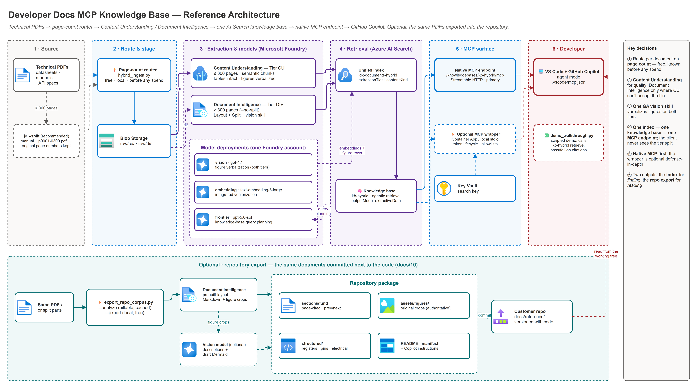

# Developer Docs MCP Knowledge Base

A reusable, low-code-first pattern for grounding coding assistants — GitHub Copilot, VS Code agent mode, or any MCP-compatible client — directly on a technical document corpus (hardware datasheets, firmware reference manuals, API specs, internal engineering wikis), via a **native Model Context Protocol (MCP) endpoint exposed by Azure AI Search**. No Foundry Agent Service, Copilot Studio, or M365 Copilot sits in the loop — the coding assistant calls the knowledge base directly as an MCP tool.

> **Generic on purpose.** This pattern is document-domain agnostic. Use it for hardware/firmware datasheets, API references, internal engineering runbooks, HR policies, contracts, or research papers — any corpus someone needs grounded, citable answers from. **The ingestion pipeline is corpus-neutral: retargeting it is a config change, not a code change** — see [Adapting this pattern to another document corpus](./docs/01-architecture.md#adapting-this-pattern-to-another-document-corpus). The hardware/firmware framing throughout the docs is the shipped *example* corpus, not a constraint.

---

## What this pattern delivers

A working end-to-end pipeline that:

- Ingests PDF technical documents from Blob Storage through an Azure AI Search indexer + skillset using the **Document Intelligence Layout skill** (handles multi-column datasheets, register tables, embedded figures)
- Chunks and embeds content with **AI Search integrated vectorization** (heading/page-aware split + Azure OpenAI embeddings) — no custom embedding pipeline
- Preserves source document + heading path metadata per chunk, so answers cite the exact document and section
- Exposes retrieval through an **AI Search Knowledge Base** (agentic retrieval — multi-query planning over the corpus)
- Surfaces that Knowledge Base as an **MCP endpoint** two ways: (1) the **native** Knowledge Base MCP surface (`/knowledgebases/{name}/mcp` — a real, documented Azure AI Search capability, zero custom code), and (2) an **optional custom MCP server wrapper** (Python, deployable to Azure Container Apps) that adds token-lifecycle handling, custom pre/post-processing, or IP allowlisting on top of the same retrieval call
- Connects directly to **GitHub Copilot in VS Code** via a workspace `.vscode/mcp.json` — developers ask natural-language hardware/firmware questions in Copilot Chat (agent mode) and get grounded, cited answers without leaving their editor

The pattern is intentionally low-code on the consumption side (zero custom UI, zero chat-agent runtime) and thin-code on the platform side (Bicep + two Python scripts). **No Foundry Agent Service, Copilot Studio, or custom chat UI required for v1.**

---

## Pattern at a glance

[](./docs/assets/dev-docs-mcp-knowledge-agent-architecture.png)

<sub>Editable source: [`docs/assets/dev-docs-mcp-knowledge-agent-architecture.drawio`](./docs/assets/dev-docs-mcp-knowledge-agent-architecture.drawio) — open in VS Code (draw.io extension) or app.diagrams.net. After editing, regenerate the PNG with `python scripts/export_diagrams.py docs/assets`.</sub>

The pattern produces **two complementary outputs** from the same documents:

| Output | Answers | Lives in | Doc |
|---|---|---|---|
| **Knowledge base + MCP endpoint** | *"Where in 2,000 pages is X?"* — cited passages, including text recovered from figures | Azure AI Search | [06](./docs/06-mcp-endpoint-and-fallback-server.md), [07](./docs/07-github-copilot-mcp-client-setup.md) |
| **Repository export** | *"Show me section 3 with its diagrams"* — the document itself, page-cited, versioned with the code | Git | [10](./docs/10-repo-corpus-export.md) |

And a scripted, self-checking customer demo ([docs/11](./docs/11-customer-walkthrough.md)) that proves both the prose path and the figure path before you present.

> **Diagrams.** Every diagram in these docs is a PNG exported from a `.drawio` source that sits next to it in `docs/assets/` — the PNG renders everywhere (GitHub, Azure DevOps, VS Code, email, slides); the `.drawio` is what you edit. `python scripts/export_diagrams.py docs/assets --check` fails if a PNG is older than its source.

---

## Locked design decisions

These decisions are **the v1 baseline**. Deviate only with an explicit decision record and updated guidance.

| # | Decision | Choice | Why |
|---|---|---|---|
| 1 | Ingestion | AI Search indexer + skillset with the **Document Intelligence Layout skill** | Handles multi-column datasheets, register/pin tables, and figures without a custom OCR pipeline |
| 2 | Chunking + embedding | AI Search **integrated vectorization** — heading/page-aware split skill + Azure OpenAI `text-embedding-3-large` vectorizer | No standalone embedding pipeline to operate; the vectorizer re-embeds queries automatically |
| 3 | Index schema | content + vector + `parent_id`, `sourceDocument`, `sourceUri`, `sectionH1/H2/H3` fields | Precise document/section citations — and deliberately **corpus-neutral**: the schema describes *where a passage came from*, not what it's about, so the same index serves any document domain |
| 4 | Retrieval / agent | Azure AI Search **Knowledge Base** (agentic retrieval) with an Azure OpenAI chat model for query planning | Native multi-query decomposition ("what's the reset value of Timer1 CTRL") without a custom orchestrator |
| 5 | MCP exposure — primary | Knowledge Base's **native MCP endpoint** (`/knowledgebases/{name}/mcp`, Streamable HTTP transport) | Zero custom code — a real, documented Azure AI Search capability, not a preview gamble |
| 6 | MCP exposure — optional wrapper | Thin **custom MCP server** (Python `mcp` SDK), deployable to Azure Container Apps or run locally over stdio | Defense-in-depth: bearer-token lifecycle management, custom pre/post-processing, or IP allowlisting beyond what the native endpoint offers on its own — not required to get a working demo |
| 7 | Consumption | GitHub Copilot in VS Code via workspace `.vscode/mcp.json` (agent mode) | Matches the target scenario directly — developers stay in their editor, no separate chat surface |
| 8 | Auth (v1) | API key (Search admin/query key) | Fastest path to a working demo; Microsoft's recommended production path is an Entra ID bearer token (`https://search.azure.com/.default` scope) + **Search Index Data Reader** RBAC — documented in [01-architecture.md](./docs/01-architecture.md#trust-boundaries-and-security) |
| 9 | Deployment | **`azd up`** (Azure Developer CLI: `infra/azd.bicep` → the shared `main.bicep`, with pre/postprovision hooks) as the one-command default; `infra/deploy.ps1` for an existing resource group; a fully manual Azure Portal + imperative CLI path ([docs/03b-manual-deployment.md](./docs/03b-manual-deployment.md)). All three deploy the same `main.bicep` resources — Storage, a Foundry multi-service account with four model deployments, AI Search, Key Vault, optional Container App | One command for a demo, without losing the script and no-IaC paths customers need. Every setting is an azd environment variable ([docs/12](./docs/12-configuration-reference.md)) |

See [01-architecture.md](./docs/01-architecture.md) for the full design narrative and trust boundaries.

---

## File index

All narrative documentation lives under `docs/`, in build order. The repo root holds only this README plus the ADO/IaC/code scaffolding.

| File | Purpose |
|---|---|
| README.md | This file |
| docs/00-reproduce-this-demo.md | Single-page "stand up from scratch" orchestrator — start here for a guided, checkpointed build |
| docs/01-architecture.md | Reference architecture: diagram, components, data flow, trust boundaries, decisions |
| docs/02-prerequisites.md | Subscriptions, licensing, RBAC, model/region availability, quotas, naming conventions |
| docs/03-deployment.md | **`azd up` fast path** + step-by-step build (Bicep / `deploy.ps1`) with validation gates |
| docs/03b-manual-deployment.md | Step-by-step build via Azure Portal + imperative CLI — no Bicep/IaC required |
| docs/04-testing.md | Functional, **chunk-quality**, retrieval, **tier-provenance** and regression tests |
| docs/05-troubleshooting.md | Symptom-by-symptom diagnosis |
| docs/06-mcp-endpoint-and-fallback-server.md | Deep dive: native Knowledge Base MCP endpoint + the optional custom wrapper |
| docs/07-github-copilot-mcp-client-setup.md | Deep dive: wiring VS Code / GitHub Copilot to the MCP endpoint |
| **docs/08-extraction-tier-comparison.md** | **The "why both services" doc** — DI-only vs CU-only vs hybrid, measured; the 300-page limit; figure verbalization; model selection; and the **cost model**. Read this before quoting a customer. |
| **docs/09-findings-and-lessons.md** | **Every defect, constraint and gotcha** from two clean-room rebuilds, organised by symptom — including the errors whose messages point at the wrong cause, and corrections to guidance that proved wrong |
| **docs/10-repo-corpus-export.md** | **PDF → repository package**: page-cited Markdown sections, original figure images, Mermaid, and opt-in register/pin/electrical extraction. Index vs. export vs. both, compared |
| **docs/12-configuration-reference.md** | **Every configurable value** — azd environment variables, hook knobs, `deploy.ps1` parameters, `demo-ids.local.json` keys, runtime environment variables — with defaults and consumers |
| **docs/11-customer-walkthrough.md** | **Scripted customer demo** with expected citations and pass/fail — rehearse with it, present with `--present` |
| docs/assets/*.drawio + *.png | Diagram sources and their exported PNGs: reference architecture, hybrid routing, repository export, customer walkthrough. Embed the PNG; edit the `.drawio` |
| azure.yaml | Azure Developer CLI template — `azd up` |
| infra/ | Bicep IaC: `main.bicep` (shared by every path), `azd.bicep` + `azd.parameters.json` (azd entry point), `modules/`, `deploy.ps1`, and `hooks/` (azd pre/postprovision + helpers shared with `deploy.ps1`) |
| scripts/hybrid_ingest.py | **The production path** — page-count router, both ingestion tiers, unified index, knowledge base |
| scripts/compare_extraction_tiers.py | Re-runnable A/B harness — audits chunk quality and retrieval per tier, emits a scorecard to `out/` |
| scripts/export_repo_corpus.py | PDF → repository-committable corpus (analyze once, export offline) |
| scripts/demo_walkthrough.py | Scripted customer walkthrough with expected citations; `--present` for the talk track |
| scripts/export_diagrams.py | Re-exports every `docs/assets/*.drawio` to PNG via the draw.io desktop CLI; `--check` flags stale PNGs |
| scripts/ | Remaining setup scripts + the optional wrapper MCP server |
| tests/ | Smoke tests, API-contract guards, and harness methodology guards |
| samples/ | Bring-your-own-corpus guidance |
| .azuredevops/pipelines/ | ADO validate + deploy pipeline |
| demo-ids.template.json | Deployment IDs **+ the `corpus` block — the only corpus-specific configuration in the pattern** |

### Reading order

| If you want to… | Read |
|---|---|
| **Build it fast** | README § Quick start (`azd up`), then `docs/07` (Copilot) and `docs/11` (rehearse) |
| **Build it** | `docs/00` → `docs/07` in order. `docs/03b` is a complete Bicep-free alternative to `docs/03`; everything else applies to both paths unchanged. |
| **Understand why it uses two services** | `docs/01` for the design, then **`docs/08`** for the measured justification and cost model |
| **Sell it** | **`docs/08`** — DI-only vs CU-only vs hybrid, on real numbers — then rehearse with **`docs/11`** |
| **Give developers the documents in their repo** | **`docs/10`** |
| **Fix something** | `docs/05` (by symptom) and **`docs/09`** (every known defect and constraint) |

### Platform support

Windows, Linux, and macOS. `infra/deploy.ps1` runs under **PowerShell 7 (`pwsh`)**, which is
cross-platform; the Python scripts and `az` commands are platform-neutral. The only command
that differs per shell is virtual-environment activation — see
[docs/02 § 0](./docs/02-prerequisites.md#0--tooling-and-shell-conventions). Every other command
in these docs is written to paste cleanly into PowerShell, bash, or zsh.

---

## Quick start — one command

```bash
azd auth login --tenant-id <tenant-id>            # azd's login
az login --tenant <tenant-id>                     # the hooks and scripts use az
azd env new dev
azd env set AZURE_SUBSCRIPTION_ID <subscription-id>
azd env set AZURE_LOCATION eastus2
azd up
```

`azd up` provisions every resource (including all four model deployments), writes
`demo-ids.local.json`, stores the Search key, and, if `DEMO_CORPUS_DIR` is set, ingests your
PDFs. Every setting is listed in [docs/12-configuration-reference.md](./docs/12-configuration-reference.md);
the step-by-step and the `deploy.ps1` / Portal alternatives are in [docs/03](./docs/03-deployment.md)
and [docs/03b](./docs/03b-manual-deployment.md).

---

## Quick-start prerequisites at a glance

Full detail in [02-prerequisites.md](./docs/02-prerequisites.md):

- Azure Developer CLI (`azd`) for the one-command path, plus Azure CLI and PowerShell 7
- Azure subscription with quota for AI Search (Basic tier minimum for semantic ranker + knowledge bases; Standard S1+ for production), a Cognitive Services multi-service account, and Storage
- Azure OpenAI model access for `text-embedding-3-large` and a chat-completion model (e.g. `gpt-5-mini`) in a region that supports both
- Contributor + RBAC-admin rights on the target resource group
- VS Code with GitHub Copilot (agent mode / MCP support enabled)
- A document corpus to ingest — PDF by default; the Layout skill also reads Office formats and images (bring your own — see [samples/README.md](./samples/README.md))

---

## When to use this pattern (and when not to)

### Use this pattern when

- Developers need grounded, citable answers from technical documentation **while coding** — inside VS Code / GitHub Copilot, not a separate chat surface
- The consumption target is any **MCP-compatible client** (GitHub Copilot, Claude Desktop, other MCP-aware IDEs) rather than Teams/M365 Copilot
- The customer wants the lowest-code path to a working retrieval endpoint — no chat-agent runtime to author or maintain

### Use a different pattern when

- The target surface is Teams, M365 Copilot, or a business-user chatbot → use [`rag-knowledge-base-pattern`](../rag-knowledge-base-pattern/README.md) (Copilot Studio or Foundry Agent Service front end)
- The corpus lives in Fabric/OneLake and needs Fabric-native governance (RLS/OLS, Purview) → also [`rag-knowledge-base-pattern`](../rag-knowledge-base-pattern/README.md)
- The customer specifically needs a custom chat UI with multi-turn memory beyond what an MCP tool call provides → the fallback MCP server here can be extended, but consider a dedicated agent-runtime pattern instead

---

## Note on the native MCP endpoint — real capability, verify the current version

Azure AI Search's Knowledge Base MCP endpoint (`/knowledgebases/{name}/mcp`, exposing a `knowledge_base_retrieve` tool) is a **real, documented Azure AI Search capability** — not a speculative preview feature. This pattern's earlier revision guessed at an incorrect URL shape and API version; both have been corrected against current Microsoft Learn documentation (see [02-prerequisites.md](./docs/02-prerequisites.md#8--regional--preview-feature-availability) and [docs/06-mcp-endpoint-and-fallback-server.md](./docs/06-mcp-endpoint-and-fallback-server.md)). Because Azure AI Search's agentic-retrieval surface has moved quickly (it was renamed from "Knowledge Agents" to "Knowledge Bases" in 2026), **always re-verify the exact API version, endpoint path, and auth model against the current Azure AI Search REST API reference before a customer-facing build** — the CLI/REST calls to check current availability are in the linked docs. The optional custom MCP server wrapper is not required to get a working demo; it exists for defense-in-depth (token lifecycle, custom processing, network controls).

---

## Pro-code alternative

There is no separate pro-code companion repo for this pattern today — the optional MCP server wrapper (`scripts/mcp_fallback_server.py`) already is the pro-code path when you need more than the native endpoint offers. If a customer engagement needs a richer custom MCP server (multiple tools, write-back, multi-index federation), fork `scripts/mcp_fallback_server.py` into a dedicated repo rather than growing it in place here.

---

## Distribution

This folder is checked into Azure DevOps as a standalone repo. `.gitignore` excludes secrets and populated local state; `demo-ids.template.json` is the committed reference template for the IDs a real deployment produces — copy it to `demo-ids.local.json` (gitignored) and populate the local copy after your first deploy. **Never commit a populated `demo-ids.local.json`, a real Search admin key, or any `.env` file.** Runtime credentials for the ADO pipeline come from an ADO variable group / Key Vault, not from any file in this repo.

---

## Decision provenance

| Date | Decision | Reference |
|---|---|---|
| 2026-08-13 | Locked v1 architecture: AI Search Knowledge Base + native/fallback MCP exposure for direct GitHub Copilot consumption of technical document corpora | `Decisions/_Process/2026-08-13 - dev-docs-mcp-knowledge-agent-pattern.md` (vault) |
| 2026-08-18 | Corrected against Microsoft Learn: renamed Knowledge Agent → Knowledge Base, fixed the native MCP endpoint path/API version (`/knowledgebases/{name}/mcp`, `2026-05-01-preview`), lowered the AI Search tier floor to Basic, replaced the deprecating `gpt-4o-mini` with `gpt-5-mini`, reframed the custom MCP server as an optional wrapper rather than a required fallback, and restructured all narrative docs under `docs/` with a manual (non-Bicep) deployment path added | `Decisions/_Process/2026-08-18 - dev-docs-mcp-knowledge-agent-accuracy-and-structure-fix.md` (vault) |

---

*Last updated: 2026-09-30*
