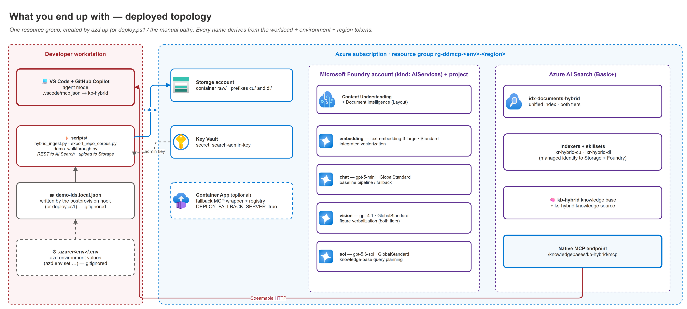

# 00 — Stand this demo up from scratch

> **Audience.** Someone cloning this repo to build the full demo against a fresh Azure
> subscription. Each part is a checkpoint — finish A before starting B. Deep-dive runbooks are
> linked rather than duplicated.

> **Time budget.** First build: **1.5–3 hours**, dominated by (a) model + AI Search
> provisioning waits and (b) ingestion, which scales with corpus size — a 906-page document
> with figure verbalization takes ~45 minutes on its own. Subsequent rebuilds in the same
> tenant: well under an hour.

---

## What you end up with

[](./assets/deployed-topology.png)

<sub>Editable source: [`assets/deployed-topology.drawio`](./assets/deployed-topology.drawio).</sub>

Read [01-architecture.md](./01-architecture.md) for *why* ingestion is split into two tiers,
and [08-extraction-tier-comparison.md](./08-extraction-tier-comparison.md) for the measured
evidence and cost model behind that decision.

---

## Before you start

Full detail in [02-prerequisites.md](./02-prerequisites.md). Do not skip the first three —
each has cost a real build time.

- [ ] Azure subscription with Contributor + RBAC-admin on the target resource group
- [ ] **AI Search regional _capacity_ confirmed** — a region can list Basic as available and
      still reject creation with `InsufficientResourcesAvailable`
- [ ] **Storage / Key Vault public network access reachable** — governed subscriptions may
      force `publicNetworkAccess: Disabled` and silently revert an override
- [ ] Model quota in-region for `text-embedding-3-large` (**Standard** SKU) and the chat/vision
      models
- [ ] `az` CLI ≥ 2.60, **PowerShell 7 (`pwsh`)**, Python 3.11+
- [ ] **VS Code with the GitHub Copilot Chat extension** (`github.copilot-chat`) — note
      `ms-azuretools.vscode-azure-github-copilot` is a *different* extension and is not enough
- [ ] A PDF corpus you have the right to index (see [../samples/README.md](../samples/README.md))

### Platform note

Everything here runs on **Windows, Linux, and macOS**. `deploy.ps1` runs under PowerShell 7,
which is cross-platform. Activate the virtual environment first — that is the only step whose
syntax differs per shell — and every command below is then identical everywhere:

```powershell
# PowerShell (any OS)
python -m venv .venv
.venv/Scripts/Activate.ps1        # Windows
# .venv/bin/Activate.ps1          # Linux / macOS
pip install -r scripts/requirements.txt
```

```bash
# bash / zsh
python3 -m venv .venv
source .venv/bin/activate
pip install -r scripts/requirements.txt
```

---

## Part A — Provision the platform

> **One command instead of A1–A3:** `azd up` provisions everything below, writes
> `demo-ids.local.json` and can ingest your corpus in the same run. Steps and settings:
> [03 § Fast path — azd up](./03-deployment.md#fast-path--azd-up) and
> [12-configuration-reference.md](./12-configuration-reference.md). Then continue at Part B
> (or Part C if you set `DEMO_CORPUS_DIR`).

### A1. Authenticate to the intended tenant/subscription

Never trust the ambient `az` login — see
[03-deployment.md § Phase 0](./03-deployment.md#phase-0--authenticate-to-the-right-tenant).

### A2. Deploy the Bicep

```bash
cd infra
./deploy.ps1 -Environment dev -Region eastus -ResourceGroup "rg-ddmcp-dev-eastus"
```

Provisions Storage, the Foundry multi-service account **plus a Foundry project**, AI Search,
Key Vault, and RBAC, then writes `demo-ids.local.json`. Detail:
[03-deployment.md § Phase 1](./03-deployment.md#phase-1--foundation-resources).

### A3. Frontier models (created by the Bicep — usually nothing to do)

The Bicep now creates all four deployments (`embedding`, `chat`, `vision`, `sol`). Run the two
commands below only if you deployed with `deployHybridModels=false` / `DEPLOY_HYBRID_MODELS=false`
(names must match `demo-ids.local.json`):

```bash
# Figure verbalization, BOTH tiers. Deliberately a NON-reasoning model: the
# vision skill has a fixed 30s timeout whose failure mode is total (one slow
# figure fails the whole document), so latency variance matters more than
# capability. See docs/08 § Model selection.
#
# CAPACITY IS A RELIABILITY SETTING HERE, not a cost setting. A deployment's
# requests-per-minute limit scales with capacity (capacity 400 -> 400 req/min),
# AI Search fires figure calls concurrently, and `degreeOfParallelism` was
# removed from the skill in API 2026-04-01 -- so there is no way to throttle
# from the AI Search side. Under-provision this and ingestion fails with a
# misleading 30s *timeout* even though each call takes ~7s.
az cognitiveservices account deployment create -n <foundry> -g <rg> --deployment-name vision --model-name gpt-4.1 --model-version 2025-04-14 --model-format OpenAI --sku-name GlobalStandard --sku-capacity 1000

# Knowledge-base query planning. Frontier -- no timeout pressure here.
az cognitiveservices account deployment create -n <foundry> -g <rg> --deployment-name sol --model-name gpt-5.6-sol --model-version 2026-07-09 --model-format OpenAI --sku-name GlobalStandard --sku-capacity 200
```

> A brand-new deployment is not immediately usable, and it fails in three different-looking
> ways: `DeploymentIdNotFound`, `FigureUnderstandingSkipped` ("the model deployment returned
> an error"), or a vision-skill `InternalServerError`. All three mean the deployment is not
> serving yet, even though the control plane already reports `Succeeded`. Verify with a direct
> chat-completions call, then reset and re-run the indexers — don't start editing the skillset.

**Checkpoint:** `az cognitiveservices account deployment list` shows `embedding`, `chat`, `sol`, `vision`.

---

## Part B — Route and upload the corpus

### B1. Split oversized documents (strongly recommended)

```bash
cd ../scripts
pip install -r requirements.txt
python hybrid_ingest.py --ids-file ../demo-ids.local.json --split --plan --source-dir "<path-to-pdfs>"
```

`--split` breaks any PDF over 300 pages into page-ranged parts
(`manual__p0001-0300.pdf`), which fixes **two independent problems at once**:

- Every part becomes eligible for the **higher-quality Content Understanding tier**, instead of
  the whole manual falling to Document Layout because of the 300-page limit.
- Figure verbalization fires one vision call per figure. A 900-page document produces a burst
  large enough to exhaust the vision deployment's requests-per-minute ceiling, and long runs
  hit transient upstream 500s — and because AI Search treats a document as one unit, a late
  failure **discards the whole document's enrichment**. Smaller parts make failures cheap and
  localised.

Part filenames carry the source page range so citations stay traceable to the original
document. Skip `--split` only if every document is already under 300 pages.

### B2. See the routing plan (free — no service calls)

```bash
python hybrid_ingest.py --ids-file ../demo-ids.local.json --plan --source-dir "<path-to-pdfs>"
```

This is also the number you need for a cost estimate — see
[08 § Cost model](./08-extraction-tier-comparison.md#cost-model).

### B3. Upload into the tier prefixes

```bash
python hybrid_ingest.py --ids-file ../demo-ids.local.json --upload --source-dir "<split-or-original-dir>"
```

If the directory still contains a document over 300 pages, `--upload` **stops before uploading
anything** and asks you to choose: re-run with `--split` (recommended) or `--no-split` (keep it
whole on Tier DI+). Routing an oversized manual is a quality and reliability decision, so the
script no longer makes it silently.

**Checkpoint:** blobs appear under `raw/cu/` and/or `raw/di/`.

---

## Part C — Build both tiers and ingest

```bash
python hybrid_ingest.py --ids-file ../demo-ids.local.json --build
python hybrid_ingest.py --ids-file ../demo-ids.local.json --status
```

`--build` creates the unified index, both skillsets, both data sources, both indexers, the
knowledge source and the knowledge base, then starts ingestion. Poll `--status` until both
tiers report `success`.

**Expect this to take a while.** Tier DI+ makes one vision call per extracted figure; a
906-page specification took ~45 minutes. Tier CU is much faster.

**Checkpoint:** both indexers `success`, and the index contains rows from every tier you
expected:

```bash
python hybrid_ingest.py --ids-file ../demo-ids.local.json --status
```

Full detail: [03-deployment.md § Phase 2](./03-deployment.md#phase-2--hybrid-ingestion).

---

## Part D — Verify retrieval and the MCP endpoint

```bash
python post_deploy_search.py --ids-file ../demo-ids.local.json --check-mcp-endpoint
```

Then run the test plan in [04-testing.md](./04-testing.md) — functional, chunk-quality, and
golden-set checks, including the tier-provenance check that proves both tiers are contributing.

---

## Part E — Wire GitHub Copilot

Add `.vscode/mcp.json` pointing at the **hybrid** knowledge base and reload VS Code, then ask
a corpus question in Copilot Chat (agent mode). Exact JSON and verification steps:
[07-github-copilot-mcp-client-setup.md](./07-github-copilot-mcp-client-setup.md).

**Checkpoint:** a question answerable only from a *figure* returns a grounded answer citing
the source document — that is the whole pattern working end to end.

---

## Part F — Rehearse, and optionally export to a repository

```bash
python demo_walkthrough.py --ids-file ../demo-ids.local.json --script ../samples/walkthrough.example.json --report
```

**Checkpoint:** `5/5 steps passed`. Full detail: [11-customer-walkthrough.md](./11-customer-walkthrough.md).

Optional — if developers want the documents themselves in their repo
([10-repo-corpus-export.md](./10-repo-corpus-export.md)):

```bash
python export_repo_corpus.py --ids-file ../demo-ids.local.json --analyze --source-dir "<split-or-original-dir>"
python export_repo_corpus.py --ids-file ../demo-ids.local.json --export --out ../out/repo-export
```

**Checkpoint:** `out/repo-export/README.md` lists every document with section, figure and table counts.

---

## Single-page checklist

| Part | What | Done |
|---|---|---|
| A | Provision platform (Bicep) + frontier model deployments | [ ] |
| B | Route by page count and upload to tier prefixes | [ ] |
| C | Build both tiers, ingest, confirm both indexers succeed | [ ] |
| D | Verify retrieval + native MCP endpoint | [ ] |
| E | Wire GitHub Copilot and ask a figure-only question | [ ] |
| F | Walkthrough passes 5/5; *(optional)* repository export generated | [ ] |

Then run [04-testing.md](./04-testing.md) before calling it demo-ready. If anything fails,
[05-troubleshooting.md](./05-troubleshooting.md) is organised by symptom.

---

## Tearing down

```bash
python hybrid_ingest.py --ids-file ../demo-ids.local.json --teardown   # Search objects only
az group delete --name rg-ddmcp-dev-eastus --yes --no-wait             # everything
```

AI Search Basic and the model deployments bill continuously — tear down when the demo is not
in use.

---

*Last updated: 2026-09-30*
