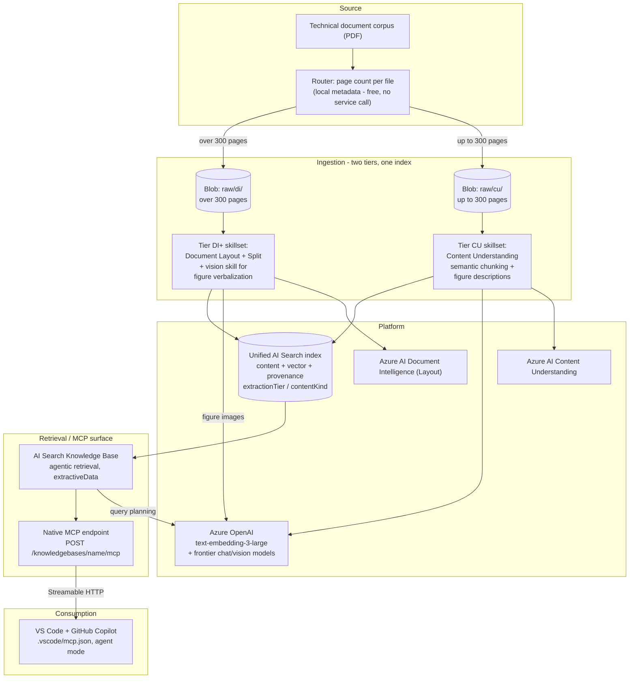

# 01 — Architecture

Reference architecture for the Developer Docs MCP Knowledge Base pattern. Read this first,
then [02-prerequisites.md](./02-prerequisites.md).

**If you read one other page, read
[08-extraction-tier-comparison.md](./08-extraction-tier-comparison.md)** — it is the measured
justification for the hybrid ingestion design below, including the cost model and the
customer-facing "why both services" narrative.

---

## Goals

- Ground a coding assistant's answers in an authoritative technical document corpus, with
  document- and section-level citations
- Expose that grounded retrieval as a standard **MCP tool** so any MCP-compatible client can
  consume it — starting with GitHub Copilot in VS Code
- Keep the platform low-code: no custom chat UI, no agent-orchestration runtime to author
- **Handle a real technical corpus** — including 500–1,500 page reference manuals and the
  register/pin diagrams that carry the engineering content

## Non-goals

- Not a general-purpose chatbot for business users (Teams / M365 Copilot) — see
  [`rag-knowledge-base-pattern`](../../rag-knowledge-base-pattern/README.md) for that surface
- Not a write-back or code-modification tool — retrieval only; the MCP tool returns grounded
  text, it does not edit files or call other systems
- Not scoped to a specific hardware vendor or document family — any PDF corpus fits the same
  pipeline

---

## The one design decision that matters

**Ingestion uses two Azure services, routed per document.** This is not hedging — it is forced
by a hard constraint and validated by measurement:

| | Azure AI Content Understanding | Azure AI Document Intelligence (Layout) |
|---|---|---|
| Chunk quality | **Best** — 100% table integrity, consistent chunk sizes | Splits ~23% of tables; chunk sizes 34–6,116 chars |
| Figures | **Describes them natively** | Emits empty `<figure></figure>` — the diagram is discarded |
| Cost | **Roughly half** the per-page price | Higher |
| **Page limit** | **300 pages per file — hard reject** | **No practical ceiling** (906 pages ingested fine) |

Content Understanding is better *and* cheaper on everything except the one property that
decides whether a hardware corpus can be ingested at all. So the pattern routes on **page
count** — free local metadata — and covers Document Intelligence's figure blindness by adding
a vision skill to that tier.

Full measurements, the DI-only vs CU-only vs hybrid comparison, and cost:
[08-extraction-tier-comparison.md](./08-extraction-tier-comparison.md).

---

## Architecture diagram

> **Presentation-ready diagram**:
> [`docs/assets/dev-docs-mcp-knowledge-agent-architecture.drawio`](./assets/dev-docs-mcp-knowledge-agent-architecture.drawio)
> — the same view laid out for a customer deck. The Mermaid below is the same content in text
> form, for quick reading and clean diffs.



---

## Ingestion tiers

### The router

Page count is read locally with `pypdf` before anything is uploaded, so the routing decision
costs nothing and no document is ever processed twice. Documents upload under a blob prefix
(`cu/` or `di/`) and each tier's data source scopes to its own folder — AI Search indexers
cannot filter on page count, but they can scope to a folder.

```
python hybrid_ingest.py --ids-file ../demo-ids.local.json --plan --source-dir <dir>

Document                         Pages  Tier                     Why
riscv-debug-specification.pdf      119  content-understanding    119 pages <= 300 limit
riscv-spec.pdf                     906  di-layout-verbalized     906 exceeds the 300-page limit
```

### Tier CU — 300 pages or fewer

One skill does extraction **and** chunking (`ContentUnderstandingSkill`), so there is no
separate Split skill. Semantic chunking respects paragraph boundaries and keeps cross-page
tables intact.

Citations: **page range** (`pageNumberFrom` / `pageNumberTo`).

### Tier DI+ — more than 300 pages

`DocumentIntelligenceLayoutSkill` (markdown + image extraction) → `SplitSkill` → embedding.
Plain Document Layout discards diagrams entirely, so this tier depends on the shared vision
skill below.

Citations: **deepest heading** (`sectionLabel`).

> **Why the deepest heading and never a heading path:** the Document Layout skill's `sections`
> dictionary holds the most recently seen heading at each level, not a validated ancestor
> chain, so rendering `h1 > h2 > h3` asserts a parent relationship that is wrong ~21.7% of the
> time. Verified against chunk content, the *deepest* heading is correct — only the implied
> ancestry is fabricated. Storing just the deepest heading removes the defect at zero cost.

### Figures — one GA mechanism, both tiers

Both tiers extract figure images (`extractionOptions: ["images"]`) and hand them to the **same
`ChatCompletionSkill`**, which verbalizes each figure into its own searchable row
(`contentKind: image-description`).

This deliberately does **not** use Content Understanding's own figure-description feature
(`modelName` / `modelDeployment`). That capability is preview, and on a clean rebuild it failed
consistently with:

```
FigureUnderstandingSkipped: Figure understanding was skipped because
the model deployment returned an error.
```

— reproducibly, across both a reasoning model (`gpt-5.5`) and a non-reasoning model
(`gpt-4.1`), with both deployments verified serving HTTP 200 on direct chat-completions calls.
Worse, in an earlier build the same condition degraded to a *silent warning*: the tier reported
success while producing **zero** figure descriptions.

Using the GA `ChatCompletionSkill` on both tiers means one figure mechanism instead of two, a
GA dependency instead of a preview one, and uniform `image-description` rows regardless of
which tier ingested the document. Measured effect of the switch: CU-tier figure rows went from
**0 → 78** on the same document.

---

## The unified index

Both tiers project into **one** index, so one knowledge base — and therefore one MCP endpoint
— serves the whole corpus. The client never knows there were two pipelines.

| Field | Purpose |
|---|---|
| `chunkId` (key), `parent_id`, `image_parent_id` | Identity and projection parents. Two parent keys are **required** — AI Search rejects two projection selectors into one index sharing a `parentKeyFieldName`. |
| `content`, `contentVector` | Chunk text (or figure description) and its embedding |
| `sourceDocument`, `sourceUri` | Provenance to the file |
| **`extractionTier`** | `content-understanding` \| `di-layout-verbalized` — lets you audit quality per tier and filter one out if it disappoints |
| **`contentKind`** | `text` \| `image-description` — figure descriptions are their own retrievable rows |
| `sectionLabel` | Deepest heading (Tier DI+) |
| `pageNumberFrom` / `pageNumberTo` | Page range (Tier CU) |

Provenance is deliberately first-class rather than an implementation detail: it is how you
answer "is this tier actually pulling its weight?" after the fact.

---

## Retrieval and the MCP surface

An AI Search **Knowledge Base** performs agentic retrieval (multi-query planning) over the
unified index, exposed through its **native MCP endpoint** — zero custom code.

**`outputMode` must be `extractiveData`.** The native MCP tool accepts only a `queries` array;
it cannot request reference source data. Under `answerSynthesis` the synthesising model
receives references with no source data and replies *"I cannot access external documents"*,
while direct REST retrieval works fine — a silent and very confusing failure. `extractiveData`
returns the ranked passages themselves, which is what an MCP client wants anyway: GitHub
Copilot does its own synthesis and citation.

An optional custom MCP server wrapper exists for defense-in-depth (token lifecycle, custom
pre/post-processing, IP allowlisting) — see
[06-mcp-endpoint-and-fallback-server.md](./06-mcp-endpoint-and-fallback-server.md). It is
**not** required; the native endpoint is verified working.

---

## Models

Three call sites, **three different ceilings** — treat "are we on a frontier model?" as three
questions:

| Call site | Model | Constraint |
|---|---|---|
| Figure verbalization, **both tiers** (`ChatCompletionSkill`) | `gpt-5.6-sol` | No allowlist — use current frontier |
| Knowledge Base query planning | `gpt-5.6-sol` | Runs on every MCP call |
| Embeddings (both tiers) | `text-embedding-3-large` (3072 dims) | Must match the index vector width |

Only **one** frontier deployment is needed. Content Understanding's own figure-description
feature would have required a second, older deployment — it enforces a model allowlist that
lags the Foundry catalog — but this pattern no longer uses that feature (see
[Figures — one GA mechanism](#figures--one-ga-mechanism-both-tiers)).

The figure-verbalization skill deliberately does **not** use a frontier reasoning model: its 30-second timeout has a total-failure mode, so latency *variance* matters more than capability. See
[08 § Model selection](./08-extraction-tier-comparison.md#model-selection--match-the-model-to-the-call-site-not-to-a-use-frontier-rule).

---

## Trust boundaries and security

| Boundary | Control |
|---|---|
| Corpus at rest | Blob Storage, private; no public container access |
| Search → Storage / Foundry | AI Search **system-assigned managed identity** with RBAC (`Storage Blob Data Reader`, `Cognitive Services User`) — no keys on the wire |
| Client → MCP endpoint | API key **or** Entra ID bearer token (`https://search.azure.com/.default` + `Search Index Data Reader`). Entra ID is the recommended production path. |
| Secrets | Search admin key in Key Vault; scripts fall back to the Search control plane where governed subscriptions block Key Vault's data plane |
| Governed subscriptions | Where policy forces `publicNetworkAccess: Disabled`, a **Network Security Perimeter** association is required before the corpus can be uploaded — see [05 § 1](./05-troubleshooting.md#1--foundation-bicep-deploy) |

---

## Adapting this pattern to another document corpus

The pipeline is **corpus-neutral**. Retargeting is a config change, not a code change — the
`corpus` block in `demo-ids.local.json` is the only corpus-specific surface:

| Setting | Drives |
|---|---|
| `displayName` | Skillset descriptions |
| `mcpToolName` / `mcpToolDescription` | The MCP tool's advertised identity — **the highest-impact setting**, since the coding assistant decides whether to invoke a tool from its description |
| `chunkSizeTokens` / `chunkOverlapTokens` | Tier DI+ Split skill sizing |
| `sourceFileExtensions` | Which files get uploaded |

The index schema describes *where a passage came from*, never what it is about, so the same
schema serves hardware datasheets, HR policies, contracts, or research papers. Add
domain-specific fields only when you need to *filter* on them.

**What does change per corpus:** the page-count distribution, and therefore the tier mix and
the cost. Run `--plan` against a real corpus before quoting anything.

---

*Last updated: 2026-08-24*
