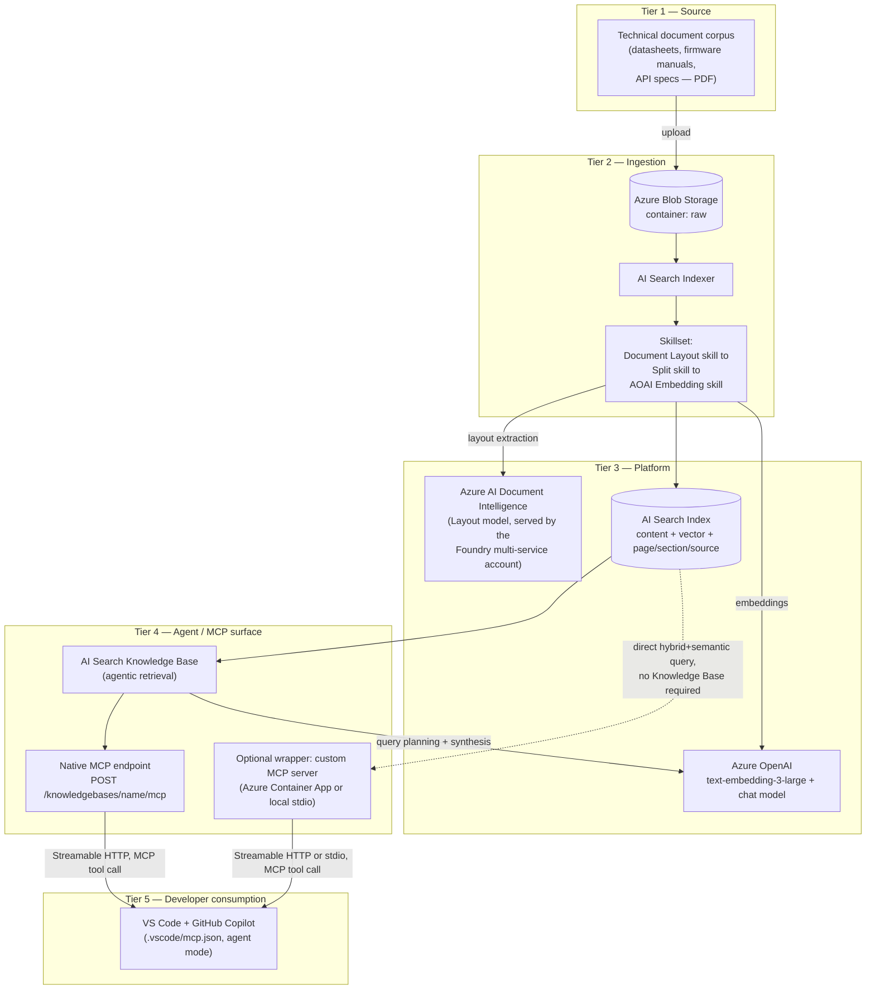

# 01 — Architecture

Reference architecture for the Developer Docs MCP Knowledge Base pattern. Read this first, then move to [02-prerequisites.md](./02-prerequisites.md).

---

## Goals

- Ground a coding assistant's answers in an authoritative technical document corpus, with document + section-level citations
- Expose that grounded retrieval as a standard **MCP tool** so any MCP-compatible client can consume it — starting with GitHub Copilot in VS Code
- Keep the platform low-code: no custom chat UI, no agent-orchestration runtime to author
- Work via the native Knowledge Base MCP endpoint by default, with an optional custom wrapper available for defense-in-depth (token lifecycle, custom processing, network controls)

## Non-goals

- Not a general-purpose chatbot for business users (Teams / M365 Copilot) — see [`rag-knowledge-base-pattern`](../../rag-knowledge-base-pattern/README.md) for that surface
- Not a write-back or code-modification tool — retrieval only in v1; the MCP tool returns grounded text, it does not edit files or call other systems
- Not a replacement for Foundry Agent Service or Copilot Studio when a customer specifically needs multi-tool orchestration, licensing-bundled distribution, or a business-user-facing chat surface
- Not scoped to a specific hardware vendor or document format family — any PDF technical corpus fits the same pipeline

## Architecture diagram

> **Presentation-ready diagram**: [`docs/assets/dev-docs-mcp-knowledge-agent-architecture.drawio`](./assets/dev-docs-mcp-knowledge-agent-architecture.drawio) (this same view, laid out for a customer deck). Open with the draw.io VS Code extension or at app.diagrams.net. The Mermaid version below is the same content in text form, for quick reading and clean diffs.

## Logical layers

| Layer | Component | Role |
|---|---|---|
| Source | Technical document corpus | PDFs the developer needs grounded answers from (bring your own — see [samples/README.md](../samples/README.md)) |
| Ingestion | Blob Storage (`raw` container) | Landing zone for source PDFs |
| Ingestion | AI Search indexer + data source | Schedules/triggers the pull from Blob into the skillset pipeline |
| Ingestion | Skillset (Document Layout → Split → Embedding) | Extracts structured text/tables/figures, chunks with heading/page awareness, embeds each chunk |
| Platform | Azure AI Document Intelligence (Layout model) | Structural PDF extraction — tables, headings, reading order — served via the Foundry multi-service account |
| Platform | Azure OpenAI (`text-embedding-3-large`, chat model) | Embeddings for the vectorizer; chat model powers the Knowledge Base's query planning + answer synthesis |
| Platform | AI Search index | Hybrid (keyword + vector) searchable store with semantic ranking and per-chunk citation metadata |
| Agent / MCP | AI Search Knowledge Base | Agentic retrieval: decomposes a developer's question into sub-queries, retrieves, ranks, and synthesizes a grounded, cited answer |
| Agent / MCP | Native MCP endpoint | The Knowledge Base's own MCP surface — no custom code |
| Agent / MCP | Fallback MCP server | Python MCP server wrapping the same retrieval logic, for when the native surface isn't available |
| Consumption | VS Code + GitHub Copilot | Developer's editor; MCP client configuration points at either the native or fallback endpoint |

### Layer note — why a Foundry multi-service account, not standalone resources

Document Intelligence and the Azure OpenAI embedding/chat deployments are served by a **single `Microsoft.CognitiveServices/accounts` resource of kind `AIServices`** (branded Microsoft Foundry), not separate Document Intelligence + Azure OpenAI resources. This mirrors the consolidation already validated in [`rag-knowledge-base-pattern`](../../rag-knowledge-base-pattern/README.md) (see that pattern's CHANGELOG, 2026-05-25): one resource, one endpoint, one managed identity, one RBAC surface for both capabilities.

## End-to-end data flow

### Background path (ingestion, scheduled or on-demand)

1. Operator (or a customer's document owner) uploads PDFs to the `raw` Blob container — via `scripts/upload_documents.py`, Storage Explorer, or `az storage blob upload-batch`
2. The AI Search indexer picks up new/changed blobs from the data source
3. The skillset runs per document: Document Layout skill extracts structured text/tables/headings as markdown sections → Split skill chunks the layout-aware output (heading aware, token-based chunks with overlap) → AOAI Embedding skill vectorizes each chunk
4. Each chunk is written to the index as one search document, carrying `content`, `contentVector`, `parent_id`, `sourceDocument`, `sourceUri`, and the heading path (`sectionH1`/`sectionH2`/`sectionH3`)
5. The indexer can be scheduled (e.g. every 4 hours) or run on-demand after a corpus update

### Real-time path (developer query, per request)

1. A developer asks a question in GitHub Copilot Chat (agent mode) inside VS Code — e.g. "What's the max SPI clock frequency for this part per the datasheet?"
2. Copilot recognizes the configured MCP tool as relevant and calls it with the developer's query
3. The MCP endpoint (native or fallback) forwards the query to the AI Search Knowledge Base's `retrieve` operation
4. The Knowledge Base plans sub-queries if needed, retrieves + semantically ranks matching chunks, and synthesizes a grounded answer citing `sourceDocument` + heading path (`sectionH1`/`H2`/`H3`)
5. The MCP tool result (grounded text + citations) returns to Copilot, which incorporates it into its response — the developer sees an answer grounded in the actual manual, without leaving the editor

## Reference schemas

### Index schema (`idx-documents`)

| Field | Type | Attributes | Purpose |
|---|---|---|---|
| `chunkId` | `Edm.String` | key, **`analyzer: keyword`**, searchable, filterable, sortable, retrievable | Unique per chunk. The `keyword` analyzer is required — the default analyzer tokenizes chunk IDs and breaks key lookups |
| `parent_id` | `Edm.String` | filterable, retrievable | **Required by index projections** (`parentKeyFieldName`) — links each chunk to its source document |
| `content` | `Edm.String` | searchable, retrievable | The chunk's extracted text |
| `contentVector` | `Collection(Edm.Single)` | searchable (vector, 3072 dims for `text-embedding-3-large`) | Embedding for vector/hybrid search. Must match the embedding skill's `dimensions` |
| `sourceDocument` | `Edm.String` | **searchable**, filterable, facetable, retrievable | Original file name. Searchable because the semantic configuration names it as `titleField` |
| `sourceUri` | `Edm.String` | retrievable | Blob URL of the source document |
| `sectionH1` / `sectionH2` / `sectionH3` | `Edm.String` | searchable, filterable, retrievable | Heading path from the Layout skill's markdown `sections` output |

> **On page numbers.** The Document Layout skill in **markdown** mode emits `content`, `sections` (h1–h6), and `ordinal_position` per section — **there is no page number**. This pattern therefore cites *heading paths* (`Peripherals > Timer Registers`), which are also more stable than page numbers across document revisions. If page-level citation is a hard requirement, switch the skill to `outputFormat: "text"` with `extractionOptions: ["locationMetadata"]`, consume the `text_sections` output, and project the location metadata instead — see `create_skillset` in `scripts/post_deploy_search.py`.

### Knowledge Base configuration

Agentic retrieval uses a **two-object model** — the knowledge base does not point at an index directly:

| Object | Purpose |
|---|---|
| **Knowledge source** (`ks-documents`, `kind: searchIndex`) | Wraps the index. Its `sourceDataFields` list decides which fields come back in `references[].sourceData` at retrieve time — fields not listed are simply absent from citations |
| **Knowledge base** (`kb-documents`) | References the source via `knowledgeSources: [{name}]`, plus the chat model for query planning and `outputMode: answerSynthesis` |

| Setting | Value |
|---|---|
| Knowledge source | `ks-documents` → `idx-documents`, semantic config `semantic-config` |
| Query planning model | Azure OpenAI chat deployment (`chat`, e.g. `gpt-5-mini`) |
| Ranking | Semantic ranker + vector + keyword hybrid |
| Reranker threshold | **Per-query** (`knowledgeSourceParams[].rerankerThreshold`) — there is no knowledge-base-level default |
| Output | Grounded answer + per-citation `sourceDocument` / heading path |
| MCP tool name | Native endpoint: `knowledge_base_retrieve` (Microsoft-defined). Custom wrapper: configurable via `corpus.mcpToolName` (defaults to `retrieve_documents`; the shipped example corpus uses `retrieve_technical_docs`) |

## Trust boundaries & security

### Identity

- v1 default: **API key** (Search admin key for setup scripts, query key for the MCP server wrapper's runtime auth to Search) — fastest path to a working demo
- **Microsoft's recommended production auth for the native MCP endpoint** is an **Entra ID bearer token** scoped to `https://search.azure.com/.default`, with the caller granted **Search Index Data Reader** RBAC on the Search service — see [docs/06-mcp-endpoint-and-fallback-server.md](./06-mcp-endpoint-and-fallback-server.md). API key remains a supported, simpler alternative for a demo.
- Hardening path: switch the custom MCP server wrapper and setup scripts to **Managed Identity** + Entra ID RBAC (`Search Index Data Reader` for query-time access, `Search Service Contributor` for setup), and disable local auth on the Search service (`disableLocalAuth: true`, matching [`rag-knowledge-base-pattern`](../../rag-knowledge-base-pattern/README.md)'s locked decision)

### Secrets

- Search admin/query keys and the Azure OpenAI key (if not using Managed Identity) live in **Key Vault**; the Container App (fallback MCP server) reads them via Key Vault references, never as plaintext environment variables in Bicep
- No secret is ever committed to the repo — see `.gitignore` and `demo-ids.template.json`

### Network

- v1 default: public endpoints on Storage, Search, and the Foundry account, secured by key/RBAC — appropriate for a POC
- Production hardening: Private Endpoints for all three, plus VNet integration for the Container App hosting the fallback MCP server — noted as a follow-on, not built in v1

### Data residency

- All resources deploy to a single region chosen at deployment time (see [02-prerequisites.md](./02-prerequisites.md) regional matrix) — no cross-region data movement in v1

## Locked decisions — rationale

**Document Intelligence Layout skill over prebuilt-read.** Hardware datasheets and firmware manuals are dense with multi-column layouts, register/pin tables, and embedded figures. The Layout model preserves table structure and reading order far better than a plain OCR/read model, which materially improves chunk quality and downstream citation accuracy.

**Integrated vectorization over a custom embedding pipeline.** AI Search's built-in vectorizer re-embeds queries automatically and keeps the ingestion pipeline entirely inside the indexer/skillset construct — no Azure Function or custom code needed just to keep embeddings in sync with an index schema change.

**Knowledge Base (agentic retrieval) over a raw hybrid search call.** Technical troubleshooting questions are often multi-part ("what's the reset behavior of GPIO12, and does that conflict with the SPI1 pin mux default?"). The Knowledge Base's query planning decomposes these without the pattern needing a custom orchestrator.

**Dual MCP exposure (native + optional wrapper), not native-only.** The native Knowledge Base MCP endpoint is a real, documented Azure AI Search capability and is the primary supported path — it is not gated behind an uncertain preview. The optional custom MCP server wrapper exists for defense-in-depth: bearer-token lifecycle management for long-lived sessions, custom pre/post-processing of results, IP allowlisting via Container Apps networking, or as the extension point if a customer later needs multi-tool federation or write-back that the native endpoint doesn't offer.

**GitHub Copilot / VS Code as the only v1 consumption surface.** This directly matches the target scenario — developers grounding hardware/firmware questions while coding — and deliberately excludes Teams/M365 Copilot/Copilot Studio, which are covered by [`rag-knowledge-base-pattern`](../../rag-knowledge-base-pattern/README.md) instead.

## Adapting this pattern to another document corpus

**The ingestion pipeline is corpus-neutral by design.** The index schema describes *where a passage came from* (`sourceDocument`, `sourceUri`, heading path) rather than what it is about, so the identical Blob → Layout → Split → Embed → Knowledge Base pipeline serves HR policies, contracts, research papers, API references, or hardware datasheets without structural change.

**To retarget it, change one block** — `corpus` in `demo-ids.local.json`. Everything else is generic:

| Setting | What it drives | Change it when |
|---|---|---|
| `corpus.displayName` | Skillset description text | Always — cosmetic but keeps the portal readable |
| `corpus.mcpToolName` | The MCP tool's advertised name | Always |
| `corpus.mcpToolDescription` | **The MCP tool's description** | **Always — this is the highest-impact setting.** GitHub Copilot decides whether to invoke the tool from this text. A generic "search documents" description gets skipped for domain questions; name the document types and the question types it answers |
| `corpus.chunkSizeTokens` / `chunkOverlapTokens` | Split skill sizing | Dense reference material with tables → smaller chunks, more overlap. Long-form prose → larger chunks tolerated |
| `corpus.sourceFileExtensions` | Which files `upload_documents.py` uploads | Corpus isn't PDF-only. The Layout skill also reads `.docx`, `.pptx`, `.xlsx`, and images |
| `searchIndexName` / `searchSkillsetName` / `searchDataSourceName` / `searchIndexerName` / `knowledgeBaseName` | Azure resource names | Always, if you want readable names (defaults are the neutral `*-documents`) |
| `embeddingDimensions` | Index vector width | Only if you deploy a different embedding model (`text-embedding-3-large` = 3072, `-3-small` = 1536). A mismatch fails at index creation |

**What stays fixed:** the index field set, the three-skill skillset shape, the vector/semantic configuration names (`vector-profile`, `hnsw-algorithm`, `semantic-config` — these are scoped *within* an index, so they never collide and never need renaming), and the MCP tool contract (query in → grounded text + citations out).

**Add domain fields only when you'll actually filter on them.** If an engagement needs `partNumber`, `policyId`, `effectiveDate`, etc., add the field to the index schema *and* a matching `indexProjections` mapping in `create_skillset`. Don't add them speculatively — the baseline schema is what keeps the pattern reusable. `tests/test_post_deploy_search.py` includes reusability guards that fail if domain terms leak back into the shared baseline.

## Replication / customization points

| Constant across engagements | Changes per engagement |
|---|---|
| Ingestion pipeline shape (Blob → skillset → index) | The document corpus itself |
| Index schema field names | Domain-specific metadata fields an engagement may want to add (e.g. `partNumber`, `revision`) |
| MCP tool contract (query in, grounded text + citations out) | The MCP tool's name / description (`corpus.mcpToolName` / `corpus.mcpToolDescription`) |
| Custom wrapper MCP server code | Its hosting choice (Container App vs. local stdio vs. a customer's own container platform) |

## What's intentionally left out

| Topic | Why | Where to go |
|---|---|---|
| Teams / M365 Copilot / Copilot Studio front end | Out of scope for this pattern's target scenario | [`rag-knowledge-base-pattern`](../../rag-knowledge-base-pattern/README.md) |
| Fabric / OneLake ingestion, RLS/OLS via Purview | Not needed for a developer-tooling MCP scenario | [`rag-knowledge-base-pattern`](../../rag-knowledge-base-pattern/README.md) |
| Write-back / code-modification MCP tools | v1 is retrieval-only | Fork `scripts/mcp_fallback_server.py` for a future write-capable pattern |
| Production network isolation (Private Endpoints, VNet) | Deferred to keep v1 "simple, customer-deployable" | Noted as a hardening follow-on in Trust boundaries above |

## Versioning

| Version | Date | Change |
|---|---|---|
| v1 | 2026-08-13 | Initial locked reference architecture |
| v1.0.1 | 2026-08-18 | Added presentation-ready `docs/assets/dev-docs-mcp-knowledge-agent-architecture.drawio` (template-completeness fix — no architectural change) |
| v1.0.2 | 2026-08-18 | Corrected against Microsoft Learn: renamed Knowledge Agent → Knowledge Base, fixed the native MCP endpoint path/API version and tool name, lowered the AI Search tier floor to Basic, replaced `gpt-4o-mini` (retiring 2026-10-01) with `gpt-5-mini`, reframed the custom MCP server as an optional wrapper rather than a required fallback. Moved all narrative docs under `docs/`. See `Decisions/_Process/2026-08-18 - dev-docs-mcp-knowledge-agent-accuracy-and-structure-fix.md` (vault). |
| v1.0.3 | 2026-08-18 | Corpus-neutral refactor: generic resource defaults, configurable MCP tool identity / chunking / embedding dimensions / source file types via a single `corpus` config block, index-scoped config names fixed as neutral constants, reusability guards added to the test suite. No architectural change — the pipeline shape was already generic; this removed the cosmetic coupling to the hardware/firmware example corpus. |
| v1.0.4 | 2026-08-18 | Azure AI Search API-contract corrections — 9 verified bugs that would have prevented the pipeline from running (missing `parent_id`, key analyzer, semantic-config field attributes and property name, `allowSkillsetToReadFileData`, billable AI Services attachment, invented Layout output paths, Knowledge Base `targetIndexes` → knowledge-source model, retrieve `knowledgeSourceParams`). Citation metadata changed from page numbers to heading paths (`sectionH1/H2/H3`) because the Layout skill's markdown mode does not emit page numbers. Test suite 19 → 29 with one regression test per bug class. |

---

*Last updated: 2026-08-18*
