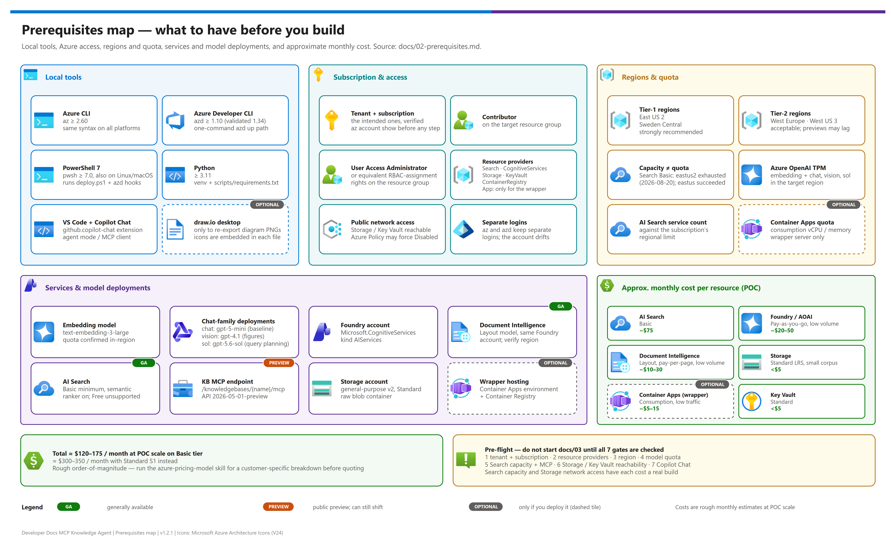

[README](../README.md) › [docs index](./00-reproduce-this-demo.md) › 02 Prerequisites

# 02 — Prerequisites

<p>
&nbsp;
&nbsp;
&nbsp;
&nbsp;
&nbsp;
&nbsp;

</p>

   

Everything required before you start building. Work through this list in order;
[03-deployment.md](./03-deployment.md) assumes all of it is in place.

## At a glance

| | Area | What you need |
|---|---|---|
|  | **Subscription** | Contributor + User Access Administrator on the target resource group; the right tenant |
|  | **AI Search** | Basic or above, semantic ranker on, real regional *capacity* |
|  | **Models** | `text-embedding-3-large` plus chat/vision models, with quota in-region |
|  | **Tooling** | `az`, `azd`, PowerShell 7, Python 3.11, VS Code + GitHub Copilot Chat |

[](./assets/prerequisites-map.png)

<sub>Editable source: [`assets/prerequisites-map.drawio`](./assets/prerequisites-map.drawio) - regenerate with `python scripts/export_diagrams.py docs/assets`.</sub>

> [!IMPORTANT]
> **Plan ahead.** Azure OpenAI model access and AI Search tier selection can involve quota
> requests that take time to clear — check these first.

---

## 0 — Tooling and shell conventions

This pattern runs on **Windows, Linux, and macOS**. Nothing in it is Windows-specific:

| Component | | Cross-platform? | Notes |
|---|---|---|---|
| `azd up` (`azure.yaml` + `infra/hooks/*.ps1`) |  | ✅ | Hooks run under `pwsh` on every platform. |
| `infra/deploy.ps1` |  | ✅ | PowerShell 7 (`pwsh`) runs on all three platforms. Invoke it as `pwsh ./infra/deploy.ps1` everywhere — including Linux and macOS. |
| `scripts/*.py` |  | ✅ | Standard library + `azure-*` / `requests` / `pypdf`. No platform-specific paths. |
| `az` CLI |  | ✅ | Identical syntax on all platforms. |

### Required tools

| Tool | | Minimum | Install |
|---|---|---|---|
| Azure CLI (`az`) |  | 2.60 | <https://aka.ms/installazurecli> |
| Azure Developer CLI (`azd`) |  | 1.10 (validated with 1.34) | <https://aka.ms/azd-install> — for the one-command `azd up` path |
| PowerShell (`pwsh`) |  | 7.0 | <https://aka.ms/powershell> — needed on Linux/macOS too, for `deploy.ps1` and the azd hooks |
| draw.io desktop |  | current | Only to re-export diagram PNGs after editing a `.drawio` (`scripts/export_diagrams.py`). Icons are embedded in each `.drawio`, so no icon library or network access is needed |
| Python |  | 3.11 | <https://python.org> |
| VS Code + **GitHub Copilot Chat** (`github.copilot-chat`) |  | current | For the consumption step in [07](./07-github-copilot-mcp-client-setup.md) |

### Create and activate the virtual environment — the one place the shells differ

Every other command in these docs is **identical on all platforms**, provided you activate the
virtual environment first. Do this once per terminal session:

**PowerShell** (Windows, Linux, macOS):

```powershell
python -m venv .venv
.venv/Scripts/Activate.ps1      # Windows
# .venv/bin/Activate.ps1        # Linux / macOS
pip install -r scripts/requirements.txt
```

**Bash / zsh** (Linux, macOS, WSL, Git Bash):

```bash
python3 -m venv .venv
source .venv/bin/activate
pip install -r scripts/requirements.txt
```

After activation, `python` refers to the virtual environment on every platform, so the rest of
these docs use plain `python ...` with no path prefix.

> [!TIP]
> **Why `az` commands in these docs are written on one line.** Multi-line continuation differs
> per shell — a backtick in PowerShell, a backslash in Bash. Single-line commands paste cleanly
> into any shell, so that is the form used throughout.

---

## 1 — Subscription and tenant

| Requirement | | Detail |
|---|---|---|
| RBAC |  | Contributor + User Access Administrator (or equivalent RBAC-assignment rights) on the target resource group |
| Tenant / subscription |  | Authenticated to the **intended tenant and subscription** before any deployment step |

- An Azure subscription with Contributor + User Access Administrator (or equivalent RBAC-assignment rights) on the target resource group
- Confirm you're authenticated to the **intended tenant and subscription** before any deployment step — see [03-deployment.md § Phase 0](./03-deployment.md#phase-0--authenticate-to-the-right-tenant) and the `azure-cli-auth` instruction. Never assume the active `az`/`azd` account is correct.

> [!WARNING]
> `az` and `azd` keep **separate** logins and the ambient account silently drifts across tenants. Resolve the tenant and subscription explicitly and verify with `az account show` before any token acquisition or resource write.
- An Azure subscription with Contributor + User Access Administrator (or equivalent RBAC-assignment rights) on the target resource group
- Confirm you're authenticated to the **intended tenant and subscription** before any deployment step — see [03-deployment.md § Phase 0](./03-deployment.md#phase-0--authenticate-to-the-right-tenant) and the `azure-cli-auth` instruction. Never assume the active `az`/`azd` account is correct.

## 2 — Resource providers

Register (if not already):

```bash
az provider register --namespace Microsoft.Search
az provider register --namespace Microsoft.CognitiveServices
az provider register --namespace Microsoft.Storage
az provider register --namespace Microsoft.KeyVault
az provider register --namespace Microsoft.App          # only if deploying the fallback MCP server to Container Apps
az provider register --namespace Microsoft.ContainerRegistry
```

## 3 — Azure AI Search

| Requirement | | Detail | Status |
|---|---|---|---|
| Tier |  | **Basic minimum** (Standard S1+ recommended for production) |  |
| Semantic ranker |  | Enabled per service |  |
| Knowledge Base MCP endpoint |  | `/knowledgebases/{name}/mcp` on your API version/region |  |

- **Tier: Basic minimum.** Semantic ranker and Knowledge Bases (agentic retrieval) run on **Basic and above** — the Free tier does not support either. **Standard (S1) or higher is recommended for production/customer-facing workloads** (replica/partition scale, concurrency headroom); Basic is sufficient for a POC-scale demo. Semantic ranker is billed per-query on top of the tier's hourly rate regardless of which tier you pick.
- Confirm **semantic ranker** is enabled on the service (it's a per-service setting, not automatic).
- Confirm whether the **Knowledge Base MCP endpoint** (`/knowledgebases/{name}/mcp`) is enabled on your chosen API version/region — this is real and GA/preview per Microsoft Learn (not a fabricated feature), but exact API version and auth support can still shift. See § 8 below.

## 4 — Azure OpenAI / Microsoft Foundry model access

| Requirement | | Detail |
|---|---|---|
| Foundry account |  | Multi-service `Microsoft.CognitiveServices/accounts`, kind `AIServices` |
| Embeddings |  | `embedding` → `text-embedding-3-large` |
| Baseline pipeline |  | `chat` → `gpt-5-mini` (`2025-08-07`) — baseline / fallback pipeline (`post_deploy_search.py`) |
| Figure verbalization |  | `vision` → `gpt-4.1` (`2025-04-14`) — non-reasoning on purpose (30 s skill timeout) |
| Query planning |  | `sol` → `gpt-5.6-sol` (`2026-07-09`) — Knowledge Base query planning |

- A Foundry multi-service (`Microsoft.CognitiveServices/accounts`, kind `AIServices`) resource with **four model deployments** (all created by Bicep / `azd up`; names and versions in [12 § Models](./12-configuration-reference.md)):
  - `embedding` — `text-embedding-3-large` (embedding vectorizer)
  - `chat` — `gpt-5-mini` (version `2025-08-07`), the baseline pipeline's chat model; upgrade to `gpt-5.4-mini` (version `2026-03-17`) if needed
  - `vision` — `gpt-4.1`, figure verbalization on both tiers; keep it non-reasoning (see [08 § Model selection](./08-extraction-tier-comparison.md#model-selection--match-the-model-to-the-call-site-not-to-a-use-frontier-rule))
  - `sol` — `gpt-5.6-sol`, Knowledge Base query planning
- **Model currency note:** this pattern originally shipped with `gpt-4o-mini`, which Microsoft retires 2026-10-01 (Standard deployments auto-upgrade starting March 2026). It has been replaced with `gpt-5-mini` — always confirm the current model + version against the [Foundry Models sold by Azure catalog](https://learn.microsoft.com/en-us/azure/foundry/foundry-models/concepts/models-sold-directly-by-azure) before deploying, since Microsoft's model catalog and retirement schedule change frequently.
- Confirm model quota in your target region before deploying (§ 8 has the CLI check)

## 5 — Azure AI Document Intelligence

| Requirement | | Detail |
|---|---|---|
| Resource |  | Served by the same Foundry account as § 4 — no separate resource |
| Layout model |  | Verify availability in your target region (§ 8) |

- Served by the same Foundry multi-service account as § 4 (kind `AIServices` supports both Document Intelligence and Azure OpenAI under one resource/endpoint) — no separate resource needed
- Confirm the **Layout model** is available in your target region (it is broadly available, but always verify — § 8)

## 6 — Storage

| Requirement | | Detail |
|---|---|---|
| Storage account |  | General-purpose v2, Standard tier |
| Container |  | `raw` blob container for source PDFs |

- A general-purpose v2 Storage account, Standard tier, with a `raw` blob container for source PDFs

## 7 — Optional custom MCP server wrapper hosting (only if you deploy it)


| Requirement | | Detail |
|---|---|---|
| Container Apps environment |  | Hosts the fallback MCP server |
| Container Registry |  | Builds/stores the fallback MCP server image |

- Azure Container Apps environment + a Container Registry to build the fallback MCP server image
- Alternatively, run the fallback server locally via stdio for single-developer testing (no Azure hosting needed) — see [docs/06-mcp-endpoint-and-fallback-server.md](./06-mcp-endpoint-and-fallback-server.md)

## 8 — Regional & preview-feature availability

> [!WARNING]
> This pattern depends on regional Azure OpenAI model availability **and** on the Azure AI Search Knowledge Base MCP endpoint. The MCP feature itself is real and documented (not a fabricated preview), but exact API versions, tool names, and regional rollout can still shift quickly — this table is a snapshot, not a guarantee.

| Feature | | Status |
|---|---|---|
| Knowledge Bases / native MCP endpoint (API `2026-05-01-preview`) |  |  |
| AI Search index and indexers, Document Intelligence Layout |  |  |

### Tier-1 — strongly recommended (all components current, new previews land first)

| Region | AI Search (Standard, semantic ranker) | Foundry / AOAI (`text-embedding-3-large`, `gpt-5-mini`) | Document Intelligence Layout |
|---|---|---|---|
| East US 2 | ✅ | ✅ | ✅ |
| Sweden Central | ✅ | ✅ | ✅ |

### Tier-2 — acceptable (full stack available, preview features may lag)

| Region | AI Search (Standard, semantic ranker) | Foundry / AOAI | Document Intelligence Layout |
|---|---|---|---|
| West Europe | ✅ | ✅ | ✅ |
| West US 3 | ✅ | ✅ | ✅ |

### Tier-3 — workarounds only

Regions without full-stack support (missing semantic ranker, missing the target embedding/chat model, or missing Layout) should be avoided unless data residency forces the choice. If forced, split the pattern across regions (e.g., AI Search in the residency-required region, Foundry/AOAI in the nearest Tier-1 region) and accept the added latency/egress.

### Verify before you deploy

```bash
# AI Search SKUs available in a region
az search service list-skus -o table

# Confirm semantic ranker + preview API surface manually via the portal, or:
#   GET https://<service>.search.windows.net/?api-version=2026-05-01-preview
# and check the service's "Semantic ranker" setting plus release notes for Knowledge Bases / MCP

# Azure OpenAI model availability in a region
az cognitiveservices account list-models --name <foundry-account-name> --resource-group <rg> --query "[?model.name=='text-embedding-3-large' || model.name=='gpt-5-mini']"

# Document Intelligence Layout model availability is bundled with the Foundry/Cognitive
# Services account -- check the region support table on Microsoft Learn for Document
# Intelligence before committing to a region.
```

> [!NOTE]
> **Publication snapshot: 2026-08-18 (corrected against Microsoft Learn).** Azure AI Search agentic retrieval was renamed from "Knowledge Agents" to "Knowledge Bases" in 2026; GA is REST API `2026-04-01`, with the fuller feature set (answer synthesis, MCP endpoint) at `2026-05-01-preview`. Re-check the current Azure AI Search REST API reference and release notes before you build — do not assume this table (or the API version strings elsewhere in this pattern) are still current.

## 9 — Naming convention (reference)

| Resource | | Pattern | Example (`dev`, `eastus2`) |
|---|---|---|---|
| Resource group |  | `rg-ddmcp-<env>-<region>` | `rg-ddmcp-dev-eastus2` |
| Storage account |  | `stddmcp<env><region>` (no hyphens, <=24 chars) | `stddmcpdeveastus2` |
| AI Search service |  | `srch-ddmcp-<env>-<region>` | `srch-ddmcp-dev-eastus2` |
| Foundry / Cognitive Services account |  | `aif-ddmcp-<env>-<region>` | `aif-ddmcp-dev-eastus2` |
| Key Vault |  | `kv-ddmcp-<env>-<region>` (<=24 chars) | `kv-ddmcp-dev-eastus2` |
| Container Apps environment |  | `cae-ddmcp-<env>-<region>` | `cae-ddmcp-dev-eastus2` |
| Container App (fallback MCP server) |  | `ca-mcp-ddmcp-<env>-<region>` | `ca-mcp-ddmcp-dev-eastus2` |
| Container Registry |  | `acrddmcp<env><region>` (no hyphens) | `acrddmcpdeveastus2` |

## 10 — Quotas to check before you start

| Quota | | Check |
|---|---|---|
| Azure OpenAI TPM |  | `text-embedding-3-large` and your chosen chat model in the target region |
| AI Search service count |  | Against your subscription's regional limit (default 4 free-tier + paid limits vary) |
| Container Apps |  | Default consumption plan vCPU/memory quota if deploying the fallback server |

- Azure OpenAI TPM quota for `text-embedding-3-large` and your chosen chat model in the target region
- AI Search service count against your subscription's regional limit (default 4 free-tier + paid limits vary)
- Container Apps: default consumption plan vCPU/memory quota if deploying the fallback server

## 11 — Rough cost estimate (POC scale, monthly)

| Resource | | SKU | Approx. monthly cost (POC volume) |
|---|---|---|---|
| AI Search |  | Basic | ~$75 |
| Foundry/AOAI |  | Pay-as-you-go, low volume | ~$20-50 |
| Document Intelligence (Layout) |  | Pay-per-page, low volume | ~$10-30 |
| Storage |  | Standard LRS, small corpus | <$5 |
| Container Apps (fallback server) |  | Consumption, low traffic | ~$5-15 |
| Key Vault |  | Standard | <$5 |

> [!NOTE]
> **Total: roughly $120-175/month at POC scale on Basic tier** (roughly $300-350/month if you use Standard S1 instead). This is a rough order-of-magnitude estimate — run the `azure-pricing-model` skill for a precise, customer-specific breakdown before quoting.

## Pre-flight checklist

Confirm all of these before moving to [03-deployment.md](./03-deployment.md):

| Step | | Action | Gate |
|---|---|---|---|
| **1** |  | Authenticate to the intended tenant + subscription | ☐ `az account show` verified |
| **2** |  | Register resource providers (§ 2) | ☐ providers registered |
| **3** |  | Choose a region from the Tier-1/2 list (§ 8) | ☐ re-verified against Microsoft Learn |
| **4** |  | Confirm model quota (§ 10) | ☐ embedding + chat model quota in-region |
| **5** |  | Confirm AI Search capacity, semantic ranker and MCP availability | ☐ capacity, not just tier |
| **6** |  | Confirm Storage / Key Vault network reachability | ☐ corpus upload possible |
| **7** |  | Confirm VS Code + GitHub Copilot Chat | ☐ `github.copilot-chat` installed and signed in |

> [!CAUTION]
> Do not start [03-deployment.md](./03-deployment.md) until every gate above is checked. Two of them — AI Search capacity and Storage network access — have each cost a real build.

The same list, in full:

- [ ] Authenticated to the intended tenant + subscription (`az account show` verified)
- [ ] Resource providers registered (§ 2)
- [ ] Target region chosen from the Tier-1/2 list (§ 8), re-verified against current Microsoft Learn
- [ ] Azure OpenAI model quota confirmed for `text-embedding-3-large` + chosen chat model in that region
- [ ] AI Search Basic tier (or higher) confirmed available in that region, with semantic ranker
- [ ] Knowledge Bases / native MCP endpoint availability checked for that region/API version (or you've accepted the fallback-only path for v1)
- [ ] A technical document corpus (PDFs) ready to upload — see [samples/README.md](../samples/README.md)
- [ ] **AI Search regional *capacity* confirmed, not just tier availability** — a region can list Basic as available and still reject creation with `InsufficientResourcesAvailable`. Verified 2026-08-20: `eastus2` was exhausted, `eastus` succeeded. This is capacity, not quota; retrying in the same region does not help.
- [ ] **Storage / Key Vault public network access confirmed reachable.** In governed subscriptions an Azure Policy may force `publicNetworkAccess: Disabled` and silently revert an explicit re-enable. Key Vault is survivable (the scripts fall back to the Search control plane); Storage is not — you cannot upload the corpus. See [05-troubleshooting.md § 1](./05-troubleshooting.md#1--foundation-bicep-deploy) for the Network Security Perimeter path.
- [ ] VS Code with the **GitHub Copilot Chat extension** (`github.copilot-chat`) installed and signed in, with agent mode / MCP client support enabled. Verify with `code --list-extensions | Select-String copilot` — note that `ms-azuretools.vscode-azure-github-copilot` is a *different* extension and does **not** provide Copilot Chat. This tripped the 2026-08-20 dogfood run: the endpoint was fully working while the client leg was untestable because Copilot Chat simply wasn't installed.

---

Next: [03 - Deployment](./03-deployment.md) →

*Last updated: 2026-10-02*
