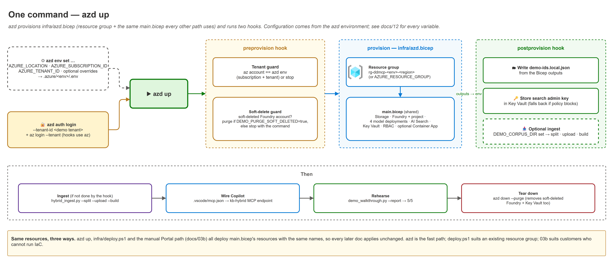

# 03 — Deployment

Step-by-step build of the Developer Docs MCP Knowledge Base pattern via Bicep/IaC. Assumes all of [02-prerequisites.md](./02-prerequisites.md) is complete.

> **Don't want to use Bicep?** See [03b-manual-deployment.md](./03b-manual-deployment.md) for a complete Azure Portal + imperative CLI alternative that produces the same resources — useful when a customer's environment doesn't allow IaC deployments.

> **Fastest path: `azd up`.** One command provisions everything in Phases 1–2 (resource group,
> all four model deployments, `demo-ids.local.json`, the Key Vault secret) and can ingest a corpus
> too. See [Fast path — azd up](#fast-path--azd-up) below. The phases after it are the
> `deploy.ps1` path and the reference for what azd does.

> **Build order matters.** Phases are sequential — each depends on artifacts from the prior phase. For the full "clone and stand up from scratch" experience with time budgets, see [docs/00-reproduce-this-demo.md](./00-reproduce-this-demo.md).

---

## Fast path — azd up

[](./assets/azd-up-flow.png)

<sub>Editable source: [`assets/azd-up-flow.drawio`](./assets/azd-up-flow.drawio).</sub>

```bash
# 1. Sign both CLIs in to the DEMO tenant -- azd provisions with its own login,
#    the hooks and scripts use az. Never rely on whichever account is ambient.
azd auth login --tenant-id <entra-tenant-guid>
az login --tenant <entra-tenant-guid>
az account set --subscription <azure-subscription-guid>

# 2. Create an environment (1-12 lowercase letters/digits -- it is part of every resource name)
azd env new dev
azd env set AZURE_TENANT_ID <entra-tenant-guid>
azd env set AZURE_SUBSCRIPTION_ID <azure-subscription-guid>
azd env set AZURE_LOCATION eastus2

# 3. Optional: ingest a corpus in the same run (activate .venv first, docs/02 § 0)
azd env set DEMO_CORPUS_DIR ./samples/corpus
azd env set DEMO_PYTHON .venv/Scripts/python      # .venv/bin/python on Linux/macOS

# 4. Preview, then deploy
azd provision --preview
azd up
```

| Step | What azd runs | Same as |
|---|---|---|
| preprovision hook | Environment-name guard; `az` must match the azd subscription/tenant; soft-deleted Foundry account purged (`DEMO_PURGE_SOFT_DELETED=true`) or reported | Phase 0 + `deploy.ps1`'s soft-delete check |
| provision | `infra/azd.bicep`: resource group + **the same `main.bicep`** (Storage, Foundry + project, `embedding` · `chat` · `vision` · `sol`, AI Search, Key Vault, RBAC, optional Container App) | Phase 1 and the model step of Phase 2 |
| postprovision hook | Writes `demo-ids.local.json` from the outputs, stores the Search admin key in Key Vault, ingests `DEMO_CORPUS_DIR` if set | `deploy.ps1`'s tail + Phase 2 §§ 2.2–2.4 |

Every setting — region, resource group, models, capacities, SKU, hook behaviour — is an azd
environment variable listed in [12-configuration-reference.md](./12-configuration-reference.md).
Re-run only the hooks with `azd hooks run postprovision`; tear everything down with
`azd down --purge` (also purges the soft-deleted Foundry account and Key Vault, so a redeploy
with the same names works).

### Fast-path validation

- [ ] `azd up` ends with `[postprovision] Done`
- [ ] `azd env get-values` shows `SEARCH_ENDPOINT`, `VISION_DEPLOYMENT=vision`, `FRONTIER_DEPLOYMENT=sol`
- [ ] `demo-ids.local.json` exists at the repo root
- [ ] Continue at [Phase 3](#phase-3--knowledge-base--mcp-endpoint) (or Phase 2 § 2.2 if you didn't set `DEMO_CORPUS_DIR`)

---

## Phase overview

| Phase | What you build | ~Time | Validation at end |
|---|---|---|---|
| 0 | Authenticate to the intended tenant + subscription | 2 min | `az account show` matches target |
| 1 | Foundation resources (RG, Storage, Key Vault, Foundry + project, Search) via Bicep | 20-40 min | All resources `Succeeded`; RBAC assigned |
| 2 | Route the corpus by page count, build **both** ingestion tiers (all four model deployments now come from Phase 1's Bicep) | 20 min setup + ingestion | Both indexers `success`; index has rows from every tier routed to |
| 3 | Knowledge Base + verify the native MCP endpoint | 10 min | Retrieve call returns grounded, cited passages |
| 4 | Optional custom wrapper MCP server | 45 min | Container App responds to an MCP `tools/list` call |
| 5 | Wire GitHub Copilot / VS Code | 15 min | Copilot Chat (agent mode) answers a corpus question with a citation |

**Total hands-on time: ~1.5 hours.** Wall-clock is dominated by **ingestion**, which scales
with the corpus: Tier CU is fast, but Tier DI+ makes one vision call per extracted figure and
took ~45 minutes for a single 906-page specification. Phase 4 is optional and was not needed
in the reference build.

---

## Phase 0 — Authenticate to the right tenant

> **Multi-tenant safety.** The active `az`/`azd` account drifts between tenants. Set it explicitly before building — never trust the ambient login.

```bash
# 1. Verify which tenant/subscription az is currently pointed at
az account show --query "{tenant:tenantId, subscription:id, name:name}" -o table

# 2. If it does NOT match your intended target, correct it.
#    Substitute your own values -- they are in demo-ids.local.json once you have one.
az login --tenant <entra-tenant-guid>          # add --use-device-code when headless
az account set --subscription <azure-subscription-guid>

# 3. Re-verify before deploying anything
az account show --query "{tenant:tenantId, subscription:id, name:name}" -o table
```

### Phase 0 validation

- [ ] `az account show` returns the intended tenant **and** subscription

---

## Phase 1 — Foundation resources

### 1.1 Create the resource group

```bash
az group create --name rg-ddmcp-dev-eastus --location eastus
```

> `deploy.ps1` creates the resource group for you if it does not exist, so this step is
> optional — it is here for the manual/portal path.

### 1.2 Deploy the Bicep template

```bash
cd infra
./deploy.ps1 -Environment $Env -Region $Region -ResourceGroup "rg-ddmcp-$Env-$Region"
```

`deploy.ps1` runs `az deployment group create` against `main.bicep`, which provisions (see `infra/modules/`):

- `storage.bicep` — Storage account + `raw` blob container
- `foundry.bicep` — Cognitive Services multi-service account (kind `AIServices`) + Foundry project + four model deployments, created one after another: `embedding` (`text-embedding-3-large`), `chat` (`gpt-5-mini`), `vision` (`gpt-4.1`) and `sol` (`gpt-5.6-sol`). Models, versions and capacities are parameters ([12 § 1.3](./12-configuration-reference.md#13-models))
- `search.bicep` — AI Search service (Standard tier, semantic ranker enabled)
- `keyvault.bicep` — Key Vault for the Search admin key + any secrets the fallback server needs
- `rbac.bicep` — role assignments (deployer + Search system-assigned MI → Storage Blob Data Reader; deployer → Key Vault Secrets Officer)
- `containerapp.bicep` — Container Apps environment + registry, only if `-DeployFallbackServer` is passed (Phase 4)

`deploy.ps1` writes the resulting resource names/endpoints into `demo-ids.local.json` (gitignored) automatically.

### 1.3 RBAC wiring

Confirm the automatic role assignments from `rbac.bicep`:

```bash
az role assignment list --resource-group "rg-ddmcp-$Env-$Region" -o table
```

### Phase 1 validation

- [ ] All 5 (or 6, if `-DeployFallbackServer`) resources show `Succeeded` in `az deployment group show`
- [ ] `demo-ids.local.json` populated with real resource names/endpoints
- [ ] Role assignments present for the Search service MI and your deployer identity

---

## Phase 2 — Hybrid ingestion

Ingestion routes each document to the extraction tier that handles it best, then lands both
tiers in **one** index. See [01-architecture.md](./01-architecture.md#ingestion-tiers) for the
design and [08-extraction-tier-comparison.md](./08-extraction-tier-comparison.md) for the
measured justification and cost.

### 2.1 Frontier model deployments (now created by the Bicep)

Phase 1 (and `azd up`) creates `vision` and `sol` alongside `embedding` and `chat`, so there is
nothing to do here by default. Create them by hand only if you deployed with
`deployHybridModels=false` / `DEPLOY_HYBRID_MODELS=false` (for example because the models
already exist). Names must match `demo-ids.local.json` (`visionDeployment`,
`frontierDeployment`):

```bash
# Figure verbalization, BOTH tiers. Deliberately a NON-reasoning model: the
# vision skill has a fixed 30s timeout whose failure mode is total (one slow
# figure fails the whole document), so latency variance matters more than
# capability. See docs/08 § Model selection.
#
# CAPACITY IS A RELIABILITY SETTING HERE, not a cost setting. A deployment's
# requests-per-minute limit scales with capacity (capacity 400 -> 400 req/min),
# AI Search fires figure calls concurrently, and `degreeOfParallelism` was
# removed from the skill in API 2026-04-01 -- so there is no way to throttle
# from the AI Search side. Under-provision this and ingestion fails with a
# misleading 30s *timeout* even though each call takes ~7s.
az cognitiveservices account deployment create -n <foundry> -g <rg> --deployment-name vision --model-name gpt-4.1 --model-version 2025-04-14 --model-format OpenAI --sku-name GlobalStandard --sku-capacity 1000

# Knowledge-base query planning. Frontier -- no timeout pressure here.
az cognitiveservices account deployment create -n <foundry> -g <rg> --deployment-name sol --model-name gpt-5.6-sol --model-version 2026-07-09 --model-format OpenAI --sku-name GlobalStandard --sku-capacity 200
```

> A brand-new deployment takes a few minutes to become usable, and the failure looks like
> three different problems depending on which skill hits it first:
> - Content Understanding: `DeploymentIdNotFound` — *"the OpenAI deployment 'x' does not exist"*
> - Content Understanding: `FigureUnderstandingSkipped` — *"figure understanding was skipped because the model deployment returned an error"*
> - Vision skill: `Web Api skill response is invalid` wrapping an `InternalServerError`
>
> All three mean the same thing: the deployment is not serving yet, even though
> `az cognitiveservices account deployment list` already reports `Succeeded`. Confirm with a
> direct chat-completions call; once that returns 200, reset and re-run the indexers. Do not
> start changing skillset configuration — nothing is wrong with it.

### 2.2 Route the corpus (free — no service calls)

```bash
cd ../scripts
pip install -r requirements.txt
python hybrid_ingest.py --ids-file ../demo-ids.local.json --plan --source-dir "<path-to-your-pdfs>"
```

Page count is read locally, so routing costs nothing and no document is processed twice. This
output is also the input to a cost estimate — see
[08 § Cost model](./08-extraction-tier-comparison.md#cost-model).

See [samples/README.md](../samples/README.md) if you don't have a corpus ready — do **not** use
copyrighted vendor manuals in a shared or customer-facing demo without checking redistribution
rights.

### 2.3 Upload into the tier prefixes

```bash
python hybrid_ingest.py --ids-file ../demo-ids.local.json --upload --split --source-dir "<path-to-your-pdfs>"
```

Documents land under `raw/cu/` (≤ 300 pages) or `raw/di/` (> 300 pages). Each tier's data
source scopes to its own folder — AI Search indexers cannot filter on page count, but they can
scope to a prefix.

| Flag | Oversized documents (> 300 pages) | Use when |
|---|---|---|
| `--split` | Split into page-ranged parts; every part goes to Tier CU | **Default choice** — best quality, and a failure costs one part instead of a whole manual |
| `--no-split` | Kept whole; routed to Tier DI+ | Splitting is unacceptable (e.g. the document must stay one unit for audit) |
| neither | `--upload` **stops before uploading anything** and lists the oversized files | — forces the choice to be deliberate |

### 2.4 Build both tiers and ingest

```bash
python hybrid_ingest.py --ids-file ../demo-ids.local.json --build
```

[`scripts/hybrid_ingest.py`](../scripts/hybrid_ingest.py) creates, in order:

1. The unified `idx-documents-hybrid` index (schema in
   [01-architecture.md](./01-architecture.md#the-unified-index))
2. `skillset-hybrid-cu` — Content Understanding (semantic chunking + figure descriptions)
3. `skillset-hybrid-di` — Document Layout + Split + embedding **+ vision skill** for figure
   verbalization
4. `ds-hybrid-cu` / `ds-hybrid-di` data sources scoped to the two blob prefixes
5. `ixr-hybrid-cu` / `ixr-hybrid-di` indexers
6. `ks-hybrid` knowledge source and `kb-hybrid` knowledge base (`outputMode: extractiveData`)

then starts both indexers.

### 2.5 Confirm ingestion succeeded

```bash
python hybrid_ingest.py --ids-file ../demo-ids.local.json --status
```

**Expect Tier DI+ to be slow** — one vision call per extracted figure. A 906-page
specification took roughly 45 minutes. Tier CU is much faster.

### Phase 2 validation

- [ ] Both indexers report `success` with 0 failed items
- [ ] The index contains rows from **every tier you routed to** — check the `extractionTier`
      facet, not just the total row count
- [ ] `contentKind: image-description` rows exist if any routed document contains figures
- [ ] A Search Explorer query returns chunks with a populated `sectionLabel` (Tier DI+) or
      `pageNumberFrom` / `pageNumberTo` (Tier CU)

---

## Phase 3 — Knowledge Base + MCP endpoint

*Full reference — endpoint paths, API versions, the native-vs-wrapper decision, and exact REST
payloads — lives in
[docs/06-mcp-endpoint-and-fallback-server.md](./06-mcp-endpoint-and-fallback-server.md). This
phase is the short version.*

### 3.1 The Knowledge Base

`hybrid_ingest.py --build` already created `kb-hybrid` over the unified index with
`outputMode: extractiveData`.

> **`extractiveData` is required, not a preference.** The native MCP tool accepts only a
> `queries` array and cannot request reference source data, so under `answerSynthesis` the
> client receives a synthesised *"I cannot access external documents"* non-answer while direct
> REST retrieval works fine.

### 3.2 Verify the native MCP endpoint

```bash
python post_deploy_search.py --ids-file ../demo-ids.local.json --check-mcp-endpoint
```

If this succeeds you have a working native MCP endpoint — skip to Phase 5. Phase 4's custom
wrapper is optional and was **not** needed in the reference build.

### Phase 3 validation

- [ ] `knowledgebases/kb-hybrid` returns 200
- [ ] A direct `retrieve` call returns grounded passages with citations
- [ ] MCP endpoint availability recorded in `demo-ids.local.json`

---

## Phase 4 — Optional custom wrapper server (skip if Phase 3's native check succeeded and you don't want it)

*Full reference in [docs/06-mcp-endpoint-and-fallback-server.md](./06-mcp-endpoint-and-fallback-server.md). This wrapper is not required for a working demo — see § 4 there for why you might still want it (token lifecycle, custom processing, network controls).*

```bash
cd ../infra
./deploy.ps1 -Environment $Env -Region $Region -ResourceGroup "rg-ddmcp-$Env-$Region" -DeployFallbackServer
cd ../scripts
./deploy_mcp_server.ps1 -IdsFile ../demo-ids.local.json
```

`deploy_mcp_server.ps1` builds `mcp_fallback_server.py` into a container image via `az acr build` and deploys/updates the Container App.

### Phase 4 validation

- [ ] Container App shows `Running` / `Succeeded` provisioning state
- [ ] A request against the Container App's `/mcp` endpoint returns a valid `tools/list` response

---

## Phase 5 — Wire GitHub Copilot / VS Code

*Full reference in [docs/07-github-copilot-mcp-client-setup.md](./07-github-copilot-mcp-client-setup.md).*

1. Add a `.vscode/mcp.json` in the target workspace pointing at whichever endpoint you validated (native from Phase 3, or fallback from Phase 4)
2. Reload the VS Code window; confirm the MCP server shows as connected in the Copilot Chat tools list
3. Ask a corpus question in Copilot Chat (agent mode) and confirm the response cites a source document + heading path

### Phase 5 validation

- [ ] MCP server shows connected in VS Code's MCP server list
- [ ] A test question in Copilot Chat returns an answer with a document/section citation traceable back to the source PDF

---

## Post-deployment checklist

- [ ] All Phase 0-5 validation boxes checked
- [ ] **Both tiers verified contributing** — check the `extractionTier` facet, not just row count
- [ ] Indexer schedule configured if the corpus will be updated regularly (or documented as manual re-run)
- [ ] Cost alert configured on the resource group (see [08 § Cost model](./08-extraction-tier-comparison.md#cost-model))
- [ ] `demo-ids.local.json` backed up somewhere safe (not committed) if you'll tear down and rebuild
- [ ] Owner identified for keeping the corpus current as source documents change
- [ ] Teardown planned — AI Search Basic and the model deployments bill continuously:
      `python hybrid_ingest.py --ids-file ../demo-ids.local.json --teardown` then
      `az group delete --name <rg> --yes --no-wait`

---

*Last updated: 2026-09-30*
