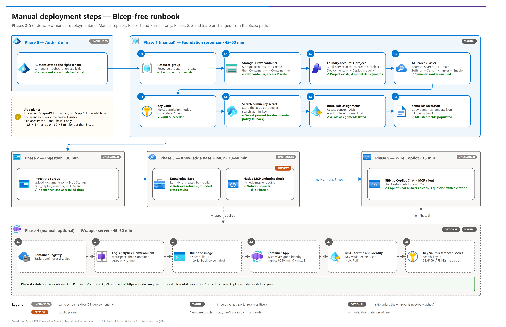

[README](../README.md) › [docs index](./00-reproduce-this-demo.md) › 03b Manual deployment

# 03b — Manual Deployment (No Bicep / IaC)

<p>
&nbsp;
&nbsp;
&nbsp;
&nbsp;
&nbsp;

</p>

   

A complete alternative to [03-deployment.md](./03-deployment.md) for customers who can't or don't want to run Bicep/IaC. Every resource below is created with imperative `az` CLI commands (with the Azure Portal equivalent noted per step) and produces the **same** resource shapes, names, and RBAC assignments as `infra/main.bicep` — so Phases 2, 3, and 5 (which are already infrastructure-agnostic; they call the same Python scripts against whatever Search/Foundry resources exist) are **not duplicated here** — this doc only replaces Phase 1 (foundation resources) and Phase 4 (optional custom wrapper server) with a Bicep-free equivalent.

## At a glance

| | Topic | One-line answer |
|---|---|---|
|  | **Use when** | Bicep/ARM deployments are blocked, no Bicep CLI is available, or you want each resource created visibly (workshop) |
|  | **Replaces** | Phase 1 (foundation resources) and Phase 4 (optional wrapper server) only |
|  | **Unchanged** | Phases 2, 3 and 5 call the same Python scripts — follow [03-deployment.md](./03-deployment.md) |
|  | **Trade-off** | About 3.5-4.5 hours hands-on — roughly 30-45 minutes longer than the Bicep path |

> [!NOTE]
> **When to use this instead of `03-deployment.md`:** the customer's environment doesn't allow Bicep/ARM template deployments, the operator doesn't have Bicep CLI tooling available, or you want to demonstrate each resource being created individually (useful for a workshop/teaching context). Otherwise, `03-deployment.md`'s Bicep path is faster and less error-prone — use this doc as the exception, not the default.

> [!TIP]
> **If IaC *is* allowed,** `azd up` is the fastest path: one command, same resources and names. See [03 § Fast path — azd up](./03-deployment.md#fast-path--azd-up).

[](./assets/manual-deployment-steps.png)

<sub>Editable source: [`assets/manual-deployment-steps.drawio`](./assets/manual-deployment-steps.drawio) - regenerate with `python scripts/export_diagrams.py docs/assets`.</sub>

---

## Phase overview (manual path)

| | Phase | What you build | ~Time | Validation at end |
|---|---|---|---|---|
|  | 0 | Authenticate to the intended tenant + subscription | 2 min | `az account show` matches target |
|  | 1 (manual) | Foundation resources (RG, Storage, Key Vault, Foundry, Search) via imperative `az` commands | 45-60 min | All 5 resources exist; RBAC assigned |
|  | 2 | Same as [03-deployment.md § Phase 2](./03-deployment.md#phase-2--hybrid-ingestion) — unchanged | 30 min | Indexer run shows 0 failed docs |
|  | 3 | Same as [03-deployment.md § Phase 3](./03-deployment.md#phase-3--knowledge-base--mcp-endpoint) — unchanged | 30-60 min | Retrieve call returns grounded, cited results |
|  | 4 (manual) | Optional custom wrapper server via imperative `az` commands (skip if the native endpoint check in Phase 3 succeeded and you don't want the wrapper) | 45-60 min | Container App responds to an MCP `tools/list` call |
|  | 5 | Same as [03-deployment.md § Phase 5](./03-deployment.md#phase-5--wire-github-copilot--vs-code) — unchanged | 15 min | Copilot Chat answers a corpus question with a citation |

**Total manual build: ~3.5-4.5 hours of hands-on time** — roughly 30-45 minutes longer than the Bicep path (Phase 1 has more individual steps, and there's no single `deploy.ps1` writing `demo-ids.local.json` for you — you populate it by hand as you go, per the sub-steps below).

---

## Phase 0 — Authenticate to the right tenant

> [!WARNING]
> Set the tenant and subscription explicitly before creating anything — `az` and `azd` keep separate logins, and ambient state can point at a different tenant. Verify with `az account show` before the first resource is created.

Identical to the Bicep path — see [03-deployment.md § Phase 0](./03-deployment.md#phase-0--authenticate-to-the-right-tenant). Do this first regardless of which deployment path you use.

---

## Phase 1 (manual) — Foundation resources

Portal step cards — one per resource, in dependency order (each links to the CLI + portal detail below):

| Step | | Resource — portal path | Gate |
|---|---|---|---|
| **1.0** |  | Resource groups → + Create → region | ☐ Resource group exists |
| **1.1** |  | Storage accounts → + Create → then Containers → + Container `raw` ([§ 1.1](#11-storage-account--raw-container)) | ☐ `raw` container, public access Private |
| **1.2** |  | Foundry / AI services multi-service account → **create a project** → Deployments → + Deploy model ×4 ([§ 1.2](#12-foundry-multi-service-account-document-intelligence--azure-openai)) | ☐ Project exists, 4 model deployments |
| **1.3** |  | Azure AI Search → + Create (Basic) → Settings → Semantic ranker → Enable ([§ 1.3](#13-azure-ai-search)) | ☐ Semantic ranker enabled |
| **1.4** |  | Key Vaults → + Create (RBAC permission model, soft-delete 7 days) ([§ 1.4](#14-key-vault)) | ☐ Vault `Succeeded` |
| **1.5** |  | Store the Search admin key as secret `search-admin-key` ([§ 1.5](#15-store-the-search-admin-key-in-key-vault)) | ☐ Secret present (or documented policy fallback) |
| **1.6** |  | Access control (IAM) → + Add role assignment ×4 ([§ 1.6](#16-rbac-role-assignments)) | ☐ 4 role assignments listed |
| **1.7** |  | Copy `demo-ids.template.json` → `demo-ids.local.json` and fill it in ([§ 1.7](#17-populate-demo-idslocaljson)) | ☐ All listed fields populated |

Set shared variables first (PowerShell):

> [!NOTE]
> **Shell note.** Only variable *assignment* differs between shells — `$Rg`, `$Storage` and
> friends are *referenced* identically in PowerShell and bash, so every command after this
> block is the same on all platforms. Set the variables using whichever form matches your shell.

```powershell
# PowerShell (any OS)
$Env = "dev"; $Region = "eastus"; $Workload = "ddmcp"
$Rg = "rg-$Workload-$Env-$Region"
$Storage = "st$Workload$Env$Region"          # lowercase, no hyphens, <=24 chars
$Foundry = "aif-$Workload-$Env-$Region"
$Search  = "srch-$Workload-$Env-$Region"
$Kv      = "kv-$Workload-$Env-$Region"        # <=24 chars
```

```bash
# bash / zsh
Env=dev; Region=eastus; Workload=ddmcp
Rg="rg-$Workload-$Env-$Region"
Storage="st$Workload$Env$Region"             # lowercase, no hyphens, <=24 chars
Foundry="aif-$Workload-$Env-$Region"
Search="srch-$Workload-$Env-$Region"
Kv="kv-$Workload-$Env-$Region"               # <=24 chars
```

Then, on any platform:

```bash
az group create --name $Rg --location $Region
```

**Portal equivalent:** Azure Portal → Resource groups → + Create → name `rg-ddmcp-dev-eastus2`, region East US 2.

### 1.1 Storage account + `raw` container

```bash
az storage account create --name $Storage --resource-group $Rg --location $Region --sku Standard_LRS --kind StorageV2 --min-tls-version TLS1_2 --allow-blob-public-access false --https-only true

az storage container create --account-name $Storage --name raw --public-access off --auth-mode login
```

**Portal equivalent:** Storage accounts → + Create (Standard_LRS, StorageV2, `Secure transfer required` = Enabled, `Allow Blob public access` = Disabled) → after creation, Containers → + Container named `raw`, Public access level = Private.

### 1.2 Foundry multi-service account (Document Intelligence + Azure OpenAI)

```bash
az cognitiveservices account create --name $Foundry --resource-group $Rg --location $Region --kind AIServices --sku S0 --custom-domain $Foundry --assign-identity

# A Foundry PROJECT is required -- without one, Content Understanding and other
# Foundry-surfaced capabilities fail. The Bicep path creates this automatically;
# the first manual build of this pattern had to add it by hand in the portal.
az rest --method put --url "https://management.azure.com/subscriptions/$SubId/resourceGroups/$Rg/providers/Microsoft.CognitiveServices/accounts/$Foundry/projects/$Foundry-project?api-version=2025-06-01" --headers "Content-Type=application/json" --body "{`"location`":`"$Region`",`"identity`":{`"type`":`"SystemAssigned`"},`"properties`":{`"displayName`":`"$Foundry-project`"}}"

# Model deployments -- verify current name/version/SKU against the Foundry model
# catalog (https://learn.microsoft.com/azure/foundry/foundry-models/concepts/models-sold-directly-by-azure)
# before deploying; values below were current as of 2026-08-21.
az cognitiveservices account deployment create --name $Foundry --resource-group $Rg --deployment-name embedding --model-name text-embedding-3-large --model-version "1" --model-format OpenAI --sku-name Standard --sku-capacity 30

# Agentic retrieval spends this on query planning AND answer generation per call;
# 10K TPM returns HTTP 429 on the very first query.
az cognitiveservices account deployment create --name $Foundry --resource-group $Rg --deployment-name chat --model-name gpt-5-mini --model-version "2025-08-07" --model-format OpenAI --sku-name GlobalStandard --sku-capacity 150

# --- Frontier models used by the hybrid ingestion path ---------------------
# Image verbalization + knowledge-base query planning (no model allowlist)
az cognitiveservices account deployment create --name $Foundry --resource-group $Rg --deployment-name sol --model-name gpt-5.6-sol --model-version "2026-07-09" --model-format OpenAI --sku-name GlobalStandard --sku-capacity 200

# Content Understanding figure descriptions -- CU enforces its OWN model
# allowlist that lags the Foundry catalog, so this is deliberately a different
# (slightly older) model than `sol`. See docs/08 § Model selection.
az cognitiveservices account deployment create --name $Foundry --resource-group $Rg --deployment-name cu-frontier --model-name gpt-5.5 --model-version "2026-04-24" --model-format OpenAI --sku-name GlobalStandard --sku-capacity 200
```

**Portal equivalent:** Azure AI Foundry portal (or Azure Portal → Azure AI services → + Create → "Azure AI services multi-service account") → kind `AIServices`, S0 pricing tier → create a **project** in the Foundry portal → then Deployments → + Deploy model, once each for `text-embedding-3-large`, `gpt-5-mini`, `gpt-5.6-sol`, and `gpt-5.5`.

> [!IMPORTANT]
> **A brand-new deployment is not immediately resolvable.** Content Understanding can return `DeploymentIdNotFound` for a deployment the control plane already reports `Succeeded` — wait a few minutes and re-run.

> **Both Document Intelligence and Azure OpenAI are served from this single resource** — no separate Document Intelligence account needed (see [01-architecture.md](./01-architecture.md)).

### 1.3 Azure AI Search

```bash
az search service create --name $Search --resource-group $Rg --location $Region --sku basic --partition-count 1 --replica-count 1 --identity-type SystemAssigned

# Semantic ranker is a per-service setting not exposed by az search service create --
# enable it via the portal (Settings -> Semantic ranker -> Enable) or:
az rest --method PATCH --uri "https://management.azure.com/subscriptions/$(az account show --query id -o tsv)/resourceGroups/$Rg/providers/Microsoft.Search/searchServices/${Search}?api-version=2024-06-01-preview" --body '{"properties":{"semanticSearch":"standard"}}'
```

**Portal equivalent:** Azure AI Search → + Create → **Basic** tier (POC scale; use Standard S1+ for production) → after creation, Settings → Semantic ranker → Enable "Standard" plan.

> **Tier note:** Basic is sufficient for semantic ranker and Knowledge Bases at demo/POC scale. Use Standard (S1) or higher for production/customer-facing workloads (replica/partition scale, concurrency headroom) — see [02-prerequisites.md § 3](./02-prerequisites.md).

### 1.4 Key Vault

```bash
az keyvault create --name $Kv --resource-group $Rg --location $Region --sku standard --enable-rbac-authorization true --enable-soft-delete true --retention-days 7
```

**Portal equivalent:** Key Vaults → + Create → Standard tier, "Azure role-based access control" permission model, soft-delete retention 7 days.

### 1.5 Store the Search admin key in Key Vault

```powershell
# PowerShell
$SearchAdminKey = az search admin-key show --service-name $Search --resource-group $Rg --query primaryKey -o tsv
az keyvault secret set --vault-name $Kv --name search-admin-key --value $SearchAdminKey
```

```bash
# bash / zsh
SearchAdminKey=$(az search admin-key show --service-name $Search --resource-group $Rg --query primaryKey -o tsv)
az keyvault secret set --vault-name $Kv --name search-admin-key --value $SearchAdminKey
```

> In governed subscriptions this call can fail with `Public network access is disabled`. That is
> expected and non-blocking — the setup scripts fall back to reading the key from the Search
> control plane. See [05 § 1](./05-troubleshooting.md#1--foundation-bicep-deploy).

You'll need `Key Vault Secrets Officer` on yourself first (see § 1.6) if RBAC authorization denies this call.

### 1.6 RBAC role assignments

Four role assignments, matching `infra/modules/rbac.bicep` exactly:

```powershell
# PowerShell -- capture the three IDs the role assignments need
$SubId = az account show --query id -o tsv
$SearchPrincipalId = az search service show --name $Search --resource-group $Rg --query identity.principalId -o tsv
$MyPrincipalId = az ad signed-in-user show --query id -o tsv          # or your deployer service principal's object ID
```

```bash
# bash / zsh -- same three IDs
SubId=$(az account show --query id -o tsv)
SearchPrincipalId=$(az search service show --name $Search --resource-group $Rg --query identity.principalId -o tsv)
MyPrincipalId=$(az ad signed-in-user show --query id -o tsv)          # or your deployer service principal's object ID
```

Then, on any platform:

```bash

# AI Search MI -> Storage Blob Data Reader (indexer reads raw PDFs)
az role assignment create --assignee-object-id $SearchPrincipalId --assignee-principal-type ServicePrincipal --role "Storage Blob Data Reader" --scope "/subscriptions/$SubId/resourceGroups/$Rg/providers/Microsoft.Storage/storageAccounts/$Storage"

# AI Search MI -> Cognitive Services User (skillset calls Document Intelligence + AOAI embeddings)
az role assignment create --assignee-object-id $SearchPrincipalId --assignee-principal-type ServicePrincipal --role "Cognitive Services User" --scope "/subscriptions/$SubId/resourceGroups/$Rg/providers/Microsoft.CognitiveServices/accounts/$Foundry"

# You (deployer) -> Key Vault Secrets Officer (to write/read the search-admin-key secret)
az role assignment create --assignee-object-id $MyPrincipalId --assignee-principal-type User --role "Key Vault Secrets Officer" --scope "/subscriptions/$SubId/resourceGroups/$Rg/providers/Microsoft.KeyVault/vaults/$Kv"

# You (deployer) -> Storage Blob Data Contributor (upload_documents.py needs data-plane write)
az role assignment create --assignee-object-id $MyPrincipalId --assignee-principal-type User --role "Storage Blob Data Contributor" --scope "/subscriptions/$SubId/resourceGroups/$Rg/providers/Microsoft.Storage/storageAccounts/$Storage"
```

**Portal equivalent:** each resource's **Access control (IAM)** blade → + Add role assignment → pick the role → assign to the AI Search service's managed identity (for the two Search MI assignments) or to yourself (for the two deployer assignments).

> RBAC role assignments can take a few minutes to propagate — if a subsequent script call gets a 403, wait 2-5 minutes and retry before troubleshooting further.

### 1.7 Populate `demo-ids.local.json`

Copy `demo-ids.template.json` to `demo-ids.local.json` (gitignored) and fill in the fields you now have: `resourceGroup`, `storageAccount`, `blobEndpoint`, `foundryResource`, `foundryOpenAIEndpoint`, `documentIntelligenceEndpoint`, `searchService`, `searchEndpoint`, `searchPrincipalId`, `keyVault`, `keyVaultUri`. The Bicep path's `deploy.ps1` does this automatically; the manual path does it by hand once, here.

### Phase 1 (manual) validation

- [ ] Storage account, Foundry account (with 4 model deployments: `embedding`, `chat`, `vision`, `sol`), Search service, and Key Vault all show `Succeeded`/exist in the portal
- [ ] `demo-ids.local.json` populated with the fields listed in § 1.7
- [ ] All 4 role assignments in § 1.6 present (`az role assignment list --resource-group $Rg -o table`)
- [ ] Search admin key stored as a Key Vault secret named `search-admin-key`

---

## Phase 2 — Ingestion

**No changes from the Bicep path.** `scripts/upload_documents.py` and `scripts/post_deploy_search.py` call the AI Search / Blob Storage REST APIs directly — they don't care whether the underlying resources were created by Bicep or by hand. Follow [03-deployment.md § Phase 2](./03-deployment.md#phase-2--hybrid-ingestion) exactly as written.

| Script | Talks to | Cares how the resource was created? |
|---|---|---|
| `scripts/upload_documents.py` | Blob Storage REST API | No |
| `scripts/post_deploy_search.py` | AI Search REST API | No |

## Phase 3 — Knowledge Base + MCP endpoint

**No changes from the Bicep path.** Follow [03-deployment.md § Phase 3](./03-deployment.md#phase-3--knowledge-base--mcp-endpoint) exactly as written. If the native MCP check succeeds, skip to Phase 5 — you don't need Phase 4 at all.

> [!TIP]
> The native endpoint is the default. The Phase 3 check result decides whether Phase 4 is needed — `wrapper-required` means build it, `native` means skip to Phase 5.

---

## Phase 4 (manual) — Optional custom wrapper server (skip if not needed)

> [!CAUTION]
> Don't build this by default. Only do this if Phase 3's native MCP check returned `wrapper-required`, or you specifically want the wrapper's defense-in-depth features (see [docs/06 § 4](./06-mcp-endpoint-and-fallback-server.md#4--the-optional-custom-wrapper-server)).

Resources created in this phase:

| Resource | Icon | Name variable | Portal path |
|---|---|---|---|
| Container Registry |  | `$Registry` | Container Registry → + Create (Basic, Admin user disabled) |
| Log Analytics workspace |  | `$CaeEnv-logs` | Created alongside the Container Apps environment |
| Container Apps environment |  | `$CaeEnv` | Container Apps → + Create Container App Environment |
| Container App |  | `$CaName` | + Create Container App (ACR image, system-assigned identity, ingress on 8080) |

```powershell
# PowerShell
$Registry = "acr$Workload$Env$Region"            # no hyphens, globally unique
$CaeEnv   = "cae-$Workload-$Env-$Region"
$CaName   = "ca-mcp-$Workload-$Env-$Region"
```

```bash
# bash / zsh
Registry="acr$Workload$Env$Region"               # no hyphens, globally unique
CaeEnv="cae-$Workload-$Env-$Region"
CaName="ca-mcp-$Workload-$Env-$Region"
```

Then, on any platform:

<details><summary><b>Show the full Phase 4 command block</b></summary>

```bash

# Container Registry
az acr create --name $Registry --resource-group $Rg --sku Basic --admin-enabled false

# Log Analytics workspace + Container Apps environment
az monitor log-analytics workspace create --resource-group $Rg --workspace-name "$CaeEnv-logs" --location $Region
$LogAnalyticsId = az monitor log-analytics workspace show --resource-group $Rg --workspace-name "$CaeEnv-logs" --query customerId -o tsv
$LogAnalyticsKey = az monitor log-analytics workspace get-shared-keys --resource-group $Rg --workspace-name "$CaeEnv-logs" --query primarySharedKey -o tsv

az containerapp env create --name $CaeEnv --resource-group $Rg --location $Region --logs-workspace-id $LogAnalyticsId --logs-workspace-key $LogAnalyticsKey

# Build the image (no local Docker required)
az acr build --registry $Registry --image mcp-fallback-server:latest ../scripts

# Create the Container App -- placeholder image on first create is fine;
# the build above already pushed the real image to $Registry
az containerapp create --name $CaName --resource-group $Rg --environment $CaeEnv --image "$Registry.azurecr.io/mcp-fallback-server:latest" --registry-server "$Registry.azurecr.io" --system-assigned --ingress external --target-port 8080 --cpu 0.5 --memory 1.0Gi --min-replicas 0 --max-replicas 2 --env-vars "SEARCH_ENDPOINT=$($ids.searchEndpoint)" "MCP_TRANSPORT=streamable-http"

# Wire Key Vault access for the Container App's managed identity
$CaPrincipalId = az containerapp show --name $CaName --resource-group $Rg --query identity.principalId -o tsv
az role assignment create --assignee-object-id $CaPrincipalId --assignee-principal-type ServicePrincipal --role "Key Vault Secrets User" --scope "/subscriptions/$SubId/resourceGroups/$Rg/providers/Microsoft.KeyVault/vaults/$Kv"
az role assignment create --assignee-object-id $CaPrincipalId --assignee-principal-type ServicePrincipal --role "AcrPull" --scope "/subscriptions/$SubId/resourceGroups/$Rg/providers/Microsoft.ContainerRegistry/registries/$Registry"

# Add the Search key as a Key-Vault-referenced secret + wire it as an env var
az containerapp secret set --name $CaName --resource-group $Rg --secrets "search-key=keyvaultref:$($ids.keyVaultUri)secrets/search-admin-key,identityref:system"
az containerapp update --name $CaName --resource-group $Rg --set-env-vars "SEARCH_API_KEY=secretref:search-key"
```

</details>

**Portal equivalent:** Container Registry → + Create (Basic SKU, Admin user disabled) → Container Apps → + Create Container App Environment → + Create Container App (pointing at the ACR image, system-assigned identity, ingress enabled on port 8080) → the app's **Secrets** blade → + Add → Key Vault reference → the app's **Identity** blade confirms system-assigned is on → grant the two role assignments above via each target resource's Access control (IAM) blade.

### Phase 4 (manual) validation

- [ ] Container App shows `Running` provisioning state
- [ ] `az containerapp show --name $CaName --resource-group $Rg --query properties.configuration.ingress.fqdn -o tsv` returns a FQDN
- [ ] A request against `https://<fqdn>/mcp` returns a valid `tools/list` response (see [docs/06 § Verification](./06-mcp-endpoint-and-fallback-server.md#verification))
- [ ] Record the FQDN into `demo-ids.local.json` (`containerAppFqdn`)

---

## Phase 5 — Wire GitHub Copilot / VS Code

**No changes from the Bicep path.** Follow [03-deployment.md § Phase 5](./03-deployment.md#phase-5--wire-github-copilot--vs-code) exactly as written; client setup detail is in [07 — GitHub Copilot MCP client setup](./07-github-copilot-mcp-client-setup.md).

| | Gate |
|---|---|
|  | ☐ Copilot Chat answers a corpus question with a citation |

---

## Post-deployment checklist

Same as [03-deployment.md § Post-deployment checklist](./03-deployment.md#post-deployment-checklist) — the manual path produces an equivalent, fully-functional deployment; nothing downstream needs to know whether Phase 1/4 used Bicep or imperative CLI commands.

| | Check | Where defined |
|---|---|---|
|  | Phase 1 validation boxes all ticked | [Phase 1 validation](#phase-1-manual-validation) |
|  | Phase 4 validation boxes ticked (only if you built the wrapper) | [Phase 4 validation](#phase-4-manual-validation) |

---

Next: [04 - Testing](./04-testing.md) →

*Last updated: 2026-10-02*
