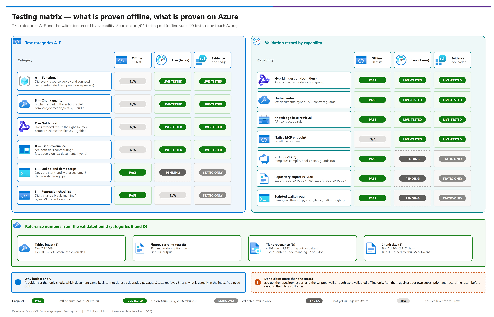

[README](../README.md) › [docs index](./00-reproduce-this-demo.md) › 04 Testing

# 04 — Testing

<p>
&nbsp;
&nbsp;
&nbsp;
&nbsp;
&nbsp;

</p>

   

How to prove the build actually works — and, specifically, that **both ingestion tiers are
earning their place**. Run these after [03-deployment.md](./03-deployment.md). This page is also the honest record of what has and has not been run against Azure: see [Live validation](#live-validation).

> [!IMPORTANT]
> **The trap this test plan exists to avoid.** The first build of this pattern passed a 4/4
> golden set and was declared working. Auditing the *content* of the index afterwards found
> 27% of tables split mid-table, 36% of figures discarded as empty tags, and 41% of heading
> citations pointing at the wrong section. **A golden set that only checks which document came
> back cannot detect a degraded passage.** Category C tests retrieval; category B tests what
> is actually in the index. You need both.

## At a glance

| | Topic | One-line answer |
|---|---|---|
|  | **What proves it works** | Chunk-quality audit (B) *and* golden set (C) — not retrieval alone |
|  | **Most valuable test** | The figure-only golden question — fails silently without the vision path |
|  | **Offline suite** | `python -m pytest tests -q` — 90 tests, none touch Azure |
|  | **Live evidence** | Two clean-room teardown/rebuilds in Aug 2026 ([docs/09](./09-findings-and-lessons.md)) |

[](./assets/testing-matrix.png)

<sub>Editable source: [`assets/testing-matrix.drawio`](./assets/testing-matrix.drawio) - regenerate with `python scripts/export_diagrams.py docs/assets`.</sub>

---

## Test categories

| | # | Category | Answers | Automated | Evidence |
|---|---|---|---|---|---|
|  | A | Functional | Did every resource deploy and connect? | partly (`azd provision --preview` for a dry run) |  |
|  | B | **Chunk quality** | Is what landed in the index actually usable? | ✅ `compare_extraction_tiers.py --audit` |  |
|  | C | Quality (golden set) | Does retrieval return the right source? | ✅ `compare_extraction_tiers.py --golden` |  |
|  | D | **Tier provenance** | Are both tiers contributing? | ✅ facet query |  |
|  | E | End-to-end demo script | Does the story land in front of a customer? | ✅ `demo_walkthrough.py` |  |
|  | F | Regression checklist | Did a change break anything? | ✅ `pytest` |  |

> [!NOTE]
> The badges describe how each *layer's tooling* has been validated, not how often you should run it: categories A-D were exercised against Azure in the Aug 2026 rebuilds, while the walkthrough script (E) and the offline regression suite (F) have only been run offline. See [Live validation](#live-validation).

---

## A — Functional tests

| Check | How | Pass |
|---|---|---|
| Resources deployed | `az resource list -g <rg> -o table` | Storage, Foundry (+ project), Search, Key Vault all present |
| Model deployments | `az cognitiveservices account deployment list -n <foundry> -g <rg> -o table` | `embedding`, `chat`, `sol`, `cu-frontier` |
| Corpus routed | `python hybrid_ingest.py --ids-file ../demo-ids.local.json --plan --source-dir <dir>` | Each document shows a tier and a reason |
| Blobs uploaded | Portal or `az storage blob list` | Files under `raw/cu/` and/or `raw/di/` |
| Both indexers ran | `python hybrid_ingest.py --ids-file ../demo-ids.local.json --status` | Both `success`, 0 failed |
| MCP endpoint | `python post_deploy_search.py --ids-file ../demo-ids.local.json --check-mcp-endpoint` | `Native MCP endpoint AVAILABLE.` |

---

## B — Chunk-quality audit (do not skip)

```bash
cd scripts
python compare_extraction_tiers.py --ids-file ../demo-ids.local.json --audit
```

Reports per tier: table integrity, figure handling, citation validity, and chunk-size
distribution. Reference numbers from the validated build:

| Metric | Tier CU | Tier DI+ | Why it matters |
|---|---|---|---|
| Tables intact | **100%** | ~77% before the vision skill | A split table loses its header row — the surviving cells lose all meaning |
| Figures carrying text | native descriptions | **334 image-description rows** | An empty `<figure></figure>` means a diagram was detected and thrown away |
| Citation validity | page range — structurally cannot misattribute | deepest heading only, never a path | A confidently wrong citation is worse than a coarse one |
| Chunk size | 204–2,317 chars | tuned by `chunkSizeTokens` | Sub-300-char chunks are retrieval noise; 6,000+ char chunks bury the answer |

> [!WARNING]
> **Fail conditions:** any chunk under ~100 characters in bulk, empty `<figure></figure>` tags
> in Tier DI+ output (means the vision skill did not run), or `sectionLabel`/`pageNumber*` empty
> across the board.

---

## C — Quality (golden set)

Build 5–10 question/answer pairs from your own corpus, then:

```bash
python compare_extraction_tiers.py --ids-file ../demo-ids.local.json --golden
```

Include at least one question of each kind:

| Kind | Example | Proves |
|---|---|---|
| Prose lookup | *"What does the dmcontrol register control?"* | Basic retrieval |
| Cross-document | a question answerable from only one of several documents | Correct routing, no bleed |
| **Figure-only** | *"What is the bit width of the mtime register and which bits does it span?"* | **The vision/figure path works** — this is the one that fails silently without it |
| Deep-section | something under a 4th- or 5th-level heading | Citation granularity |
| Out-of-corpus | something the corpus genuinely does not cover | Honest "no relevant content" rather than a hallucination |

> [!TIP]
> **The figure-only question is the most valuable test in this document.** It is the one that
> distinguishes a working hybrid from a pipeline that quietly discarded every diagram.

---

## D — Tier provenance (is the hybrid actually hybrid?)

A single unified index makes it easy to *assume* both tiers contributed. Verify it.

**Any platform** — `curl` ships with Windows 10+, Linux and macOS:

```bash
AK=$(az search admin-key show -g <rg> --service-name <search> --query primaryKey -o tsv)
curl -s -X POST "https://<search>.search.windows.net/indexes/idx-documents-hybrid/docs/search?api-version=2026-05-01-preview" -H "api-key: $AK" -H "Content-Type: application/json" -d '{"search":"*","top":0,"count":true,"facets":["extractionTier","contentKind","sourceDocument,count:50"]}'
```

<details>
<summary>PowerShell equivalent (nicer output formatting)</summary>

```powershell
$ak = az search admin-key show -g <rg> --service-name <search> --query primaryKey -o tsv
$body = @{ search='*'; top=0; count=$true; facets=@('extractionTier','contentKind','sourceDocument,count:50') } | ConvertTo-Json
Invoke-RestMethod -Uri "https://<search>.search.windows.net/indexes/idx-documents-hybrid/docs/search?api-version=2026-05-01-preview" -Method Post -Headers @{'api-key'=$ak;'Content-Type'='application/json'} -Body $body | Select-Object -ExpandProperty '@search.facets'
```

</details>

| Check | Pass |
|---|---|
| `extractionTier` facet | One entry per tier you routed to — a missing tier means that indexer silently produced nothing |
| `contentKind` facet | `image-description` rows present if any routed document has figures |
| `sourceDocument` facet | **Every** document from `--plan` appears — a missing document is a rejected ingest, not a rounding error |

Reference build: 4,109 rows — 3,882 `di-layout-verbalized`, 227 `content-understanding`, of
which 334 `image-description`, across 2 of 2 documents.

Then confirm a single query draws on **both** tiers:

```bash
python compare_extraction_tiers.py --ids-file ../demo-ids.local.json --report
```

---

## E — End-to-end demo script

Scripted and self-checking — see [11-customer-walkthrough.md](./11-customer-walkthrough.md):

```bash
python demo_walkthrough.py --ids-file ../demo-ids.local.json --script ../samples/walkthrough.example.json --report
```

The steps it runs, and what to say at each:

1. Show `--plan` — the routing decision, with the page-count reason per document. *"We don't
   pick a service; we route per document, and the decision is free."*
2. In VS Code agent mode, ask a prose question → grounded answer with a citation.
3. Ask the **figure-only** question → the answer comes from a diagram the baseline pipeline
   would have discarded. *This is the moment the pattern sells itself.*
4. Show the `extractionTier` facet → both services contributed to one seamless corpus.
5. Ask an out-of-corpus question → honest "no relevant content", not a hallucination.
6. *(Optional)* Open the repository export ([docs/10](./10-repo-corpus-export.md)) → the same
   section as a page-cited Markdown file with the original figure and the register's bit-field
   diagram, committed next to the code.

---

## F — Regression checklist

Install the pinned requirements first. `tests/test_mcp_fallback_server.py` imports the `mcp`
SDK, and without it pytest reports a **collection error** for that file, not a test failure:

```bash
pip install -r scripts/requirements.txt
python -m pytest tests -q          # 90 tests, all offline
az bicep build --file infra/main.bicep --stdout > $null
az bicep build --file infra/azd.bicep --stdout > $null    # azd entry point
python scripts/export_diagrams.py docs/assets --check   # every diagram PNG is newer than its .drawio
```

| Test file | Covers |
|---|---|
| `test_post_deploy_search.py` | API-contract guards, reusability guards, model configuration |
| `test_compare_extraction_tiers.py` | Harness methodology guards |
| `test_mcp_fallback_server.py` | Optional MCP wrapper |
| `test_export_repo_corpus.py` | Section splitting, page mapping across split parts, figure rewriting, register/pin/electrical extraction, manifest |
| `test_demo_walkthrough.py` | Walkthrough pass/fail rules, both response shapes, and the oversized-upload guard |
| `test_configuration.py` | azd ↔ Bicep parameter wiring, quoted parameter substitutions, hook ↔ output contract, and that **every** azd variable, output and script setting is documented in docs/12 |

Run after any change to `scripts/`, `infra/`, or the index schema. The suite includes one
regression test per defect class found during live builds — API-contract guards, harness
methodology guards, and model-configuration guards.

---

## When to re-run what

| Trigger | Re-run |
|---|---|
| Changed a skillset or index schema | B, C, D, F |
| Added or changed corpus documents | A (routing), B, C, D |
| Changed a model deployment | B (figure quality), C, F |
| Upgraded the Search API version | A, D, F |
| Before any customer demo | E, plus a smoke pass of A |

---

## Live validation

What has actually been run, and where. Nothing on this page claims more than the record in [09 — Findings and lessons](./09-findings-and-lessons.md).

| Capability | Offline (90 tests) | Live (against Azure) | Evidence |
|---|---|---|---|
| Hybrid ingestion (both tiers) | ✅ API-contract and model-configuration guards | ✅ Two clean-room teardown/rebuilds, Aug 2026 |  |
| Unified index (`idx-documents-hybrid`) | ✅ API-contract guards | ✅ Same rebuilds |  |
| Knowledge base retrieval | ✅ API-contract guards | ✅ Same rebuilds |  |
| Native MCP endpoint | — | ✅ Same rebuilds |  |
| `azd up` (v1.2.0) | ✅ Templates compile, hooks parse, guards exercised locally | ⏳ Not yet run end to end against a subscription |  |
| Repository export (`export_repo_corpus.py`, v1.1.0) | ✅ `test_export_repo_corpus.py` | ⏳ Not run against Azure |  |
| Scripted walkthrough (`demo_walkthrough.py`) | ✅ `test_demo_walkthrough.py` | ⏳ Not run against Azure |  |

> [!CAUTION]
> Don't present `azd up`, the repository export or the scripted walkthrough as live-tested. They were validated offline only. Run them against your own subscription — and record the result — before quoting them to a customer.

---

Next: [05 - Troubleshooting](./05-troubleshooting.md) →

*Last updated: 2026-10-02*
