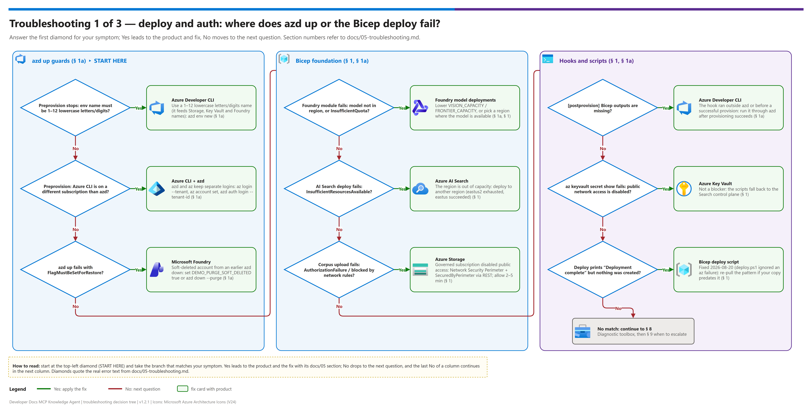
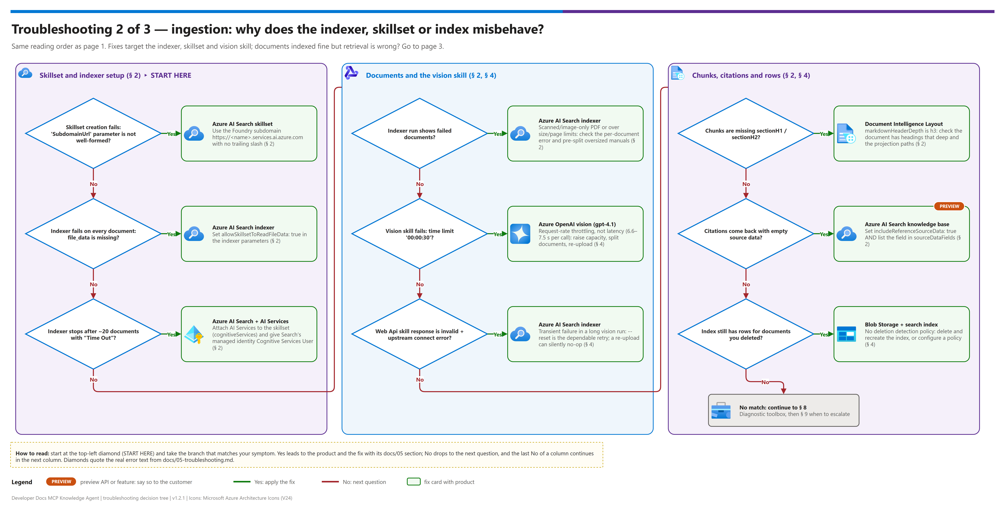
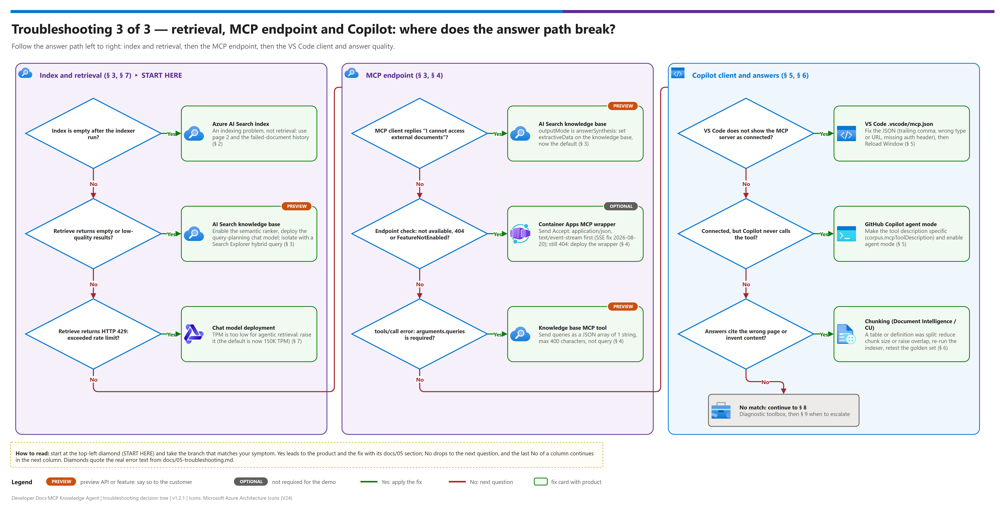

[README](../README.md) › [docs index](./00-reproduce-this-demo.md) › 05 Troubleshooting

# 05 — Troubleshooting

<p>
&nbsp;
&nbsp;
&nbsp;
&nbsp;
&nbsp;
&nbsp;

</p>

   

Common failure modes and fixes for the Developer Docs MCP Knowledge Base pattern, organized by where the symptom appears. Start with the decision tree or the quick-triage table, then jump to the product section for the full explanation.

## At a glance

| | Topic | One-line answer |
|---|---|---|
|  | **`azd up` fails** | Almost always a guard: environment name, tenant/subscription, or a soft-deleted Foundry account ([§ 1a](#1a--azd-up)) |
|  | **Indexer or skillset fails** | Check `allowSkillsetToReadFileData`, the AI Services attachment and the subdomain form ([§ 2](#2--ingestion-indexer--skillset)) |
|  | **Vision skill times out** | Request-rate throttling, not a slow model ([§ 4](#4--mcp-endpoint-native-or-fallback)) |
|  | **Copilot doesn't use the tool** | Tool description too generic, or MCP not enabled ([§ 5](#5--github-copilot--vs-code-mcp-client)) |

> [!NOTE]
> The Knowledge Base and its native MCP endpoint are  on Search API `2026-05-01-preview`, so behavior can differ from this page on other services, regions or API versions. See [§ 9 — When to escalate](#9--when-to-escalate).

## Decision tree

The tree has three pages. Start on the page that matches where the symptom shows up.

| Page | Covers | Doc sections |
|---|---|---|
| 1 | Deploy and auth | [1a](#1a--azd-up), [1](#1--foundation-bicep-deploy) |
| 2 | Ingestion | [2](#2--ingestion-indexer--skillset) |
| 3 | Retrieval, MCP, Copilot | [3](#3--knowledge-base--retrieval-quality), [4](#4--mcp-endpoint-native-or-fallback), [5](#5--github-copilot--vs-code-mcp-client) |

**Page 1 — Deploy and auth**

[](./assets/troubleshooting-decision-tree-1.png)

**Page 2 — Ingestion**

[](./assets/troubleshooting-decision-tree-2.png)

**Page 3 — Retrieval, MCP, Copilot**

[](./assets/troubleshooting-decision-tree-3.png)

<sub>Editable source (all three pages): [`assets/troubleshooting-decision-tree.drawio`](./assets/troubleshooting-decision-tree.drawio) - regenerate with `python scripts/export_diagrams.py docs/assets`.</sub>

## Quick triage table

| Where | Symptom | Most likely root cause | Section |
|---|---|---|---|
|  **azd** | `[preprovision] azd environment name … must be 1-12 lowercase letters/digits` | The env name becomes part of Storage/Key Vault/Foundry names | [§ 1a](#1a--azd-up) |
|  **azd** | `[preprovision] The Azure CLI is on a different subscription than the azd environment` | `azd` and `az` keep separate logins; the hooks and scripts use `az` | [§ 1a](#1a--azd-up) |
|  **Foundry** | `azd up` fails with `FlagMustBeSetForRestore` / preprovision reports a soft-deleted Foundry account | A previous `azd down` without `--purge` (or a deleted RG) left it soft-deleted | [§ 1a](#1a--azd-up) |
|  **azd** | `[postprovision] Bicep outputs are missing` | Hook run outside `azd` or before a successful provision | [§ 1a](#1a--azd-up) |
|  **Bicep** | Bicep deploy prints "Deployment complete" but nothing was created | Fixed 2026-08-20 — `deploy.ps1` used to ignore `az` failure. Re-pull the pattern if your copy predates that | [§ 1](#1--foundation-bicep-deploy) |
|  **AI Search** | Bicep deploy fails: AI Search `InsufficientResourcesAvailable` | The region is out of AI Search capacity — try another region | [§ 1](#1--foundation-bicep-deploy) |
|  **Storage** | Corpus upload fails: `AuthorizationFailure` / "blocked by network rules" | Governed subscription forces `publicNetworkAccess: Disabled` on Storage | [§ 1](#1--foundation-bicep-deploy) |
|  **Key Vault** | `az keyvault secret show` fails with `Forbidden: Public network access is disabled` | Same policy applied to Key Vault — the scripts fall back to the Search control plane | [§ 1](#1--foundation-bicep-deploy) |
|  **AI Search** | Skillset creation fails: `'SubdomainUrl' parameter is not well-formed` | Wrong AI Services subdomain form or a trailing slash | [§ 2](#2--ingestion-indexer--skillset) |
|  **Scripts** | `FileNotFoundError: [WinError 2]` running a setup script | Windows `az.cmd` resolution — fixed 2026-08-20 via `shutil.which` | [§ 2](#2--ingestion-indexer--skillset) |
|  **Foundry** | Bicep deploy fails on the Foundry/Cognitive Services module | Model not available in the target region, or quota exhausted | [§ 1](#1--foundation-bicep-deploy) |
|  **AI Search** | Indexer run shows failed documents | PDF is scanned/image-only with no extractable layer, or exceeds size/page limits | [§ 2](#2--ingestion-indexer--skillset) |
|  **AI Search** | Indexer fails on every document (`file_data` missing) | Indexer lacks `allowSkillsetToReadFileData: true` | [§ 2](#2--ingestion-indexer--skillset) |
|  **AI Search** | Indexer stops after ~20 documents ("Time Out") | Skillset has no billable AI Services attachment | [§ 2](#2--ingestion-indexer--skillset) |
|  **AI Search** | Chunks missing `sectionH1` / `sectionH2` | Split skill isn't reading the Layout skill's structured output correctly, or the doc has no headings at that depth | [§ 2](#2--ingestion-indexer--skillset) |
|  **AI Search** | Citations come back with empty source data | `includeReferenceSourceData` not set, or field missing from the knowledge source's `sourceDataFields` | [§ 2](#2--ingestion-indexer--skillset) |
|  **Knowledge Base**  | Knowledge Base `retrieve` call returns empty/low-quality results | Semantic ranker not enabled, or query planning model not deployed | [§ 3](#3--knowledge-base--retrieval-quality) |
|  **Chat deployment** | Retrieval returns HTTP 429 `exceeded rate limit` | Chat deployment TPM too low for agentic retrieval | [§ 7](#7--cost-and-quota) |
|  **Blob + index** | Rows present for documents you deleted | Blob deletion doesn't remove index rows without a deletion detection policy | [§ 4](#4--mcp-endpoint-native-or-fallback) |
|  **Vision skill** | Vision skill fails: `did not execute within the time limit '00:00:30'` | **Request-rate throttling**, not model latency — deployment req/min ceiling below the concurrent burst | [§ 4](#4--mcp-endpoint-native-or-fallback) |
|  **Vision skill** | `Web Api skill response is invalid` + `upstream connect error` | Transient upstream failure in a long vision run — re-upload the failed blobs to retry them (`--reset` is the dependable method; see § 4) | [§ 4](#4--mcp-endpoint-native-or-fallback) |
|  **Knowledge Base**  | MCP client gets "I cannot access external documents" instead of passages | Knowledge base `outputMode` is `answerSynthesis`; MCP needs `extractiveData` | [§ 3](#3--knowledge-base--retrieval-quality) |
|  **MCP endpoint**  | MCP endpoint check reports "not available" but the endpoint works | SSE response parsed as JSON — fixed 2026-08-20 | [§ 4](#4--mcp-endpoint-native-or-fallback) |
|  **MCP endpoint**  | MCP endpoint check returns 404 / `FeatureNotEnabled` | Native Knowledge Base MCP surface not available on this Search tier/region/API version | [§ 3](#3--knowledge-base--retrieval-quality), [§ 4](#4--mcp-endpoint-native-or-fallback) |
|  **MCP endpoint**  | MCP `tools/call` returns "`arguments.queries` field ... is required" | The native tool takes `queries` (array), not `query` | [§ 4](#4--mcp-endpoint-native-or-fallback) |
|  **Wrapper**  | Fallback Container App fails to start | Missing Key Vault reference, wrong managed identity role assignment | [§ 4](#4--mcp-endpoint-native-or-fallback) |
|  **VS Code** | VS Code doesn't show the MCP server as connected | `.vscode/mcp.json` syntax error, wrong endpoint URL, or auth header missing | [§ 5](#5--github-copilot--vs-code-mcp-client) |
|  **Copilot Chat** | Copilot Chat never calls the tool | Tool description too vague, or GitHub Copilot's agent mode / MCP support not enabled | [§ 5](#5--github-copilot--vs-code-mcp-client) |
|  **Chunking** | Answers cite the wrong page or fabricate content | Chunking split a table/definition across chunks, or golden-set threshold not yet tuned | [§ 6](#6--answer-quality) |

---

##  1a — azd up

| Symptom | Fix |
|---|---|
| Environment-name guard fails | `azd env new <name>` with 1–12 lowercase letters/digits (e.g. `dev`, `demo1`); select it with `azd env select <name>` |
| Subscription/tenant guard fails | `az login --tenant <id>` then `az account set --subscription <id>` so `az` matches `AZURE_SUBSCRIPTION_ID` / `AZURE_TENANT_ID`; `azd auth login --tenant-id <id>` for azd itself |
| Soft-deleted Foundry account | `azd env set DEMO_PURGE_SOFT_DELETED true` and re-run, or purge with the printed command. Next time tear down with `azd down --purge` |
| Model deployment fails (`InsufficientQuota`, `DeploymentModelNotSupported`) | Lower `VISION_CAPACITY` / `FRONTIER_CAPACITY`, pick a region with quota, or override `*_MODEL_NAME` / `*_MODEL_VERSION` ([12 § 1.3](./12-configuration-reference.md#13-models)). `DEPLOY_HYBRID_MODELS=false` skips the two frontier models |
| Bool/int parameter rejected | Values in `infra/azd.parameters.json` must stay quoted (`"${VAR=default}"`) — azd parses the JSON before substituting |
| `demo-ids.local.json` stale after a re-provision | `azd hooks run postprovision` rewrites it from the current outputs |
| Ingestion in the hook can't import packages | Set `DEMO_PYTHON` to your virtual environment's interpreter |

---

##  1 — Foundation (Bicep deploy)

**Symptom: AI Search fails with `InsufficientResourcesAvailable` — "The region 'X' is currently out of the resources required to provision new services."**
This is regional capacity exhaustion, not a quota problem, and no amount of retrying in the same region fixes it. Deploy to another region. (Observed 2026-08-20: `eastus2` — the pattern's default — was exhausted; `eastus` succeeded.) Confirm your chosen region also has quota for `text-embedding-3-large` on the **Standard** SKU (not just GlobalStandard) and your chat model:

<details><summary><b>Show quota check</b></summary>

```bash
az cognitiveservices usage list -l <region> --query "[?contains(name.value,'text-embedding-3-large') || contains(name.value,'gpt-5')].{name:name.value, used:currentValue, limit:limit}" -o table
```

</details>

**Symptom: corpus upload fails with `AuthorizationFailure` / "The request may be blocked by network rules of storage account", and `az keyvault secret show` returns `Forbidden: Public network access is disabled`.**
You are in a **governed subscription** where an Azure Policy forces `publicNetworkAccess: Disabled` on Storage and Key Vault. RBAC is not the problem — check first, and note the policy will silently revert an explicit re-enable:

```bash
az storage account show -n <storage> -g <rg> --query publicNetworkAccess -o tsv   # Disabled
az storage account update -n <storage> -g <rg> --public-network-access Enabled --query publicNetworkAccess -o tsv   # still Disabled -> policy modify effect
```

> [!WARNING]
> Key Vault is **not** a blocker: `post_deploy_search.py` falls back to `az search admin-key show` automatically. Storage **is** a blocker, because the indexer needs the blobs and you need to upload them.

The working path is a **Network Security Perimeter** (NSP):

1. Find the perimeter (governed subscriptions normally already have one):
   ```bash
   az resource list --resource-type "Microsoft.Network/networkSecurityPerimeters" -o table
   ```
2. Create a profile with two inbound rules — one for the whole subscription (this is what lets AI Search reach Storage via its managed identity) and one for your workstation's public IP — plus an outbound rule. Prefer a **dedicated profile** over editing the shared `defaultProfile`, so you don't change access for unrelated resources.
3. Associate the storage account with that profile in `Enforced` mode.
4. Set the storage account to perimeter mode — note the `az storage account` CLI does **not** expose this value, so it must go through REST:
   ```bash
   az rest --method patch --url "https://management.azure.com/subscriptions/<sub>/resourceGroups/<rg>/providers/Microsoft.Storage/storageAccounts/<storage>?api-version=2023-05-01" --body '{"properties":{"publicNetworkAccess":"SecuredByPerimeter"}}' --headers "Content-Type=application/json"
   ```
5. Wait for propagation — roughly 2-5 minutes before the data plane accepts requests. Re-test with `az storage container list --account-name <storage> --auth-mode login`.

**Symptom: `foundry.bicep` deployment fails with a model-capacity or region error.**
Check `az cognitiveservices account list-models --name <account> --resource-group <rg>` for `text-embedding-3-large` and your chosen chat model in the target region. If unavailable, redeploy in a Tier-1/2 region from [02-prerequisites.md § 8](./02-prerequisites.md#8--regional--preview-feature-availability).

**Symptom: `AuthOptions must be null if DisableLocalAuth is true` on the Search module.**
Don't set both `authOptions` and `disableLocalAuth: true` in `search.bicep` — they're mutually exclusive on the AI Search ARM API. Pick one auth model.

##  2 — Ingestion (indexer / skillset)

**Symptom: skillset creation fails with HTTP 400 `'SubdomainUrl' parameter is not well-formed`.**
The skillset's `cognitiveServices.subdomainUrl` must be the **AI Foundry** subdomain of the multi-service account — `https://<name>.services.ai.azure.com` — **without** a trailing slash. Passing the Document Intelligence / FormRecognizer endpoint (`https://<name>.cognitiveservices.azure.com/`) is rejected, even though it is literally the same resource and is what the Azure portal and the Bicep `documentIntelligenceEndpoint` output both display. The Bicep now emits `aiServicesSubdomainUrl` for this, and `post_deploy_search.py` derives it from `foundryResource`; set `aiServicesSubdomainUrl` explicitly in `demo-ids.local.json` to override.

**Symptom: `FileNotFoundError: [WinError 2] The system cannot find the file specified` when a setup script shells out to `az`.**
On Windows the Azure CLI is `az.cmd`, which `subprocess.run(["az", ...])` cannot resolve without a shell. The scripts now resolve it through `shutil.which("az")`.

> [!CAUTION]
> If you see this in your own extension code, resolve `az` through `shutil.which("az")` rather than adding `shell=True`.

**Symptom: a large PDF logs `Truncated extracted text to '524288' characters`.**
This warning comes from the blob `DocumentExtraction` stage, not the Layout skill, and is safe to ignore — the Layout skill reads `file_data` directly. A 700-page specification still indexed fully (1,300 chunks) with this warning present. Expect long runtimes: a single 700-page PDF took roughly 25 minutes to work through the Layout skill.

**Symptom: indexer reports failed documents.**
Most common cause: a scanned/image-only PDF with no text layer that the Layout model can't structure usefully, or a PDF exceeding AI Search's per-document size/page limits. Check the indexer execution history for the specific error per document; consider pre-splitting oversized manuals.

**Symptom: indexer fails on every document with a missing `file_data` / input error.**
The Document Layout skill reads `/document/file_data`, which only exists when the indexer sets `"allowSkillsetToReadFileData": true` in `parameters.configuration`. Confirm `create_indexer` in `scripts/post_deploy_search.py` still sets it (alongside `"parsingMode": "default"`), then re-create the indexer and re-run.

**Symptom: indexer stops after ~20 documents with a "Time Out" message.**
The Layout skill is billable and the skillset has no AI Services attachment, so it's running on the free daily enrichment allowance. Confirm the skillset's `cognitiveServices` block is present and its `subdomainUrl` points at your Foundry resource, and that the Search service's managed identity holds **Cognitive Services User** on it.

**Symptom: chunks are missing `sectionH1` / `sectionH2` / `sectionH3`.**
First check whether the source document actually has headings at that depth — the Layout skill's `markdownHeaderDepth` is set to `h3`, so deeper headings collapse and documents with no heading structure produce empty values. If headings clearly exist, confirm the index projection mappings still point at `/document/markdownDocument/*/sections/h1` (etc.) in `scripts/post_deploy_search.py` — projections that reference a nonexistent path write nulls silently rather than erroring.

**Symptom: citations come back with empty source data.**
`references[].sourceData` is `null` unless the retrieve request sets `includeReferenceSourceData: true` in `knowledgeSourceParams`, AND the knowledge source declares the field in `searchIndexParameters.sourceDataFields`. Both are required — check `retrieve_body` and `create_knowledge_source`.

##  3 — Knowledge Base / retrieval quality

 The Knowledge Base and its native MCP surface use Search API `2026-05-01-preview`.

**Symptom: the MCP client (GitHub Copilot) gets a prose non-answer — e.g. "I cannot access external documents right now" or "No relevant content was found" — while a direct `POST /knowledgebases/{name}/retrieve` call returns good grounded passages.**
The knowledge base's `outputMode` is `answerSynthesis`. That mode has the query-planning model write the final prose, but the **native MCP tool cannot pass `includeReferenceSourceData`** (its schema accepts only `queries`), so the synthesising model receives references with no source data and answers that it has nothing to read. Nothing is wrong with your index. Set `outputMode` to `extractiveData`, which returns the ranked passages themselves — each with `ref_id`, source document title, and heading path — and let the MCP client do its own synthesis and citation:

> [!IMPORTANT]
> `answerSynthesis` plus the native MCP tool produces a prose non-answer because the tool cannot pass `includeReferenceSourceData`. Fix it on the knowledge base (`outputMode: extractiveData`), not in the client.

<details><summary><b>Show the knowledge-base inspection command</b></summary>

```bash
AK=$(az search admin-key show -g <rg> --service-name <search> --query primaryKey -o tsv)
curl -s "https://<search>.search.windows.net/knowledgebases/<kb>?api-version=2026-05-01-preview" -H "api-key: $AK"
```

</details>

`post_deploy_search.py` now defaults to `extractiveData`; override with `knowledgeBaseOutputMode` in `demo-ids.local.json` only if a non-LLM client genuinely needs prose.

**Symptom: `retrieve` calls return empty or clearly irrelevant results.**
- Confirm semantic ranker is enabled on the Search service (a per-service setting — see [02-prerequisites.md § 3](./02-prerequisites.md#3--azure-ai-search))
- Confirm the Knowledge Base's query-planning chat model deployment exists and is reachable
- Re-run a manual hybrid query directly against `idx-documents-hybrid` in Search Explorer to isolate whether the problem is indexing or agent configuration
- Check the question is actually answerable from the ingested corpus before assuming a retrieval bug — "No relevant content was found for your query" is the correct response to an out-of-corpus question

##  4 — MCP endpoint (native or fallback)

**Symptom: `--check-mcp-endpoint` reports "Native endpoint not available", but the endpoint actually works.**
Fixed 2026-08-20. The MCP Streamable HTTP transport replies with **Server-Sent Events** (`Content-Type: text/event-stream`) — each JSON-RPC message arrives on a `data:` line — so calling `resp.json()` on it raises `Expecting value: line 1 column 1 (char 0)` and the check falsely concluded the endpoint was missing. That in turn pushes you to deploy the optional fallback Container App for no reason. If your copy predates the fix, verify by hand:

<details><summary><b>Show the manual <code>tools/list</code> check</b></summary>

```bash
AK=$(az search admin-key show -g <rg> --service-name <search> --query primaryKey -o tsv)
curl -s -X POST "https://<search>.search.windows.net/knowledgebases/<kb>/mcp?api-version=2026-05-01-preview" -H "api-key: $AK" -H "Content-Type: application/json" -H "Accept: application/json, text/event-stream" -d '{"jsonrpc":"2.0","id":1,"method":"tools/list"}'
```

</details>

A working endpoint returns HTTP 200 with `event: message` / `data: {...}` advertising the `knowledge_base_retrieve` tool.

> [!TIP]
> Always send `Accept: application/json, text/event-stream` — the Streamable HTTP transport replies with Server-Sent Events.

**Symptom: `tools/call` returns "An error occurred invoking 'knowledge_base_retrieve': The 'arguments.queries' field for the tool call is required and must be a JSON array."**
The native tool takes `queries` — a JSON **array** of 1 string, max 400 characters — not `query`. Its input schema sets `minItems: 1`, `maxItems: 1`, and `additionalProperties: false`, so there is no way to pass retrieval options (reranker threshold, `includeReferenceSourceData`) through the MCP call. Anything you need must be configured server-side on the knowledge base — see § 3.

**Symptom: native MCP endpoint check returns 404 or a feature-not-enabled error.**
This is expected on Search services/regions where the MCP endpoint hasn't rolled out yet, or where the API version has moved on since this pattern was last verified. Proceed with the optional custom wrapper server (Phase 4) — this is exactly what it's for. Re-check availability periodically; see [docs/06](./06-mcp-endpoint-and-fallback-server.md) for the current verification command.

**Symptom: the vision skill fails with `Could not execute skill because it did not execute within the time limit '00:00:30'`.**
Almost always **request-rate throttling**, not a slow model — and the error message actively
misleads you toward the wrong fix.

The `ChatCompletionSkill` timeout is fixed at 30 seconds, and `degreeOfParallelism` was removed
from the skill schema in Search REST API `2026-04-01`, so concurrency cannot be limited from
the AI Search side. AI Search issues figure calls concurrently; if the deployment's
requests-per-minute ceiling is below that burst, calls queue and individual requests exceed 30
seconds.

Confirm it is not model latency by timing a single call directly — a real register-diagram page
through `gpt-4.1` at `detail: high` measured **6.6–7.5s**:

<details><summary><b>Show the deployment rate-limit check</b></summary>

```bash
az cognitiveservices account deployment show -n <foundry> -g <rg> --deployment-name vision --query "{cap:sku.capacity, limits:properties.rateLimits[].{key:key,count:count}}" -o json
```

</details>

A deployment's request/minute limit **scales with capacity** (capacity 400 → 400 requests/min).
Fixes, in order of preference:

1. **Raise the deployment capacity** to give request headroom proportional to the number of
   figures in a single document.
2. **Split oversized documents** so each ingestion produces a smaller concurrent burst — also
   what Content Understanding's 300-page limit requires, for an unrelated reason.
3. Re-upload the failed blobs to retry just those documents (a plain re-run skips them — change tracking treats an attempted-and-failed document as seen).

If capacity is already at the subscription quota ceiling (`InsufficientQuota` on the raise),
splitting is the only remaining lever.

**Symptom: rows for documents you deleted are still in the index.**
Deleting a blob does **not** remove its rows. The indexer only *adds and updates* unless you
configure a deletion detection policy on the data source, so a corpus that changes — or a
re-split of the same source material — leaves orphaned rows behind and silently
double-represents content.

Observed live: re-splitting a 906-page specification from 300-page parts into 100-page parts
left the old parts' rows in place, so the same pages existed twice under different
`sourceDocument` values.

| Situation | What to do |
|---|---|
| One-off corpus change during a demo build | Delete and recreate the index (`--teardown` then `--build`), then re-run ingestion |
| Corpus that changes in production | Configure a [deletion detection policy](https://learn.microsoft.com/azure/search/search-howto-index-changed-deleted-blobs) on the blob data source (soft-delete or metadata-based) |

Detect orphans by faceting on `sourceDocument` and comparing against what is actually in the
container:

<details><summary><b>Show the orphan-detection commands</b></summary>

```bash
# rows currently in the index, by source document
AK=$(az search admin-key show -g <rg> --service-name <search> --query primaryKey -o tsv)
curl -s -X POST "https://<search>.search.windows.net/indexes/idx-documents-hybrid/docs/search?api-version=2026-05-01-preview" -H "api-key: $AK" -H "Content-Type: application/json" -d '{"search":"*","top":0,"facets":["sourceDocument,count:50"]}'

# ...then compare against what is actually in the container
az storage blob list --account-name <storage> --container-name raw --auth-mode login --query "[].name" -o tsv
```

</details>

**Symptom: `Web Api skill response is invalid` wrapping `InternalServerError: upstream connect error`.**
Transient upstream failure during a long vision-heavy run. Expected at volume — figure
verbalization makes hundreds of vision calls per run.

The indexers are created with `maxFailedItems: 10` so a flaky document does not halt the run;
without that (the AI Search default is `0`) a single transient failure stops everything and
every remaining document goes unprocessed.

**To retry the failed documents, `--reset` is the only reliable method.** Blob change tracking
treats an attempted-and-failed document as seen, so a plain re-run reports
`processed=0 failed=0` and skips it.

Re-uploading the failed blobs *seems* like the surgical fix, and it sometimes works — but it is
**timing-sensitive and can silently no-op**. Change detection compares blob `LastModified`
against the indexer's `lastFullEnumerationStartTime`; if the re-upload lands before that
marker advances, the document is still considered seen and the run does nothing. Observed
live: two consecutive re-upload-then-run cycles both returned `processed=0 failed=0`.

| Approach | Reliability | Cost |
|---|---|---|
| `--reset` then run | **Dependable** | Reprocesses the entire corpus and re-bills every page |
| Re-upload the failed blobs, then run | Timing-dependent — verify `processed` actually increased | Cheap when it works |

Inspect the tracking state to understand what the indexer thinks it has seen:

<details><summary><b>Show the indexer status command</b></summary>

```bash
AK=$(az search admin-key show -g <rg> --service-name <search> --query primaryKey -o tsv)
curl -s "https://<search>.search.windows.net/indexers/ixr-hybrid-cu/status?api-version=2026-05-01-preview" -H "api-key: $AK"
# look at .lastResult.initialTrackingState and .lastResult.errors[].key
```

</details>

If a document fails **repeatedly** across resets, it is not transient — split it smaller (see
below).

##  5 — GitHub Copilot / VS Code MCP client

| Symptom | Where it is covered |
|---|---|
| VS Code doesn't show the MCP server as connected | Below; full config in [07](./07-github-copilot-mcp-client-setup.md) |
| Copilot Chat never invokes the tool | Below; set `corpus.mcpToolDescription` |

**Symptom: VS Code doesn't show the MCP server as connected.**
Validate `.vscode/mcp.json` against the schema in [docs/07-github-copilot-mcp-client-setup.md](./07-github-copilot-mcp-client-setup.md) — a common mistake is a trailing comma or wrong `type` value. Reload the VS Code window after any change.

**Symptom: Copilot Chat never invokes the tool even though it's connected.**
Make the MCP tool's description more specific to the corpus domain — set `corpus.mcpToolDescription` in `demo-ids.local.json` (no code edit required) and redeploy the wrapper. Name the document types *and* the question types it answers (e.g. "Search the hardware datasheet and firmware reference documentation for register values, pin configuration, and timing characteristics") rather than a generic "search documents". Confirm GitHub Copilot's agent mode is enabled for the workspace.

##  6 — Answer quality

| Check | Reference |
|---|---|
| Re-test against the golden set after any chunking change | [04 § C](./04-testing.md#c--quality-golden-set) |
| Audit what landed in the index | [04 § B](./04-testing.md#b--chunk-quality-audit-do-not-skip) |

**Symptom: answers cite the wrong page, or invent content not in the corpus.**
Almost always a chunking issue — a register table or multi-step procedure split across two chunks loses context. Reduce chunk size or increase overlap in the Split skill config, re-run the indexer, and re-test against the golden set ([04-testing.md § C](./04-testing.md#c--quality-golden-set)).

##  7 — Cost and quota

**Symptom: retrieval fails with HTTP 429 — "Your requests to gpt-5-mini for chat in <region> have exceeded rate limit."**
The chat deployment's TPM is too low. Agentic retrieval spends the chat model on query planning *and* (under `answerSynthesis`) answer generation on every call, so the pattern's original 10K TPM default returned 429 on the very first query. The default is now 150K TPM; raise an existing deployment with:

<details><summary><b>Show the capacity command</b></summary>

```bash
az cognitiveservices account deployment create -n <foundry> -g <rg> --deployment-name chat --model-name gpt-5-mini --model-version 2025-08-07 --model-format OpenAI --sku-name GlobalStandard --sku-capacity 150
```

</details>

(There is no `az cognitiveservices account deployment update` — re-running `create` with the same deployment name updates capacity in place.)

**Symptom: unexpected AI Search or Azure OpenAI cost.**
Check the indexer schedule isn't re-processing the full corpus more often than needed; check the fallback MCP server's Container App scale-to-zero setting is enabled for low-traffic POC use.

##  8 — Diagnostic toolbox

### 8.1 Check logs in this order

1. AI Search indexer execution history (portal → Search service → Indexers → the indexer → execution history)
2. `az containerapp logs show` for the fallback MCP server (if deployed)
3. VS Code's "MCP: Show Output" command for the client-side connection log

### 8.2 Useful queries

```bash
# Indexer status
python scripts/post_deploy_search.py --ids-file demo-ids.local.json --indexer-status

# Manual retrieve call against the Knowledge Base
python scripts/post_deploy_search.py --ids-file demo-ids.local.json --test-retrieve --query "your test question"
```

##  9 — When to escalate

| Issue | Escalate to |
|---|---|
|  Azure AI Search Knowledge Base / MCP behavior differs from this pattern's documentation | Re-check Microsoft Learn / release notes first — this surface evolved quickly (renamed from "Knowledge Agents" in 2026) and may have moved again since this pattern was last verified, not necessarily a bug |
|  Persistent quota denial after a support request | Azure support ticket via the portal |
|  GitHub Copilot agent-mode / MCP client behavior issues unrelated to this pattern's server | GitHub Copilot support / VS Code issue tracker |

---

Next: [06 - MCP endpoint and custom wrapper server](./06-mcp-endpoint-and-fallback-server.md) →

*Last updated: 2026-10-02*
