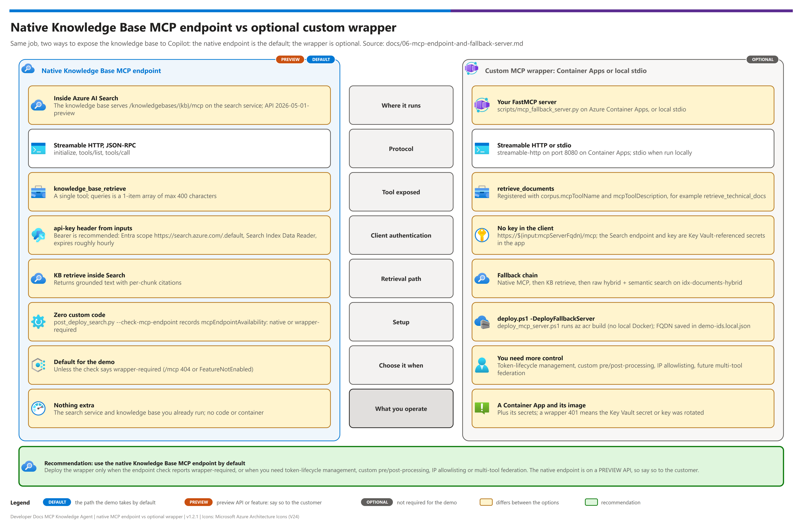

[Demo README](../README.md) › Docs › 06 — MCP endpoint and custom wrapper server

# 06 — MCP endpoint and custom wrapper server

<p>
  &nbsp;
  &nbsp;
  &nbsp;
  &nbsp;
  
</p>

    

> Deep dive on the pattern's Knowledge Base retrieval surface: how the native MCP endpoint works, how to check it's enabled on your Search service, and how the optional custom MCP server wrapper adds defense-in-depth on top of it. Referenced from [03-deployment.md Phase 3-4](03-deployment.md#phase-3--knowledge-base--mcp-endpoint) and [docs/00-reproduce-this-demo.md Parts C-D](00-reproduce-this-demo.md) — read this before running those phases if anything is unclear.

## At a glance

| | |
|---|---|
| **Goal** | Expose the Knowledge Base to any MCP client — natively, or through the optional wrapper |
| **Default path** |  Native Knowledge Base MCP endpoint on Azure AI Search (public preview, API `2026-05-01-preview`) |
| **Optional path** |  Custom wrapper server on Azure Container Apps (`scripts/mcp_fallback_server.py`) |
| **Sections** | [§ 3 check availability](#3--checking-availability) · [§ 4 wrapper](#4--the-optional-custom-wrapper-server) · [§ 5 deploy](#5--deploying-the-custom-wrapper-server-to-azure-container-apps) · [Verification](#verification) |

> [!NOTE]
> The Knowledge Base and its native MCP endpoint are **public preview**. The wrapper is **optional** — a working demo does not need it.

## Native endpoint vs wrapper

[](./assets/mcp-endpoint-vs-wrapper.png)

<sub>Editable source: [`assets/mcp-endpoint-vs-wrapper.drawio`](./assets/mcp-endpoint-vs-wrapper.drawio) - regenerate with `python scripts/export_diagrams.py docs/assets`.</sub>

| | Native MCP endpoint | Custom wrapper server |
|---|---|---|
| **Status** |   |  |
| **Hosted by** |  Azure AI Search (`/knowledgebases/{name}/mcp`) |  Azure Container Apps (`scripts/mcp_fallback_server.py`) |
| **Custom code** | None | Small Python `FastMCP` server |
| **Why choose it** | Zero custom code; any MCP client can call it | Token-lifecycle management, custom pre/post-processing, IP allowlisting, future multi-tool federation |
| **Falls back to** | — | Knowledge Base `retrieve` REST, then raw hybrid + semantic search on `idx-documents-hybrid` |
| **Recommendation** |  Use this unless § 3 reports `wrapper-required` |  Deploy only when you need the extras above, or the native surface isn't enabled on your service/region/API version |

---

##  1 — Prerequisites checklist

Work through these in order:

| Step | | Prerequisite | Gate |
|---|---|---|---|
| 1 |  | [Index populated](#1-index-populated) | ☐ `idx-documents-hybrid` has documents |
| 2 |  | [Chat model deployed](#2-chat-model-deployed) | ☐ `chat` deployment exists |

### 1. Index populated

`idx-documents-hybrid` must have documents ([03-deployment.md § Phase 2](03-deployment.md#phase-2--hybrid-ingestion) complete) before a Knowledge Base is useful to create.

### 2. Chat model deployed

The Foundry account must have a chat-completion deployment (`chat`, e.g. `gpt-5-mini`) for the Knowledge Base's query planning — provisioned by `infra/modules/foundry.bicep` in Phase 1.

---

##  2 — Understanding the native MCP endpoint

Azure AI Search's **Knowledge Bases** (agentic retrieval) can expose their `retrieve` operation directly as an MCP server — a Streamable HTTP endpoint implementing the Model Context Protocol's JSON-RPC 2.0 transport, so any MCP client can call it with zero custom code.

**Conceptual shape** (verify exact path/API version at deployment time — see § 3):

```
POST https://{search-service}.search.windows.net/knowledgebases/{knowledgeBaseName}/mcp?api-version={api-version}
Authorization: Bearer {entra-id-token-scoped-to-https://search.azure.com/.default}     # recommended; api-key also accepted
Content-Type: application/json
```

The endpoint speaks MCP's standard lifecycle (`initialize`, `tools/list`, `tools/call`) and exposes a single tool that performs agentic retrieval against the configured index(es), returning grounded text with per-chunk citations.

> [!IMPORTANT]
> **This is a real, documented Azure AI Search capability** — Microsoft Learn states: *"each knowledge base is a standalone MCP server that exposes the `knowledge_base_retrieve` tool. Any MCP-compatible client, including Foundry Agent Service, GitHub Copilot, Claude, and Cursor, can invoke this tool."* The exact API version and regional rollout still move quickly (agentic retrieval was renamed from "Knowledge Agents" to "Knowledge Bases" in 2026), so always re-verify against the current Azure AI Search REST API reference before a customer-facing build — but do not treat the endpoint itself as speculative.

##  3 — Checking availability

`post_deploy_search.py --check-mcp-endpoint` (see [scripts/post_deploy_search.py](../scripts/post_deploy_search.py)) does the following:

1. Sends an MCP `initialize` request to `POST {searchEndpoint}/knowledgebases/{knowledgeBaseName}/mcp?api-version=2026-05-01-preview`
2. If it receives a valid MCP `initialize` response → records `mcpEndpointAvailability: "native"` in `demo-ids.local.json`
3. If it receives a 404, `FeatureNotEnabled`, or an unrecognized-path error → records `mcpEndpointAvailability: "wrapper-required"` and prints the custom wrapper deployment instructions

```bash
python post_deploy_search.py --ids-file ../demo-ids.local.json --check-mcp-endpoint
```

If you get an ambiguous result, cross-check manually:

```bash
# Confirm the Knowledge Base itself exists and responds to a direct retrieve call
python post_deploy_search.py --ids-file ../demo-ids.local.json --test-retrieve --query "test question your corpus can answer"
```

If the direct `retrieve` call works but the `/mcp` path 404s, the Knowledge Base is fine — only the MCP surface specifically isn't enabled yet on your service/region/API version. This is exactly the case the optional custom wrapper server exists for.

##  4 — The optional custom wrapper server

 Not required for a working demo.

`scripts/mcp_fallback_server.py` is a small Python MCP server (built on the official `mcp` SDK's `FastMCP` helper) that exposes one tool with the same contract as the native endpoint. It is **not required** to get a working demo — it's a defense-in-depth option for token-lifecycle management, custom pre/post-processing of results, IP allowlisting via Container Apps networking, or as an extension point for future multi-tool federation:

<details><summary><b>Show the tool registration excerpt</b></summary>

```python
async def retrieve_documents(query: str, top_k: int = 5) -> str:
    """Search the indexed document corpus and return grounded, cited results."""

# Registered with a configurable name/description so one server serves any corpus:
mcp.add_tool(retrieve_documents, name=MCP_TOOL_NAME, description=MCP_TOOL_DESCRIPTION)
```

</details>

`MCP_TOOL_NAME` / `MCP_TOOL_DESCRIPTION` come from the `corpus` block in `demo-ids.local.json` (passed through as Container App env vars by `deploy_mcp_server.ps1`).

> [!TIP]
> **Set the description to reflect the actual corpus** — GitHub Copilot decides whether to invoke the tool from that text, so a generic description gets skipped for domain questions. See [01-architecture.md § Adapting this pattern to another document corpus](01-architecture.md#adapting-this-pattern-to-another-document-corpus).

Internally, it:

| Order | Path | Detail |
|---|---|---|
| 1 |  Knowledge Base `retrieve` | Direct `POST /knowledgebases/{name}/retrieve?api-version=...` — a stable (non-MCP) surface, so it works even where the `/mcp` path doesn't |
| 2 |  Raw hybrid + semantic search | If no Knowledge Base is provisioned at all: `POST /indexes('{name}')/docs/search?api-version=...` with `queryType: semantic` and a vector query against `idx-documents-hybrid` |
| 3 |  Formatting | Result returned as grounded text with inline citations (`[sourceDocument — sectionH1 > sectionH2 > sectionH3]`) |

This gives the pattern **two levels of redundancy**: native MCP → Knowledge Base retrieve via custom wrapper → raw hybrid search via custom wrapper. A working demo is possible even on a Search service with only baseline Basic-tier capabilities.

Run it locally over stdio for single-developer testing:

```bash
cd scripts
python mcp_fallback_server.py --transport stdio
```

Or over Streamable HTTP (what Container Apps hosting uses):

```bash
python mcp_fallback_server.py --transport streamable-http --port 8080
```

##  5 — Deploying the custom wrapper server to Azure Container Apps

```bash
cd scripts
./deploy_mcp_server.ps1 -IdsFile ../demo-ids.local.json
```

This script:

| Step | | Action |
|---|---|---|
| 1 |  | Builds the container image from `scripts/` via `az acr build` (no local Docker required) |
| 2 |  | Deploys/updates the Container App in the environment provisioned by `infra/modules/containerapp.bicep` (only created when `deploy.ps1 -DeployFallbackServer` was run in Phase 1/Part D) |
| 3 |  | Wires the Search endpoint + Key Vault reference for the admin/query key as Container App secrets — never as plaintext env vars |
| 4 |  | Writes the resulting Container App FQDN into `demo-ids.local.json` |

##  Verification

```bash
# From any machine with network access to the Container App
curl -X POST https://<container-app-fqdn>/mcp -H "Content-Type: application/json" -d '{"jsonrpc":"2.0","id":1,"method":"tools/list"}'
```

A healthy response lists your configured tool (`corpus.mcpToolName` — `retrieve_technical_docs` in the shipped example). If this fails, see [05-troubleshooting.md § 4](05-troubleshooting.md#4--mcp-endpoint-native-or-fallback).

##  Troubleshooting

| Where | Symptom | Root cause | Fix |
|---|---|---|---|
|  Search | `/mcp` path returns 404 on the native endpoint | MCP surface not enabled on this Search service/tier/region/API version | Deploy the optional custom wrapper; periodically re-check native availability |
|  Wrapper | Custom wrapper's Knowledge Base call fails with 401 | Search admin key rotated or Key Vault reference misconfigured | Re-check the Container App's Key Vault secret reference and the key's current value |
|  Wrapper | Custom wrapper falls all the way through to raw hybrid search unexpectedly | Knowledge Base wasn't created, or its name doesn't match `knowledgeBaseName` in `demo-ids.local.json` | Re-run `post_deploy_search.py --create-knowledge-base` and confirm the name matches |
|  Search | Both native and wrapper return different citations for the same question | One is querying a stale index snapshot or a differently-configured Knowledge Base | Confirm both point at the same `searchIndexName` / `knowledgeBaseName`; re-run the indexer if the corpus changed recently |

---

Next: [07 - GitHub Copilot MCP client setup](./07-github-copilot-mcp-client-setup.md) →

*Last updated: 2026-10-02*
