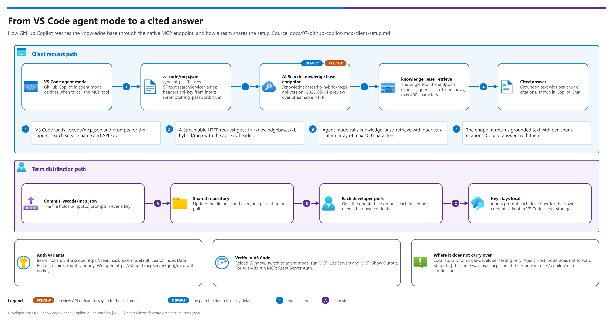

[Demo README](../README.md) › Docs › 07 — GitHub Copilot MCP client setup

# 07 — GitHub Copilot MCP client setup

<p>
  &nbsp;
  &nbsp;
  &nbsp;
  &nbsp;
  &nbsp;
  
</p>

   

> Deep dive on wiring VS Code / GitHub Copilot to the MCP endpoint from [docs/06](06-mcp-endpoint-and-fallback-server.md). Referenced from [03-deployment.md Phase 5](03-deployment.md#phase-5--wire-github-copilot--vs-code) and [docs/00-reproduce-this-demo.md Part E](00-reproduce-this-demo.md).

## At a glance

| | |
|---|---|
| **Goal** | Connect GitHub Copilot agent mode in VS Code to the MCP endpoint |
| **Config file** | `.vscode/mcp.json` (workspace, committed) |
| **Auth options** | [A — API key](#option-a--native-ai-search-mcp-endpoint-api-key-auth-simplest) · [A2 — Entra ID bearer token](#option-a2--native-ai-search-mcp-endpoint-entra-id-bearer-token-microsofts-recommended-production-auth) · [B — wrapper](#option-b--optional-custom-wrapper-container-app) · [stdio](#local-stdio-option-single-developer-testing-only--not-for-team-distribution) |
| **Then** | [Verify](#3--verifying-the-connection) · [Use](#4--using-it) · [Distribute to the team](#5--team-distribution) |

> [!NOTE]
> The native Knowledge Base MCP endpoint is **public preview** (Search API `2026-05-01-preview`); see [docs/06](06-mcp-endpoint-and-fallback-server.md).

## Client connection flow

[](./assets/copilot-mcp-client-flow.png)

<sub>Editable source: [`assets/copilot-mcp-client-flow.drawio`](./assets/copilot-mcp-client-flow.drawio) - regenerate with `python scripts/export_diagrams.py docs/assets`.</sub>

---

##  1 — Prerequisites checklist

| Step | | Prerequisite | Gate |
|---|---|---|---|
| 1 |  | [GitHub Copilot with agent mode](#1-github-copilot-with-agent-mode) | ☐ MCP server configuration is visible in your extension version |
| 2 |  | [A working MCP endpoint](#2-a-working-mcp-endpoint) | ☐ Native endpoint validated, or wrapper deployed |

### 1. GitHub Copilot with agent mode

VS Code with the GitHub Copilot + GitHub Copilot Chat extensions installed, signed in, and **agent mode** enabled (Copilot Chat settings → agent mode / MCP support — this ships as a standard capability of recent Copilot Chat versions; confirm your extension version supports MCP server configuration if the option isn't visible).

### 2. A working MCP endpoint

Either the native Knowledge Base MCP endpoint (validated in [docs/06 § 3](06-mcp-endpoint-and-fallback-server.md#3--checking-availability)) or the optional custom wrapper Container App (deployed in [docs/06 § 5](06-mcp-endpoint-and-fallback-server.md#5--deploying-the-custom-wrapper-server-to-azure-container-apps)).

---

##  2 — Workspace `.vscode/mcp.json`

VS Code discovers MCP servers from a workspace-level `.vscode/mcp.json` (shared with the team when committed to the project repo) or a user-level MCP config (personal, not shared). For a customer-deployable demo, **commit the workspace file** so every developer on the project gets the connection automatically when they open the repo.

> [!IMPORTANT]
> **Portability note.** When VS Code's Agent Host mode is enabled, `.vscode/mcp.json` entries that use `${input:...}` prompted secrets aren't forwarded to the Agent Host the same way as static config. If your team relies on Agent Host and hits connection issues with the `inputs`-based options below, use a portable `.mcp.json` at the repo root (not under `.vscode/`) or a user-level `~/.copilot/mcp-config.json` instead — the server entry shape is the same either way.

| Step | | Option | Auth | Use when |
|---|---|---|---|---|
| 2a |  | [A — native endpoint, API key](#option-a--native-ai-search-mcp-endpoint-api-key-auth-simplest) | Query key via `inputs` prompt | Simplest path |
| 2b |  | [A2 — native endpoint, Entra ID bearer token](#option-a2--native-ai-search-mcp-endpoint-entra-id-bearer-token-microsofts-recommended-production-auth) | Bearer token (`Search Index Data Reader`) | Microsoft's recommended production auth |
| 2c |  | [B — optional custom wrapper](#option-b--optional-custom-wrapper-container-app) | None in the client (server-side Key Vault) | Wrapper deployed  |
| 2d |  | [stdio](#local-stdio-option-single-developer-testing-only--not-for-team-distribution) | Local env vars | Single-developer testing only |

### Option A — native AI Search MCP endpoint, API key auth (simplest)

<details><summary><b>Show the Option A <code>mcp.json</code></b></summary>

```jsonc
// .vscode/mcp.json
{
  "servers": {
    "dev-docs-knowledge-agent": {
      "type": "http",
      "url": "https://${input:searchServiceName}.search.windows.net/knowledgebases/kb-hybrid/mcp?api-version=2026-05-01-preview",
      "headers": {
        "api-key": "${input:searchApiKey}"
      }
    }
  },
  "inputs": [
    {
      "id": "searchServiceName",
      "type": "promptString",
      "description": "AI Search service name (e.g. srch-ddmcp-dev-eastus2)"
    },
    {
      "id": "searchApiKey",
      "type": "promptString",
      "description": "AI Search query key",
      "password": true
    }
  ]
}
```

</details>

`inputs` prompts each developer for their own key on first use (stored securely by VS Code, never written to this file) — this is why the API key is **never hardcoded** in the committed `mcp.json`.

### Option A2 — native AI Search MCP endpoint, Entra ID bearer token (Microsoft's recommended production auth)

<details><summary><b>Show the Option A2 <code>mcp.json</code></b></summary>

```jsonc
// .vscode/mcp.json
{
  "servers": {
    "dev-docs-knowledge-agent": {
      "type": "http",
      "url": "https://${input:searchServiceName}.search.windows.net/knowledgebases/kb-hybrid/mcp?api-version=2026-05-01-preview",
      "headers": {
        "Authorization": "Bearer ${input:searchBearerToken}"
      }
    }
  },
  "inputs": [
    {
      "id": "searchServiceName",
      "type": "promptString",
      "description": "AI Search service name (e.g. srch-ddmcp-dev-eastus2)"
    },
    {
      "id": "searchBearerToken",
      "type": "promptString",
      "description": "Entra ID token scoped to https://search.azure.com/.default (e.g. `az account get-access-token --resource https://search.azure.com --query accessToken -o tsv`) — the caller needs Search Index Data Reader on the service",
      "password": true
    }
  ]
}
```

</details>

> [!WARNING]
> Entra ID bearer tokens expire (roughly an hour), so re-prompting is more frequent than Option A's API key — acceptable for a demo, but flag to the customer that a service-principal / `DefaultAzureCredential`-based client (or the custom wrapper server, which can refresh tokens server-side) is the more durable choice for daily developer use.

### Option B — optional custom wrapper Container App

 Requires the wrapper from [docs/06](06-mcp-endpoint-and-fallback-server.md).

<details><summary><b>Show the Option B <code>mcp.json</code></b></summary>

```jsonc
// .vscode/mcp.json
{
  "servers": {
    "dev-docs-knowledge-agent": {
      "type": "http",
      "url": "https://${input:mcpServerFqdn}/mcp"
    }
  },
  "inputs": [
    {
      "id": "mcpServerFqdn",
      "type": "promptString",
      "description": "Custom wrapper MCP server Container App FQDN (from demo-ids.local.json: containerAppFqdn)"
    }
  ]
}
```

</details>

The wrapper server's own auth to AI Search is handled server-side (Key Vault reference — see [docs/06 § 5](06-mcp-endpoint-and-fallback-server.md#5--deploying-the-custom-wrapper-server-to-azure-container-apps)), so no key is needed in the VS Code client config for this option.

### Local stdio option (single-developer testing only — not for team distribution)

<details><summary><b>Show the stdio <code>mcp.json</code></b></summary>

```jsonc
// .vscode/mcp.json
{
  "servers": {
    "dev-docs-knowledge-agent": {
      "type": "stdio",
      "command": "python",
      "args": ["${workspaceFolder}/scripts/mcp_fallback_server.py", "--transport", "stdio"],
      "env": {
        "SEARCH_ENDPOINT": "${input:searchEndpoint}",
        "SEARCH_API_KEY": "${input:searchApiKey}"
      }
    }
  }
}
```

</details>

> [!CAUTION]
> Use this only for a developer running the wrapper server locally against their own dev Search instance — not suitable for a shared team demo (each developer would need Python + dependencies installed locally).

---

##  3 — Verifying the connection

| Step | | Action | Gate |
|---|---|---|---|
| 1 |  | Reload the VS Code window (`Developer: Reload Window`) after adding/editing `.vscode/mcp.json` | ☐ Window reloaded |
| 2 |  | Open the Copilot Chat panel, switch to **agent mode** | ☐ Agent mode active |
| 3 |  | Open the MCP servers list (Command Palette → `MCP: List Servers`, or the tools icon in the Copilot Chat input) — confirm `dev-docs-knowledge-agent` shows as **connected** | ☐ Shows as connected |
| 4 |  | If it fails to connect, open `MCP: Show Output` for the connection log (auth errors, malformed URL, and transport mismatches show up here first) | ☐ Cause identified |

##  4 — Using it

Ask a natural-language question about the corpus directly in Copilot Chat (agent mode) — no special syntax required:

> "According to the datasheet, what's the maximum SPI clock frequency this part supports, and does our current firmware config exceed it?"

Copilot recognizes the connected MCP tool as relevant to the question, calls it, and incorporates the grounded, cited result into its response — while still having full access to your open workspace files for the code-side half of the comparison.

> [!TIP]
> If Copilot never calls the tool, the tool description is usually too generic — see the [Troubleshooting](#troubleshooting) table below.

##  5 — Team distribution

| Step | | Action | Gate |
|---|---|---|---|
| 1 |  | Commit `.vscode/mcp.json` to the customer's repository so every developer gets the connection when they clone/open the project — this is the "customer-ready, easily deployable" part of the ask: one file, no separate portal step per developer | ☐ File committed |
| 2 |  | Use the `inputs` prompt pattern (Option A or A2) so no team member needs to know or share a hardcoded secret; VS Code's secret storage keeps each developer's entered credential local to their machine | ☐ No hardcoded secrets |
| 3 |  | If the corpus or endpoint changes (e.g., switching from the custom wrapper to the native endpoint once it's confirmed available), update the committed `.vscode/mcp.json` once — every developer picks up the change on next pull | ☐ Change pulled by team |

##  Troubleshooting

| Where | Symptom | Root cause | Fix |
|---|---|---|---|
|  VS Code | Server never shows as connected | Malformed JSON (trailing comma, wrong `type` value) | Validate `.vscode/mcp.json`; reload window after any edit |
|  Copilot | Connected, but Copilot never calls the tool | Tool description too generic for Copilot to judge relevance | Set `corpus.mcpToolDescription` in `demo-ids.local.json` to name the actual document types and question types (no code edit needed), then redeploy the wrapper — or update the Knowledge Base's configured description for the native endpoint |
|  Auth | 401/403 on tool call | API key or bearer token input wasn't entered, or a rotated key/expired token | Re-trigger the `inputs` prompt (Command Palette → `MCP: Reset Server Auth` or remove and re-add the server); for Option A2, tokens expire roughly hourly — re-prompt is expected |
|  Team | Works for one developer, not another | Each developer needs their own credential entered once — if this fails, they're either on the wrong endpoint or lack Search access (`Search Index Data Reader` for bearer-token auth) | Confirm they're using the same `searchServiceName`/`mcpServerFqdn` and have valid credentials |

---

Next: [08 - Extraction tier comparison](./08-extraction-tier-comparison.md) →

*Last updated: 2026-10-02*
