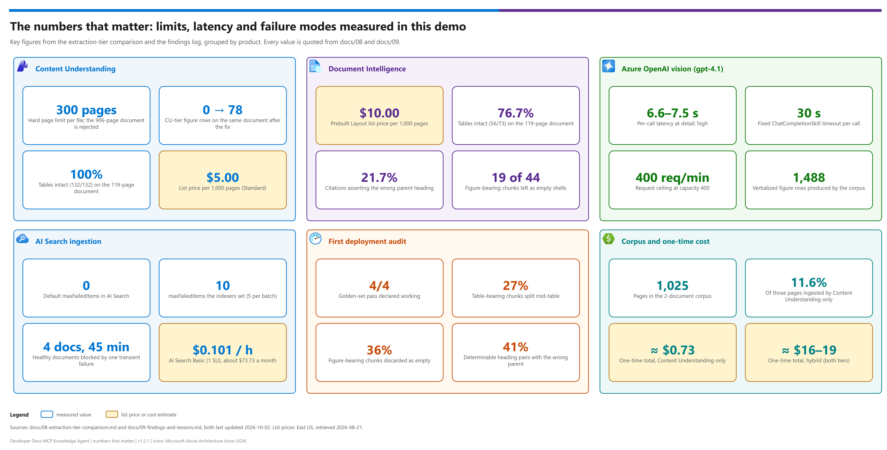

[README](../README.md) › [docs index](./00-reproduce-this-demo.md) › 09 Findings and lessons

# 09 — Findings and lessons

<p>
  &nbsp;
  &nbsp;
  &nbsp;
  &nbsp;
  &nbsp;
  &nbsp;
  
</p>

   

Everything two clean-room rebuilds surfaced, in one place. Each entry states the **symptom you
will actually see**, the **real cause** (often different from what the error says), and the
**fix**. It is for anyone about to build, debug or sell this pattern and wants the shortcuts
before hitting the same walls.

> [!NOTE]
> **Why this document exists.** This pattern was authored, reviewed for accuracy against
> Microsoft Learn, and had its API contracts validated — three passes — before it was ever
> deployed. The first real deployment still hit **nine** defects, six of them hard blockers. A
> second teardown-and-rebuild found **six more**. Almost every one was invisible to static
> review, and several presented with error messages that pointed at the wrong thing.
>
> The generalisable lesson: **a pattern is not customer-ready until it has been built from
> zero, twice.** Once proves it can work; twice proves the documentation is what made it work.

## At a glance

Seven families of finding, one card each. The detailed entries follow in the same order.

| | Family | What bites you | Jump to |
|---|---|---|---|
|  | **Failures that lie to you** | The error names a plausible-but-wrong cause (a "timeout" that is really throttling) | [below](#failures-that-lie-to-you) |
|  | **Silent failures** | Everything reports success; zero figures, stale rows, or a dropped property | [below](#silent-failures) |
|  | **Teardown and rebuild** | Soft-deleted accounts and in-flight deletes block a redeploy | [below](#teardown-and-rebuild) |
|  | **Ingestion at scale** | One failed document halts a run; split size follows figure density | [below](#ingestion-at-scale) |
|  | **Environment constraints** | Regional capacity and governed-subscription policy | [below](#environment-constraints) |
|  | **Corrections to earlier guidance** | Confident claims later disproved by measurement | [below](#corrections-to-earlier-guidance) |
|  | **Testing lessons** | A golden set that only checks *which document* hides degraded passages | [below](#testing-lessons) |

### Symptom → real cause cheat sheet

| | Error you see | Real cause | Fix |
|---|---|---|---|
|  | Vision skill `did not execute within the time limit '00:00:30'` | **Request-rate throttling**, not a slow model | Provision request headroom, then split documents |
|  | `Web Api skill response is invalid` → HTTP 404 | The `api-version` query parameter is missing from the skill `uri` | Always include `?api-version=...` |
|  | `DeploymentIdNotFound` on a deployment that exists | The new deployment is **not serving yet** | Verify with a direct chat call, then reset and re-run |
|  | `Parsing failure: unexpected '='` | `='literal'` used in an index projection mapping | Materialise the constant with a `ConditionalSkill` |

## The numbers that matter

The limits and measurements that shaped the design, on one page. The same figures appear in [08](./08-extraction-tier-comparison.md) and in the entries below.

[](./assets/numbers-that-matter.png)

<sub>Editable source: [`assets/numbers-that-matter.drawio`](./assets/numbers-that-matter.drawio) - regenerate with `python scripts/export_diagrams.py docs/assets`.</sub>

> [!TIP]
> If you only carry one lesson into a customer conversation, make it this one: **when a service imposes a
> hard per-call timeout with a total-failure mode, select on latency _variance_, not mean latency — and
> benchmark more than one input.** See [Corrections to earlier guidance](#corrections-to-earlier-guidance).

**Navigation**

- [Failures that lie to you](#failures-that-lie-to-you) — wrong-cause error messages
- [Silent failures](#silent-failures) — no error at all
- [Teardown and rebuild](#teardown-and-rebuild)
- [Ingestion at scale](#ingestion-at-scale)
- [Environment constraints](#environment-constraints)
- [Corrections to earlier guidance](#corrections-to-earlier-guidance)
- [Testing lessons](#testing-lessons)

---

## Failures that lie to you

The most expensive category: the error message names a plausible-but-wrong cause.

### Vision skill: `did not execute within the time limit '00:00:30'`

| | |
|---|---|
| **Looks like** | The model is too slow |
| **Actually is** | **Request-rate throttling** |
| **Evidence** | Measured per-call latency for `gpt-4.1` on a real register-diagram page at `detail: high`: **6.6–7.5s** — nowhere near the limit |

An Azure OpenAI deployment's **requests-per-minute limit scales with its capacity**
(capacity 400 → 400 req/min). AI Search issues figure calls concurrently, and
`degreeOfParallelism` was **removed** from `ChatCompletionSkill` in Search REST API
`2026-04-01`, so concurrency cannot be limited from the AI Search side. Hundreds of figures
exhaust the ceiling, requests queue, and individual calls exceed the fixed 30-second timeout.

**Fix:** provision request headroom, then split documents if that is not enough.

```bash
az cognitiveservices account deployment show -n <foundry> -g <rg> --deployment-name vision --query "{cap:sku.capacity, limits:properties.rateLimits[].{key:key,count:count}}" -o json
```

> [!IMPORTANT]
> **Capacity is a reliability setting for this deployment, not a cost setting.** A timeout here is
> almost never a slow model — check the requests-per-minute ceiling before changing the model.

### `Web Api skill response is invalid` → HTTP 404

| | |
|---|---|
| **Looks like** | Bad endpoint host, or a missing deployment |
| **Actually is** | The **`api-version` query parameter is missing** |

The Microsoft documentation sample for the skill omits it. Azure OpenAI returns 404, which the
indexer wraps in a generic message.

**Fix:** always include `?api-version=...` in the skill's `uri`.

### `DeploymentIdNotFound` on a deployment that exists

| | |
|---|---|
| **Looks like** | Wrong deployment name |
| **Actually is** | The deployment is **not serving yet** |

A brand-new model deployment takes a few minutes to become usable, and fails **three
different-looking ways** in the meantime:

- Content Understanding: `DeploymentIdNotFound`
- Content Understanding: `FigureUnderstandingSkipped` — *"the model deployment returned an error"*
- Vision skill: `InternalServerError`

All three occur while `az cognitiveservices account deployment list` already reports
`Succeeded`.

**Fix:** verify with a direct chat-completions call; once it returns 200, reset and re-run.
**Do not start editing the skillset** — nothing is wrong with it.

### `Parsing failure: unexpected '='`

| | |
|---|---|
| **Looks like** | A malformed skillset |
| **Actually is** | `='literal'` used in an **index projection mapping** |

That expression syntax is valid in skill **inputs** only. In projection `mappings` it fails the
entire indexer run.

**Fix:** materialise constants with a `ConditionalSkill` and project the resulting path.

---

## Silent failures

Worse than an error, because everything reports success.

### `allowProjectManagement` stripped from the compiled template

Bicep emitted `BCP037` ("property not allowed"). The warning was **correct**: on
`Microsoft.CognitiveServices/accounts@2024-10-01` the property is not in the type definition
and is **silently dropped from the compiled ARM template**. Foundry project creation then fails
with a message that reads like a service bug.

Compounding it: an earlier build appeared to work only because the project had been created by
hand in the portal, masking the defect entirely.

**Fix:** use `accounts@2025-06-01` or later, and verify the property survives:

```bash
az bicep build --file infra/modules/foundry.bicep --stdout | grep allowProjectManagement
```

**Lesson: never suppress a Bicep warning without first proving the property reaches ARM.**

### Content Understanding figure descriptions producing nothing

`FigureUnderstandingSkipped` reproduced across a reasoning model (`gpt-5.5`) *and* a
non-reasoning model (`gpt-4.1`), with both deployments verified serving HTTP 200 directly. In
an earlier build the same condition degraded to a **warning** — the tier reported success while
producing **zero** figure descriptions.

**Fix:** this pattern no longer uses CU's preview figure feature. Figures on **both** tiers go
through the GA `ChatCompletionSkill`. CU-tier figure rows went **0 → 78** on the same document.

### `modelName` not matching the deployed model

Using the documentation sample's `gpt-4.1` against a `gpt-5-mini` deployment produced **zero**
figure descriptions, with the skillset accepted and the indexer reporting success.

**Fix:** derive `modelName` from the deployment you actually created.

### Reasoning models returning empty content

Reasoning tokens are charged against the completion budget. At a small budget the model spends
everything reasoning and returns **empty content with no error** — measured: `gpt-5.6-sol` at
800 tokens returned **0 characters**.

**Fix:** give headroom, and pass it through `extraParameters`:

```jsonc
"extraParameters": { "max_completion_tokens": 4000, "reasoning_effort": "low" }
```

`commonModelParameters.maxTokens` serializes to the legacy `max_tokens`, which current API
versions reject. Note this is **API-version** behaviour, not model-family behaviour —
`gpt-4.1` rejects it too.

### Orphaned index rows after a corpus change

> [!WARNING]
> Deleting a blob does **not** remove its rows. A changed or re-split corpus silently
> double-represents content unless you act.

Deleting a blob does **not** remove its rows. The indexer only adds and updates unless a
deletion detection policy is configured, so a changed or re-split corpus leaves stale rows and
silently double-represents content.

**Fix:** delete and recreate the index for one-off changes; configure a
[deletion detection policy](https://learn.microsoft.com/azure/search/search-howto-index-changed-deleted-blobs)
for a corpus that changes in production.

### `deploy.ps1` reporting success after a failed deployment

`az deployment group create` returned non-zero, but the script continued, wrote a garbage
`demo-ids.local.json`, and printed "Deployment complete."

**Fix:** check `$LASTEXITCODE` and validate the deployment output before writing any state.
Fixed in this pattern.

---

## Teardown and rebuild

### Soft-deleted Cognitive Services blocks redeploy

Deleting a resource group **soft-deletes** the Cognitive Services account. Redeploying the same
name fails preflight with `FlagMustBeSetForRestore`, which reads like a template bug.

**Fix:** purge it. `deploy.ps1` now detects this and offers to purge automatically.

```bash
az cognitiveservices account purge --location <region> --resource-group <rg> --name <name>
```

### AI Search name held by an in-flight delete

`ServiceDeleting` — *"a background operation is still in progress"*. Unlike Cognitive Services
there is **no purge**; you wait.

**Fix:** `deploy.ps1` retries with backoff (5 attempts, 1–5 minutes) on both this and
`FlagMustBeSetForRestore`, so teardown-then-rebuild is self-healing.

---

## Ingestion at scale

### One failed document halting the entire run

The AI Search default is `maxFailedItems: 0`. Observed live: one transient upstream 500 on an
already-indexed document blocked **four healthy documents for 45 minutes**, and the run
reported `processed=1 failed=1` with nothing else attempted.

**Fix:** `maxFailedItems: 10` / `maxFailedItemsPerBatch: 5`. Deliberately **not** `-1`, which
would mask a genuinely broken corpus.

### Retrying failed documents

> [!CAUTION]
> **`--reset` is the only reliable method** — and it reprocesses and re-bills the whole corpus.
> Budget for it before you press the button.

**`--reset` is the only reliable method.** Change tracking treats an attempted-and-failed
document as *seen*, so a plain re-run reports `processed=0 failed=0` and skips it.

Re-uploading the failed blobs looks like the surgical fix and sometimes works, but it is
**timing-sensitive and can silently no-op**: change detection compares blob `LastModified`
against the indexer's `lastFullEnumerationStartTime`. Observed live — two consecutive
re-upload-then-run cycles both returned `processed=0 failed=0`.

| Approach | Reliability | Cost |
|---|---|---|
| `--reset` then run | **Dependable** | Reprocesses and re-bills the whole corpus |
| Re-upload failed blobs | Timing-dependent — verify `processed` increased | Cheap when it works |

### Split size is driven by figure density, not page count

300 pages is Content Understanding's **ceiling, not a target**. Two 300-page parts of the same
specification failed repeatedly on the vision timeout even at 1,000 req/min, while a third part
of **identical page count succeeded**.

Figure density is **not predictable from the file**: embedded raster image counts for those
parts were 2–9, yet the corpus produced **1,488 verbalized figure rows** — the figures are
vector diagrams detected during extraction, invisible to page-level image inspection.

**Fix:** reduce split size when a part fails repeatedly. `hybrid_ingest.py --split` defaults to
the 300-page limit; drop to 100 for figure-dense technical content.

### Wall-clock expectations

Figure-heavy ingestion is **throughput-bound, not capability-bound**. A 906-page specification
with full figure verbalization is an **hours-scale one-time ingest**. Set that expectation
before a POC rather than discovering it during one.

---

## Environment constraints

| | Constraint | Symptom | Workaround |
|---|---|---|---|
|  | Regional capacity ≠ availability | `InsufficientResourcesAvailable` on AI Search Basic | Pick another region (`eastus` succeeded where `eastus2` did not) |
|  | Governed subscription forces `publicNetworkAccess: Disabled` | Policy silently reverts an explicit re-enable | Network Security Perimeter, `SecuredByPerimeter` via REST |
|  | Content Understanding model allowlist lags the Foundry catalog | Rejection error enumerates the current ceiling | No longer a constraint here — figures use the  vision skill |

> [!NOTE]
> These three are environmental, not defects in the pattern: they depend on the subscription,
> region and policy you deploy into. Check them during region selection, before the first deploy.

### Regional capacity ≠ regional availability

`eastus2` listed AI Search Basic as available and still rejected creation with
`InsufficientResourcesAvailable`. This is capacity exhaustion, not quota; retrying in the same
region does not help. `eastus` succeeded.

**Fix:** check capacity as part of region selection, and confirm model quota for the
**Standard** SKU (not just GlobalStandard) in the same region.

### Governed subscriptions force `publicNetworkAccess: Disabled`

Policy forces this on Storage and Key Vault, and **silently reverts** an explicit re-enable
(a `modify` effect). RBAC is not the problem.

- **Key Vault** is survivable — the scripts fall back to the Search control plane.
- **Storage is not** — the corpus cannot be uploaded.

**Fix:** associate the storage account with a **Network Security Perimeter** and set
`publicNetworkAccess: SecuredByPerimeter` via REST (the `az storage account` CLI does not
expose that value). Propagation takes 2–5 minutes. Full steps in
[05 § 1](./05-troubleshooting.md#1--foundation-bicep-deploy).

### Content Understanding's model allowlist

CU enforces its own allowlist that **lags the Foundry catalog**, and the rejection error
usefully enumerates the current ceiling. No longer a constraint for this pattern, since figures
moved to the GA vision skill — but worth knowing if you revisit CU's native figure descriptions.

---

## Corrections to earlier guidance

Recorded deliberately: each of these was documented confidently and later proved wrong by
measurement. They are the clearest argument for validating a pattern by rebuilding it.

| Originally claimed | Corrected to |
|---|---|
| "Reasoning models are too slow for the vision skill" | Latency was never the problem — the **token budget** was. Later still: reasoning models are wrong here, but because of **latency variance**, not mean latency |
| "Use the frontier model everywhere" | Frontier for query planning; **non-reasoning** for the vision skill, because a hard per-call timeout with a total-failure mode rewards predictability |
| "Re-run without `--reset` resumes from the checkpoint" | Wrong for **failed** documents — they are treated as seen |
| "Re-upload the failed blobs to retry them" | Timing-sensitive; can silently no-op. `--reset` is the reliable method |
| "`sections` gives a heading path" | It is the most-recent-heading-per-level, not a validated ancestor chain — wrong parent ~21.7% of the time |
| Suppressing Bicep `BCP037` | The warning was correct; the property was being stripped |

**Meta-lesson: when a service imposes a hard per-call timeout with a total-failure mode, select
on latency _variance_, not mean latency — and benchmark more than one input.** A single-page
benchmark measures the mean; the ceiling punishes the tail.

---

## Testing lessons

### A golden set that only checks *which document* cannot detect a degraded passage

> [!IMPORTANT]
> A **4/4 golden-set pass** was declared "working" while more than a third of figure-bearing
> chunks were empty. Test what landed in the index, not only what came back from a query.

The first build passed **4/4** on its golden set and was declared working. Auditing the actual
index content found:

| Defect | Measurement |
|---|---|
| Tables split mid-table | 27% of table-bearing chunks |
| Figures discarded as empty `<figure></figure>` | 36% of figure-bearing chunks |
| Heading citation asserting the **wrong parent** | 41% of determinable pairs |
| Chunk size range | 10 – 8,013 characters |

**Fix:** [04-testing.md](./04-testing.md) now has a **chunk-quality audit** (category B) and a
**tier-provenance check** (category D) alongside retrieval tests. Test what landed in the
index, not only what came back from a query.

### Include a figure-only question in every golden set

*"What is the bit width of the mtime register and which bits does it span?"* — answerable only
from a diagram. It is the single question that distinguishes a working figure pipeline from one
silently discarding every image.

### A comparison harness needs its own regression tests

Four bugs in the A/B harness produced plausible-but-wrong numbers: comparing whole indexes when
one tier had rejected a document; parsing only one of two knowledge-base response shapes;
pointing a knowledge base at a source it did not own (HTTP 200, zero results); and missing
orphaned table *tails*, which undercounted the very defect being measured.

**A tool that measures quality needs tests as much as the thing it measures.**

---

Next: [10 - Repo corpus export](./10-repo-corpus-export.md) →

*Last updated: 2026-10-02*
