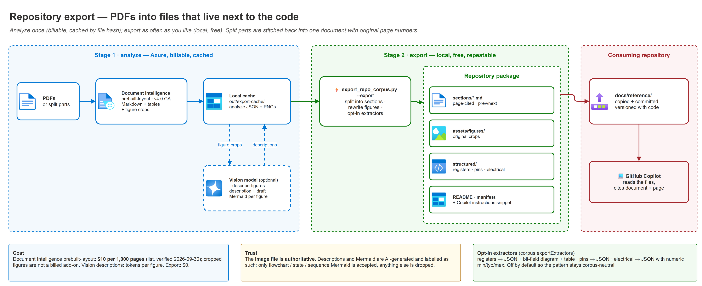

# 10 — Repository corpus export

Turn source PDFs into **files that live next to the code**: per-section Markdown, the original
figures as images, Mermaid renderings, and (optionally) structured register/pin/electrical data.
The knowledge-base MCP endpoint answers questions *about* a document; this export puts the
document itself in the working tree, where every coding assistant can read it.

> **Script:** [`scripts/export_repo_corpus.py`](../scripts/export_repo_corpus.py) ·
> **Tests:** [`tests/test_export_repo_corpus.py`](../tests/test_export_repo_corpus.py) (offline)

---

## Index, export, or both?

| | Knowledge base + MCP ([docs/06](./06-mcp-endpoint-and-fallback-server.md)) | Repository export (this doc) | Both |
|---|---|---|---|
| Best at | **Finding** the right passage across thousands of pages | **Reading** a known section in full, with its figures | Find with the index, then open the exported section |
| Where it lives | Azure AI Search | Git, beside the source code | — |
| Works offline / in code review | ❌ | ✅ | ✅ |
| Figures | Searchable text descriptions | **Original image files** + descriptions + draft Mermaid | ✅ |
| Structured data (registers, pins) | ❌ | ✅ JSON + Markdown tables (opt-in) | ✅ |
| Versioned with the code | ❌ | ✅ — diffable when the vendor revises the manual | ✅ |
| Running cost | Search service bills continuously | One-time analysis; files are free after that | — |
| Scale limit | Corpus size | Practical repo size (hundreds of MB of figures is a smell) | — |

**Recommendation:** ship both for large vendor manuals. Use the export on its own when the
corpus is a handful of documents the team reads repeatedly.

---

## How it works

[](./assets/repo-export-pipeline.png)

<sub>Editable source: [`assets/repo-export-pipeline.drawio`](./assets/repo-export-pipeline.drawio).</sub>

| Stage | Command | Calls Azure | Cost |
|---|---|---|---|
| Analyze | `--analyze --source-dir <pdfs>` | Document Intelligence | $10 per 1,000 pages (prebuilt-layout, pay-as-you-go list price, verified 2026-09-30); cropped figure output is not a billed add-on |
| Describe figures | `--describe-figures` | Azure OpenAI vision deployment | Tokens per figure — the same order as the ingestion vision skill ([08 § Cost model](./08-extraction-tier-comparison.md#cost-model)) |
| Export | `--export --out <dir>` | nothing | free — re-run as often as you like |

Results are cached by file hash, so re-running `--analyze` on an unchanged PDF costs nothing.
`--force` re-runs the service calls.

---

## Run it

Authenticate to the tenant that owns the Foundry account first (see
[03 § Phase 0](./03-deployment.md)) — the script uses your signed-in identity, which needs the
**Cognitive Services User** role on that account.

```bash
cd scripts
pip install -r requirements.txt

# 1. Analyze (billable). Split parts are fine -- they are stitched back together on export.
python export_repo_corpus.py --ids-file ../demo-ids.local.json --analyze --source-dir ../samples/corpus-split

# 2. Optional: describe figures and draft Mermaid for flow/block/state diagrams (billable).
python export_repo_corpus.py --ids-file ../demo-ids.local.json --describe-figures

# 3. Export (free). Extractors come from corpus.exportExtractors, or override with --extract.
python export_repo_corpus.py --ids-file ../demo-ids.local.json --export --out ../out/repo-export
```

| Option | Default | Effect |
|---|---|---|
| `--extract registers,pins,electrical` | `corpus.exportExtractors`, else none | Which structured extractors run; `none` disables them |
| `--max-section-chars` | 40000 | A chapter longer than this is split again at its next heading level |
| `--min-section-chars` | 1500 | Consecutive tiny sections are merged so the export isn't hundreds of stubs |
| `--cache-dir` / `--out` | `out/export-cache` / `out/repo-export` | Both are under the gitignored `out/` folder |

Limits worth knowing (Document Intelligence S0): up to 2,000 pages and 500 MB per document.
The free F0 tier analyzes **only the first two pages**, which produces a misleadingly small export.

---

## What you get

```
repo-export/
├── README.md                          corpus index + how it was produced (Mermaid)
├── COPILOT-INSTRUCTIONS.snippet.md    paste into .github/copilot-instructions.md
├── manifest.json                      source hashes, page offsets, every file's SHA-256
└── <document>/
    ├── README.md                      at-a-glance table, structure mindmap, section index
    ├── sections/
    │   ├── 001-front-matter.md
    │   ├── 002-1-overview.md          frontmatter: source + page range; prev/next links
    │   └── …
    ├── assets/figures/
    │   └── fig-p0012-1.png            original crop; name carries the ORIGINAL page
    └── structured/                    only when extractors are enabled
        ├── registers.json / .md       bit-field diagram + field table per register
        ├── pins.json / .md
        └── electrical.json / .md      min/typ/max also parsed to numbers
```

Each section file starts like this, so a coding assistant can cite exactly where a value came from:

```markdown
---
source: "riscv-spec.pdf"
pages: "412–431"
section: "3 Machine-Level ISA"
generated_by: "export_repo_corpus.py 1.0.0"
---

> Source: `riscv-spec.pdf`, pages 412–431 · ← previous section · Document index · next section →
```

(In the real file the navigation items are relative links to the neighbouring section files.)

Page markers (`<!-- page: 417 -->`) inside the body keep finer-grained citations possible. They
are HTML comments, so they don't show up in the rendered Markdown.

### Figures

| Element | Source | Trust |
|---|---|---|
| Image file | Crop produced by Document Intelligence | **Authoritative** |
| Caption | Document Intelligence | Extracted from the document |
| "Text detected inside the figure" | Document Intelligence | Extracted — useful for search, not layout |
| Description | Vision model (`--describe-figures`) | AI-generated — labelled as such |
| Mermaid rendering | Vision model, only for flow/block/state/sequence diagrams | AI-drafted — labelled; only `flowchart`, `stateDiagram-v2` and `sequenceDiagram` are accepted, anything else is dropped |

### Structured extraction (opt-in)

Extractors are **off by default** so the pattern stays corpus-neutral. The shipped hardware
example turns them on in `demo-ids.template.json`:

```json
"corpus": { "exportExtractors": ["registers", "pins", "electrical"] }
```

| Extractor | A table qualifies when… | Output |
|---|---|---|
| `registers` | It has a bit column (`Bit`, `Bits`, `Position`) **and** a field-name column, and ≥ 60% of rows parse as a bit or bit range (`31:16`, `[7:0]`, `5`, `3-0`, `0..7`) | Fields with msb/lsb/access/reset/description + a Mermaid bit-field diagram |
| `pins` | It has a `Pin`/`Ball`/`Pad` column plus a name/function/signal column | Rows keyed by header |
| `electrical` | It has min/typ/max columns plus a parameter/symbol/condition column | Rows plus parsed numeric min/typ/max |

A register's name comes from the table caption, falling back to the nearest heading above it.
Tables with overlapping bit ranges keep their field table but skip the diagram rather than
drawing something wrong.

> **Rendering note.** The bit-field diagram uses Mermaid's `packet-beta` keyword. It is
> accepted by every Mermaid version that has packet diagrams (the documented name is `packet`
> since v11). GitHub doesn't publish its Mermaid version, so each diagram is always followed by
> a Markdown table that holds the same data. VS Code's built-in preview needs the
> *Markdown Preview Mermaid Support* extension for **any** Mermaid diagram.
>
> **Why the export uses Mermaid when these docs use draw.io.** This pattern's own docs are for
> people, so their diagrams are draw.io sources exported to PNG. The export is written for a
> *coding assistant* reading the repository: Mermaid is text that Copilot can read, reason over
> and diff, while a PNG is opaque to it. The original figure image is always kept alongside.

---

## Wire it into a repository

| Step | Action |
|---|---|
| 1 | Copy `out/repo-export/<document>/` into the consuming repo (e.g. `docs/hardware/<document>/`). |
| 2 | Merge `COPILOT-INSTRUCTIONS.snippet.md` into that repo's `.github/copilot-instructions.md`. |
| 3 | Commit `manifest.json` alongside — it records which source revision the files came from. |
| 4 | When the vendor revises the manual, re-run analyze + export and review the diff like code. |

> **Licensing.** Exported sections reproduce the vendor's document. Check redistribution
> rights before committing a third-party manual to a shared repository, as you would for the
> PDF itself ([samples/README.md](../samples/README.md)).

---

## Troubleshooting

| Symptom | Cause | Fix |
|---|---|---|
| Export has only two pages of content | Document Intelligence **F0** (free) tier | Use S0 |
| `401`/`403` on analyze | Signed-in identity lacks **Cognitive Services User**, or the wrong tenant is active | `az account show`; assign the role on the Foundry account |
| Every chapter lands in one huge file | Headings aren't numbered and all share one Markdown level | Lower `--max-section-chars`; the splitter falls back to heading level |
| A figure shows a caption but no image | The crop download failed during analyze (logged as `! figure …`) | Re-run `--analyze --force` for that document |
| Register table missing from `structured/` | Header wording didn't match the classifier, or < 60% of rows parsed as bits | Check the table in `sections/`; extend the header vocabulary in `classify_table` |
| Page numbers off by a constant | A split part was renamed and lost its `__pNNNN-MMMM` suffix | Keep the part filenames `hybrid_ingest.py --split` produces |

---

*Last updated: 2026-09-30*
