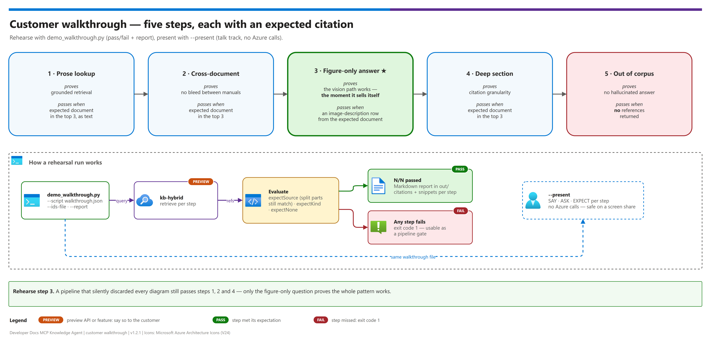

[README](../README.md) › [docs index](./00-reproduce-this-demo.md) › 11 Customer walkthrough

# 11 — Customer walkthrough

<p>
  &nbsp;
  &nbsp;
  &nbsp;
  &nbsp;
  &nbsp;
  
</p>

  

A scripted, self-checking demo. Run it **before** the session to prove the story still lands,
then use `--present` **during** the session as the talk track.

> [!NOTE]
> **Validation status.** The walkthrough script is  — validated by its offline tests, not run
> against Azure by the pattern authors. Rehearse it against your own deployment before presenting.

> **Script:** [`scripts/demo_walkthrough.py`](../scripts/demo_walkthrough.py) ·
> **Example:** [`samples/walkthrough.example.json`](../samples/walkthrough.example.json) ·
> **Tests:** [`tests/test_demo_walkthrough.py`](../tests/test_demo_walkthrough.py) (offline)

## At a glance

| | Phase | Command | Azure calls |
|---|---|---|---|
|  | **Rehearse** (before) | `demo_walkthrough.py --script … --report` | Yes — queries the knowledge base; exits non-zero on any failed step |
|  | **Present** (during) | `demo_walkthrough.py --script … --present` | **None** — prints `SAY` / `ASK` / `EXPECT`, safe to screen-share |
|  | **Follow up** (after) | the `--report` output | None — a Markdown table of results to attach to an email |

> [!TIP]
> **Presenter tip.** Rehearse step 3 until it is boring — it is the moment the pattern sells
> itself. Run `--present` on the shared screen so the audience sees the questions and the
> expected citations, while the live answers come from Copilot Chat.

---

## The story in five steps

[](./assets/customer-walkthrough.png)

<sub>Editable source: [`assets/customer-walkthrough.drawio`](./assets/customer-walkthrough.drawio). The lower half of the diagram shows how a rehearsal run evaluates each step.</sub>

| # | Step | What it proves | Pass condition |
|---:|---|---|---|
| 1 | Prose lookup | Basic grounded retrieval | Expected document in the top 3, as `text` |
| 2 | Cross-document routing | No bleed between manuals | Expected document in the top 3 |
| 3 | **Figure-only answer** | The vision path works — **the moment the pattern sells itself** | An `image-description` reference **from the expected document** in the top 3 |
| 4 | Deep section | Citation granularity | Expected document in the top 3 |
| 5 | Out of corpus | No hallucinated answer | **No** references returned |

Step 3 is the one to rehearse. A pipeline that silently discarded every diagram still passes
steps 1, 2 and 4.

### Run of show

The shipped example (`samples/walkthrough.example.json`) for the RISC-V corpus.

| # | | Step | Ask (type into Copilot Chat) | Expect |
|---:|---|---|---|---|
| 1 |  | Prose lookup | *What does the dmcontrol register control in the Debug Module?* | `riscv-debug-specification`, `text` |
| 2 |  | Cross-document routing | *What is the encoding format of the RISC-V compressed instruction set?* | `riscv-spec`, `text` |
| 3 |  | **Figure-only answer** | *What is the bit width of the mtime register and which bits does it span?* | `riscv-spec`, `image-description` |
| 4 |  | Deep section | *How does the JTAG Debug Transport Module encode DMI operations?* | `riscv-debug-specification` |
| 5 |  | Out of corpus | *What is the recommended torque for the enclosure mounting screws?* | **No** references |

### Step cards

Each card is what you say, what you show, and the proof that the step landed.

| Step | Talk track (`SAY`) | Expected result | Proof |
|---|---|---|---|
|  **1 · Prose lookup** | A developer asks a reference-manual question without leaving the editor. The answer cites the exact document and section. | The Debug Module spec is cited as a `text` reference | `[PASS]` line in the rehearsal output; expected document in the top 3 |
|  **2 · Cross-document routing** | Two manuals are indexed together. The question routes to the right one, with no bleed from the other. | `riscv-spec` is cited, not the debug spec | Expected document in the top 3 |
|  **3 · Figure-only answer** | This answer lives in a register diagram, not in the prose. A text-only pipeline throws the diagram away; here it comes back as a searchable description. | An `image-description` reference from `riscv-spec` | A reference of kind `image-description` **from the expected document** in the top 3 |
|  **4 · Deep section** | Citations stay precise even several heading levels down. | The debug spec is cited at the deep section | Expected document in the top 3 |
|  **5 · Out of corpus** | When the documents don't cover something, the honest answer is "not found", not a confident guess. | An honest "not found" | **No** references returned |

> [!CAUTION]
> **Do not show, and do not claim:**
> - the AI Search **admin key** or any Key Vault secret — the walkthrough needs neither on screen;
> - the contents of `demo-ids.local.json` (it holds environment-specific identifiers);
> - preview capabilities as GA — semantic chunking, figure descriptions and the Knowledge Base
>   MCP endpoint are public preview ([08 § Verify before you quote](./08-extraction-tier-comparison.md#verify-before-you-quote));
> - that this script has been run live against Azure for you — it is
>   , so run the rehearsal on your own deployment first.

---

## Before the session

```bash
cd scripts
python demo_walkthrough.py --ids-file ../demo-ids.local.json --script ../samples/walkthrough.example.json --report
```

```
[PASS] Step 3 — Answer that only exists in a figure  (2.1s)
       What is the bit width of the mtime register and which bits does it span?
       ↳ riscv-spec__p0001-0100.pdf · image-description
...
5/5 steps passed
report: out/walkthrough-2026-09-30_101500.md
```

The script exits non-zero if any step fails, so it can also gate a pipeline. The report is a
Markdown table of results plus the top citations and snippets for each step, ready to attach
to a follow-up email.

## During the session

```bash
python demo_walkthrough.py --script ../samples/walkthrough.example.json --present
```

This prints each step's talk track (`SAY`), the question to type into Copilot Chat (`ASK`) and
what a correct answer cites (`EXPECT`). It makes no Azure calls, so it's safe to run on a
screen share.

---

## Write a walkthrough for your own corpus

Copy the example and replace the queries. Schema:

| Field | Required | Meaning |
|---|---|---|
| `title` | no | Heading for the presenter view and the report |
| `steps[].title` | no | Step name |
| `steps[].say` | no | Talk track for the presenter |
| `steps[].query` | **yes** | The question — type the same text into Copilot Chat |
| `steps[].expectSource` | no | Substring of the cited document name. Split parts (`manual__p0301-0600.pdf`) still match `manual` |
| `steps[].expectKind` | no | `text` or `image-description` |
| `steps[].expectNone` | no | `true` for the out-of-corpus step |

Keep at least one figure-only step and one out-of-corpus step. `--top N` changes how many
citations count toward a pass (default 3). To target a different knowledge base, set
`walkthroughKnowledgeBase` / `walkthroughKnowledgeSource` in the ids file; the defaults are the
hybrid build's `kb-hybrid` / `ks-hybrid`.

---

## If a step fails

| Failing step | Most likely cause | Where to look |
|---|---|---|
| 3 only | Vision skill produced no rows — throttling or a missing `api-version` | [09 § Failures that lie to you](./09-findings-and-lessons.md), [04 § B](./04-testing.md#b--chunk-quality-audit-do-not-skip) |
| 2 | A document didn't ingest (rejected or still indexing) | [04 § D tier provenance](./04-testing.md#d--tier-provenance-is-the-hybrid-actually-hybrid) |
| 5 | Reranker threshold too low for the corpus | `rerankerThreshold` in `post_deploy_search.retrieve_body` |
| All | Wrong knowledge base, or indexing not finished | `hybrid_ingest.py --status` |

---

Next: [12 - Configuration reference](./12-configuration-reference.md) →

*Last updated: 2026-10-02*
