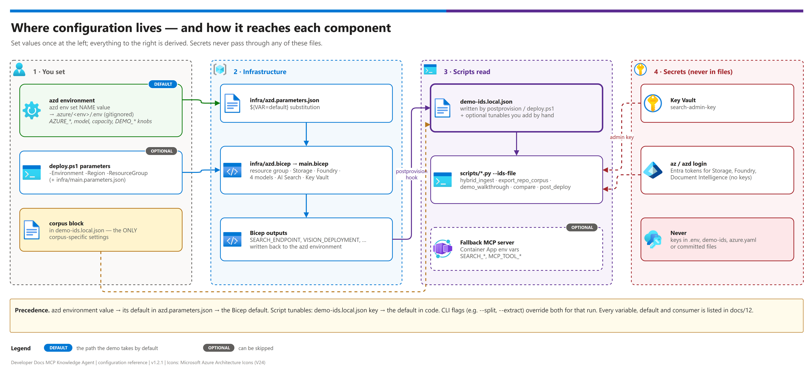

[README](../README.md) › [docs index](./00-reproduce-this-demo.md) › 12 Configuration reference

# 12 — Configuration reference

  &nbsp;
  &nbsp;
  &nbsp;
  &nbsp;
  &nbsp;
  &nbsp;
  &nbsp;
  

   

Every setting this pattern reads, where you set it, its default, and what consumes it. Use it to
change a model or capacity, deploy into an existing resource group, point the scripts at a
different knowledge base, or retarget the pattern at another corpus — without reading code.

> [!IMPORTANT]
> **Rule of thumb.** Deployment settings are **azd environment variables** (`azd env set …`).
> Script settings are **keys in `demo-ids.local.json`**. Secrets are **never** in either: the
> Search admin key lives in Key Vault, and everything else authenticates with your Entra login.

## At a glance

| | Group | Section | Set with |
|---|---|---|---|
|  | Target and identity | [1.1](#11-target-and-identity) | `azd env set` |
|  | Platform (search SKU, wrapper) | [1.2](#12-platform) | `azd env set` |
|  | Models and capacity | [1.3](#13-models) | `azd env set` |
|  | Hook behaviour | [1.4](#14-hook-behaviour) | `azd env set` |
|  | azd outputs | [1.5](#15-outputs-written-back-by-azd) | written for you |
|  | Script configuration | [3](#3--demo-idslocaljson-script-configuration) | `demo-ids.local.json` |
|  | Runtime environment | [4](#4--process-environment-variables-runtime) | shell / Container App |

Editable source: [`assets/configuration-flow.drawio`](./assets/configuration-flow.drawio) - regenerate with `python scripts/export_diagrams.py docs/assets`.

| Where | Set with | Read by | Committed? |
|---|---|---|---|
| azd environment | `azd env set NAME value` → `.azure/<env>/.env` | `infra/azd.parameters.json` → Bicep; both hooks | ❌ gitignored |
| `deploy.ps1` parameters | `-Environment -Region -ResourceGroup -DeployFallbackServer` | `infra/main.bicep` (+ `main.parameters.json` defaults) | script only |
| `demo-ids.local.json` | written by the postprovision hook / `deploy.ps1`; add tunables by hand | every script via `--ids-file` | ❌ gitignored (`demo-ids.template.json` is the committed reference) |
| Process environment | shell / Container App settings | `mcp_fallback_server.py`, `export_diagrams.py` | — |

**Precedence:** azd environment value → its default in `azd.parameters.json` → the Bicep
default. For scripts: `demo-ids.local.json` key → the default in code. Command-line flags
(`--split`, `--extract`, `--top`, …) override both for that run.

---

## 1 — azd environment variables (deployment)

Set before `azd up` / `azd provision`. Values marked *azd* are managed by azd itself.

### 1.1 Target and identity

 **Group: target and identity** — where the deployment lands and who it is deployed as.

| Variable | Default | Effect |
|---|---|---|
| `AZURE_ENV_NAME` | *azd* — chosen at `azd env new <name>` | Environment token in every resource name. **1–12 lowercase letters/digits**: Storage, Key Vault and the Foundry subdomain reject anything else (the preprovision hook enforces it) |
| `AZURE_SUBSCRIPTION_ID` | *azd* — prompted if unset | Target subscription. The preprovision hook stops if `az account show` is on a different one |
| `AZURE_LOCATION` | *azd* — prompted if unset | Region for every resource. Check model + AI Search capacity first ([02 § regional](./02-prerequisites.md)) |
| `AZURE_TENANT_ID` | unset (recommended to set) | Pins the tenant: the preprovision hook stops if the `az` login is in a different tenant. Also written to `demo-ids.local.json` |
| `AZURE_RESOURCE_GROUP` | `rg-<workload>-<env>-<region>` | Deploy into an existing (or specifically named) resource group |
| `AZURE_PRINCIPAL_ID` | *azd* — signed-in principal | Granted Key Vault + Storage data roles so the scripts can upload and read the key |
| `AZURE_PRINCIPAL_TYPE` | *azd* — `User` / `ServicePrincipal` | Principal type for those role assignments |
| `WORKLOAD_NAME` | `ddmcp` | Workload token in every resource name |

### 1.2 Platform

 **Group: platform** — the search service and the optional wrapper.

| Variable | Default | Effect |
|---|---|---|
| `SEARCH_SKU` | `basic` | `basic` · `standard` · `standard2` · `standard3`. Basic is the floor for semantic ranker + knowledge bases; use Standard for production |
| `DEPLOY_FALLBACK_SERVER` | `false` | `true` adds the Container Apps environment, registry and app for the optional MCP wrapper ([06](./06-mcp-endpoint-and-fallback-server.md)) |

### 1.3 Models

 **Group: models** — four deployments on the Foundry account.

All four deployments are created **one after another** on the Foundry account (concurrent
deployment operations are throttled). Capacity is in thousands of tokens per minute; requests
per minute scale with it.

| Variable | Default | Deployment | Notes |
|---|---|---|---|
| `EMBEDDING_MODEL_NAME` · `EMBEDDING_MODEL_VERSION` | `text-embedding-3-large` / `1` | `embedding` | Changing the model changes vector width — set `embeddingDimensions` in `demo-ids.local.json` to match |
| `EMBEDDING_CAPACITY` | `30` | | **Standard** SKU |
| `CHAT_MODEL_NAME` · `CHAT_MODEL_VERSION` | `gpt-5-mini` / `2025-08-07` | `chat` | Baseline pipeline (`post_deploy_search.py`) |
| `CHAT_CAPACITY` | `150` | | 10K returns HTTP 429 on the first agentic-retrieval query |
| `DEPLOY_HYBRID_MODELS` | `true` | `vision`, `sol` | `false` skips the two below (create them by hand, [00 § A3](./00-reproduce-this-demo.md#a3-frontier-models-created-by-the-bicep--usually-nothing-to-do)) |
| `VISION_MODEL_NAME` · `VISION_MODEL_VERSION` | `gpt-4.1` / `2025-04-14` | `vision` | Figure verbalization on both tiers. **Keep it non-reasoning**: the vision skill's 30 s timeout fails a whole document ([08 § Model selection](./08-extraction-tier-comparison.md#model-selection--match-the-model-to-the-call-site-not-to-a-use-frontier-rule)) |
| `VISION_CAPACITY` | `1000` | | **A reliability setting, not a cost one.** AI Search fires figure calls concurrently with no throttle; under-provisioning surfaces as a misleading 30 s timeout. Lower it only if quota forces you to, and expect slower or failed ingestion |
| `FRONTIER_MODEL_NAME` · `FRONTIER_MODEL_VERSION` | `gpt-5.6-sol` / `2026-07-09` | `sol` | Knowledge-base query planning (no timeout pressure) |
| `FRONTIER_CAPACITY` | `200` | | |

> [!WARNING]
> **`VISION_CAPACITY` is a reliability setting.** Lowering it to save quota turns into a
> misleading 30-second timeout during ingestion — see [09](./09-findings-and-lessons.md#failures-that-lie-to-you).

> [!NOTE]
> **Model currency.** Model names and versions move; check the live Foundry catalog and the
> retirement schedule before a customer build, and override here rather than editing Bicep.

### 1.4 Hook behaviour

 **Group: hooks** — the preprovision and postprovision scripts.

| Variable | Default | Read by | Effect |
|---|---|---|---|
| `DEMO_PURGE_SOFT_DELETED` | `false` | preprovision | `true` purges a soft-deleted Foundry account with the same name instead of stopping |
| `DEMO_CORPUS_DIR` | unset | postprovision | Folder of PDFs to route, upload and build in the same `azd up` |
| `DEMO_SPLIT` | `true` | postprovision | `false` uploads oversized PDFs whole (`--no-split`) instead of splitting them |
| `DEMO_PYTHON` | `python` | postprovision | Interpreter for ingestion — point it at your virtual environment, e.g. `.venv/Scripts/python` |

### 1.5 Outputs written back by azd

 **Group: outputs** — resource identifiers captured after provisioning.

Written to `.azure/<env>/.env` after provisioning and copied into `demo-ids.local.json` by the
postprovision hook. Don't set these yourself.

| Output | `demo-ids.local.json` key |
|---|---|
| `AZURE_RESOURCE_GROUP`, `AZURE_LOCATION`, `AZURE_TENANT_ID`, `DEMO_ENVIRONMENT` | `resourceGroup`, `region`, `tenantId`, `environment` |
| `STORAGE_ACCOUNT`, `BLOB_ENDPOINT`, `RAW_CONTAINER` | `storageAccount`, `blobEndpoint`, `rawContainer` |
| `FOUNDRY_RESOURCE`, `FOUNDRY_OPENAI_ENDPOINT`, `DOCUMENT_INTELLIGENCE_ENDPOINT`, `AI_SERVICES_SUBDOMAIN_URL`, `FOUNDRY_PROJECT` | `foundryResource`, `foundryOpenAIEndpoint`, `documentIntelligenceEndpoint`, `aiServicesSubdomainUrl`, `foundryProject` |
| `EMBEDDING_DEPLOYMENT`, `CHAT_DEPLOYMENT`, `VISION_DEPLOYMENT`, `FRONTIER_DEPLOYMENT`, `FRONTIER_MODEL`, `HYBRID_MODELS_DEPLOYED` | `embeddingDeployment`, `chatDeployment`, `visionDeployment`, `frontierDeployment`, `frontierModel` |
| `SEARCH_SERVICE`, `SEARCH_ENDPOINT`, `SEARCH_PRINCIPAL_ID` | `searchService`, `searchEndpoint`, `searchPrincipalId` |
| `KEY_VAULT`, `KEY_VAULT_URI` | `keyVault`, `keyVaultUri` |
| `FALLBACK_SERVER_DEPLOYED`, `CONTAINER_APP_FQDN`, `CONTAINER_REGISTRY` | `_fallback_mcp_server_fields_populated_only_if_deployed.*` |

---

## 2 — `deploy.ps1` parameters (script path)

| Parameter | Default | Equivalent azd variable |
|---|---|---|
| `-Environment` | `dev` | `AZURE_ENV_NAME` |
| `-Region` | `eastus2` | `AZURE_LOCATION` |
| `-ResourceGroup` | *required* | `AZURE_RESOURCE_GROUP` |
| `-DeployFallbackServer` | off  | `DEPLOY_FALLBACK_SERVER` |
| `-WhatIf` | off | `azd provision --preview` |

Model, capacity and SKU settings on this path come from `infra/main.parameters.json` and the
Bicep defaults (same values as section 1). Edit that file, or pass extra
`--parameters name=value` pairs, to change them.

---

## 3 — `demo-ids.local.json` (script configuration)

### 3.1 Written for you

Everything in section 1.5, plus `subscriptionId`. Re-running `azd provision` (or `deploy.ps1`)
updates these and **preserves every other key**, so your hand-added tunables survive.

### 3.2 Corpus block — the only corpus-specific settings

 **Group: corpus** — keys under `corpus` in `demo-ids.local.json`.

| Key | Default | Read by | Effect |
|---|---|---|---|
| `corpus.displayName` | `document` (export: `reference documentation`) | `post_deploy_search.py`, `compare_extraction_tiers.py`, `export_repo_corpus.py` | Human name for the corpus in skill descriptions, reports and generated READMEs |
| `corpus.mcpToolName` | `retrieve_documents` | `deploy_mcp_server.ps1` → wrapper | MCP tool name Copilot sees (wrapper path only) |
| `corpus.mcpToolDescription` | generic | `deploy_mcp_server.ps1` → wrapper | **The highest-impact setting for tool selection** — Copilot picks tools by description |
| `corpus.chunkSizeTokens` | `1500` | `hybrid_ingest.py` (Tier DI+), `post_deploy_search.py` | Split skill page length |
| `corpus.chunkOverlapTokens` | `200` | same | Split skill overlap |
| `corpus.sourceFileExtensions` | `[".pdf"]` | `upload_documents.py` | Accepted input types |
| `corpus.exportExtractors` | `[]` (template: hardware set)  | `export_repo_corpus.py` | `registers`, `pins`, `electrical` — set `[]` for any non-hardware corpus |

### 3.3 Optional tunables (add the key only to change the default)

 **Group: tunables** — every key here is ; absent means the default applies.

| Key | Default | Read by | Effect |
|---|---|---|---|
| `embeddingModel` | `text-embedding-3-large` | ingestion scripts | Model name declared on the vectorizer — must match the deployment |
| `embeddingDimensions` | `3072` | ingestion scripts | Vector width; a mismatch fails index creation |
| `chatModel` | `gpt-5-mini` | `post_deploy_search.py`, `compare_extraction_tiers.py` | Baseline knowledge-base model name |
| `chatApiVersion` | `2025-04-01-preview` | `hybrid_ingest.py`, `export_repo_corpus.py` | Azure OpenAI API version for vision calls (required, or the skill 404s) |
| `visionMaxTokens` | `1200` | `hybrid_ingest.py` | Completion budget per figure description |
| `visionReasoningEffort` | unset  | `hybrid_ingest.py` | Only for a reasoning vision model; non-reasoning deployments reject it |
| `cuChunkTokens` | `500` | `hybrid_ingest.py`, `compare_extraction_tiers.py` | Content Understanding chunk size |
| `cuModelDeployment` / `cuModelName` | `cu-frontier` / `gpt-4.1` | `hybrid_ingest.py` | Reference only — CU's own figure feature is not used (see the code comment) |
| `cuFigureModelName` | — | `compare_extraction_tiers.py` | A/B harness only |
| `maxFailedItems` / `maxFailedItemsPerBatch` | `10` / `5` | `hybrid_ingest.py` | Indexer failure budget; never `-1`, which hides a broken corpus |
| `knowledgeBaseOutputMode` | `extractiveData`  | ingestion scripts | **Keep `extractiveData` for MCP clients** — `answerSynthesis` breaks the Copilot path |
| `searchIndexName` | `idx-documents` | all | Base index name; the hybrid index appends `-hybrid` |
| `searchSkillsetName`, `searchDataSourceName`, `searchIndexerName` | `skillset-documents`, `ds-documents-blob`, `ixr-documents` | baseline pipeline | Baseline object names |
| `knowledgeBaseName`, `knowledgeSourceName` | `kb-documents`, `ks-documents` | baseline pipeline, harness | Baseline knowledge base (the hybrid uses `kb-hybrid` / `ks-hybrid`) |
| `rawContainer` | `raw` | upload + ingestion | Blob container for source documents |
| `searchAdminKeySecretName` | `search-admin-key` | `post_deploy_search.py` | Key Vault secret name |
| `exportFigureDeployment` | `visionDeployment` | `export_repo_corpus.py` | Deployment used by `--describe-figures` |
| `exportFigureMaxTokens` | `1500` | `export_repo_corpus.py` | Completion budget per exported figure |
| `walkthroughKnowledgeBase` / `walkthroughKnowledgeSource` | `kb-hybrid` / `ks-hybrid` | `demo_walkthrough.py` | Which knowledge base the walkthrough rehearses against |
| `mcpEndpointAvailability` | written by `post_deploy_search.py --check-mcp-endpoint` | `post_deploy_search.py` | Records whether the native endpoint answered |

---

## 4 — Process environment variables (runtime)

 **Group: runtime** — read by the optional MCP wrapper and the diagram exporter.

| Variable | Default | Read by | Effect |
|---|---|---|---|
| `SEARCH_ENDPOINT` | *required* | `mcp_fallback_server.py` | Set by `deploy_mcp_server.ps1` on the Container App |
| `SEARCH_API_KEY` | *required* | `mcp_fallback_server.py` | Key Vault reference on the Container App — never a literal |
| `SEARCH_API_VERSION` | `2026-05-01-preview`  | `mcp_fallback_server.py` | |
| `SEARCH_INDEX_NAME` | `idx-documents` | `mcp_fallback_server.py` | |
| `KNOWLEDGE_BASE_NAME` / `KNOWLEDGE_SOURCE_NAME` | `kb-documents` / `ks-documents` | `mcp_fallback_server.py` | Point at `kb-hybrid` / `ks-hybrid` for the hybrid build |
| `SEMANTIC_CONFIG_NAME` | `semantic-config` | `mcp_fallback_server.py` | Must match the index |
| `MCP_TOOL_NAME` / `MCP_TOOL_DESCRIPTION` | from `corpus.*` | `mcp_fallback_server.py` | Tool identity Copilot sees |
| `MCP_SERVER_NAME` | `knowledge-base-wrapper` | `mcp_fallback_server.py` | |
| `DRAWIO_EXE` | auto-detected | `scripts/export_diagrams.py` | Path to the draw.io desktop app when it isn't on PATH |

---

## 5 — Recipes

Each row is a recipe card: the goal, then the commands.

| | Goal | Do this |
|---|---|---|
|  | Standard demo in a fresh subscription  | `azd env new dev` → `azd env set AZURE_TENANT_ID …` → `azd env set AZURE_SUBSCRIPTION_ID …` → `azd env set AZURE_LOCATION eastus2` → `azd up` |
|  | Infrastructure **and** a working knowledge base in one command | also `azd env set DEMO_CORPUS_DIR ./samples/corpus` and `azd env set DEMO_PYTHON .venv/Scripts/python` |
|  | Region with tight model quota | `azd env set VISION_CAPACITY 300` (expect slower ingestion; split documents) and/or `FRONTIER_CAPACITY 100` |
|  | Models already exist / created by hand | `azd env set DEPLOY_HYBRID_MODELS false` |
|  | Existing resource group | `azd env set AZURE_RESOURCE_GROUP rg-my-existing` |
|  | Redeploy after `azd down` without `--purge` | `azd env set DEMO_PURGE_SOFT_DELETED true` |
|  | Production-sized search | `azd env set SEARCH_SKU standard` |
|  | Different corpus domain | edit the `corpus` block (section 3.2); set `exportExtractors` to `[]` unless it's hardware |
|  | See what would change | `azd provision --preview` |
|  | Inspect current values | `azd env get-values` |

---

Next: [README](../README.md) →

*Last updated: 2026-10-02*
